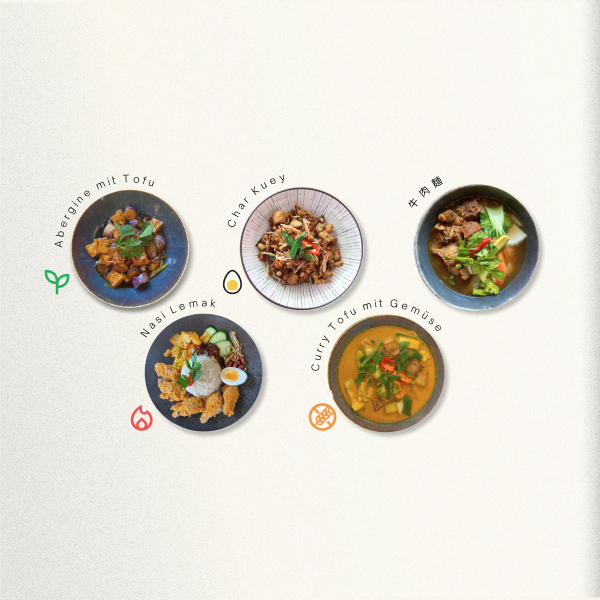
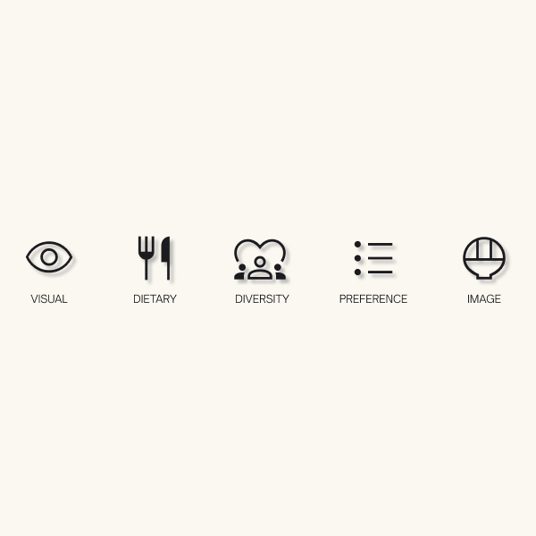
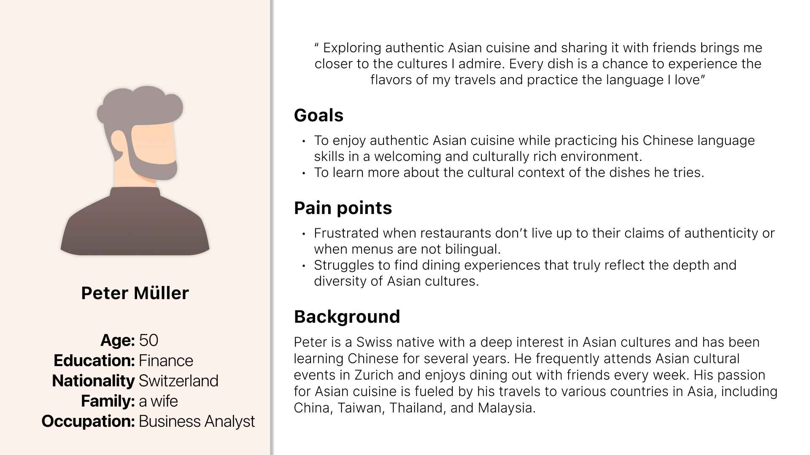
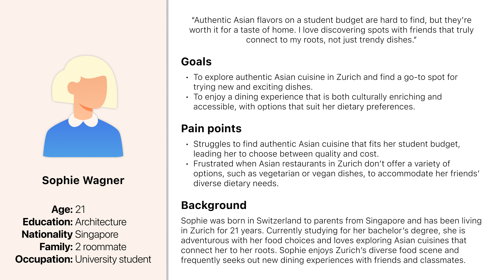
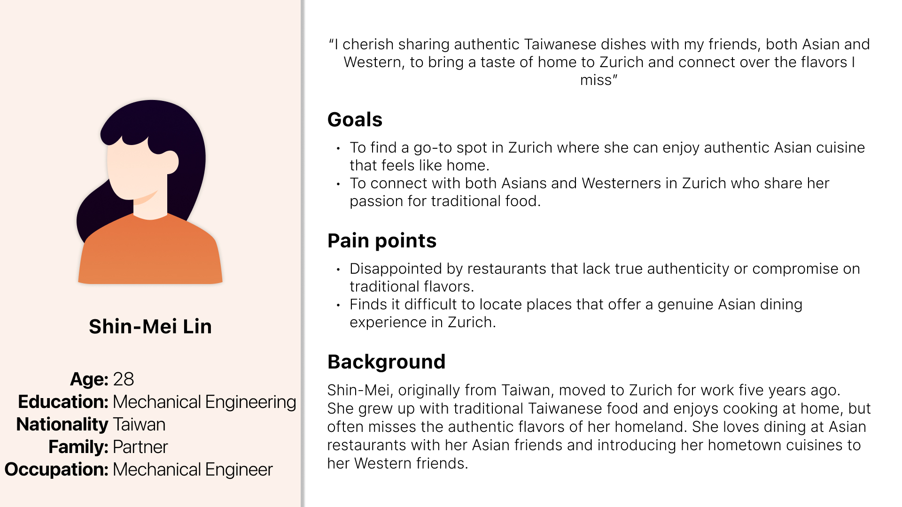
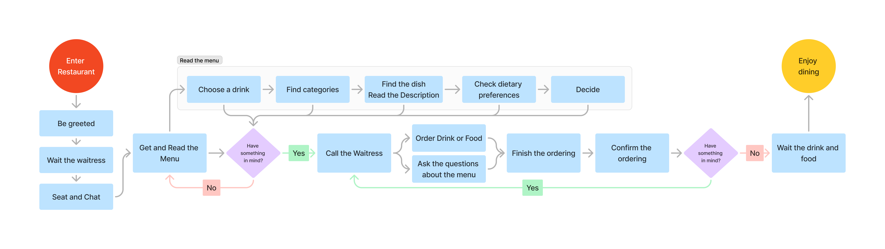
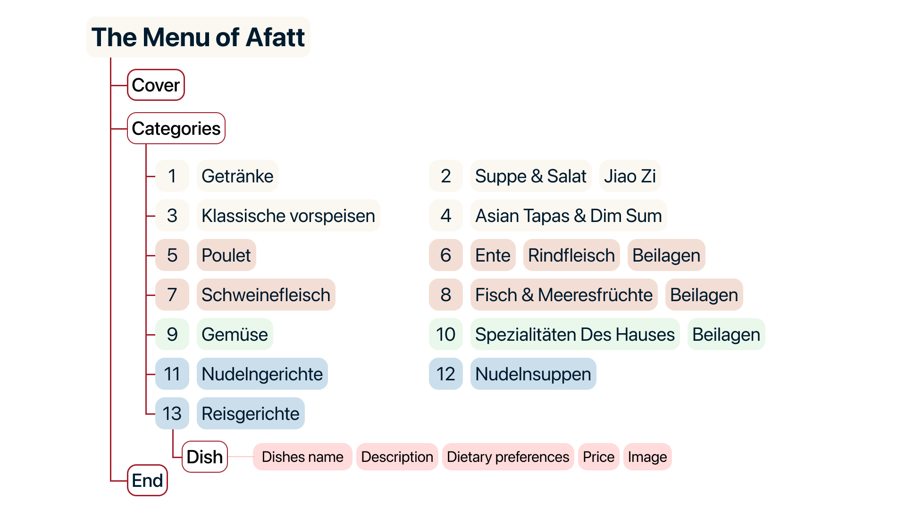
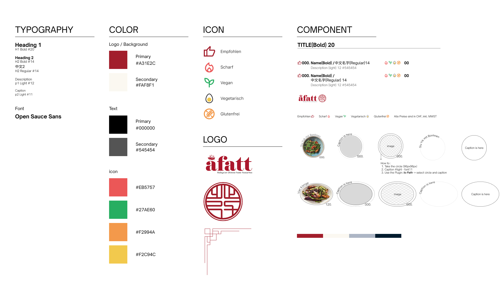
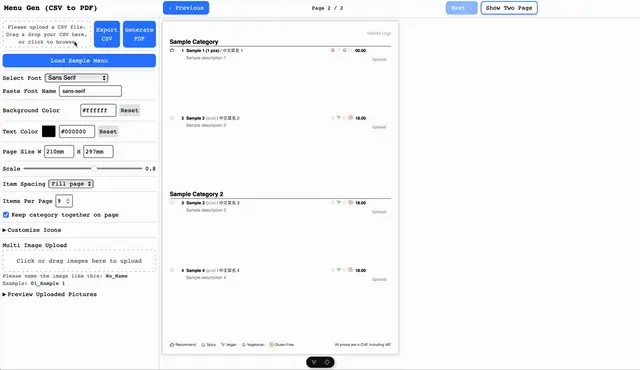

## Background

##### Showcasing Authentic Asian Flavors and Culture in Zürich!

People come to the restaurant not only to enjoy authentic dishes but also to experience the exotic culture. Both the flavors and the cultural representation need to be localized to the location. As a Taiwanese, Chinese, and Malaysian restaurant in Zurich, how can it showcase its unique characteristics within Switzerland and through its menu?

##### Crafting a Menu that Represents Our Restaurant and Serves Every Guest

The menu is an integral part of the service and represents the restaurant. With clear dish names and descriptions, and a variety of spicy, vegan, vegetarian, and gluten-free options, the restaurant ensures that every guest can find something to delight their palate while staying true to its rich culinary heritage.

#### Challenge

Design a menu for an authentic Asian restaurant in Switzerland that balances cultural integrity with local preferences, supports diverse dietary needs, and provides an **intuitive**, **scalable framework** that the restaurant team can **maintain and update efficiently**, without compromising usability or brand consistency.

#### Solution

- Developed a menu system that functions as a living design framework: modular layout components, multilingual content blocks, and dietary tagging allow the team to update or expand offerings without redesigning. The system integrates cultural authenticity, usability, and operational scalability, serving both diners and restaurant staff efficiently.

- The system streamlines both the customer experience and internal menu management, enabling the restaurant to scale and update offerings seamlessly.

#### A glimpse at behind the scene

Competitive Audit, User Research, Prototype, UX Design, Usability Testing

## Research

#### The Menu's Goal

Create a menu that authentically represents Asian cuisine while catering to the diverse tastes and dietary needs of the Swiss market. The menu should be easy to understand, featuring clear names and descriptions in multiple languages (German, English, Traditional Chinese), and highlight a variety of options including vegan, vegetarian, gluten-free, and spicy dishes. The goal is to provide an inclusive and delightful dining experience that respects cultural traditions and local preferences.

  

Cultural integrity with local preferences

Blend modern design trends with color and cultural elements to create a contemporary yet authentic atmosphere that resonates with both Asian and Swiss clients.

Multilingual and Dietary-friendly

Provide dietary options to accommodate various preferences, with descriptions written in multiple languages.​

Intuitive navigation and Inclusive experience

Ensure hierarchical readability, appropriate font sizes, and dish images to help customers easily find their favorite dishes.

## User

Afatt has built a strong reputation and loyal customer base since its opening in 2019. Over the past five years, the restaurant has become a beloved spot for a diverse clientele. Recently, we conducted a survey to better understand our customers, revealing three primary groups who frequent Afatt.

#### Persona

At Afatt, our customer base is as diverse as the cuisine we serve. Based on recent surveys and feedback, we’ve identified three key customer personas who shape our dining experience.
In addition to these core personas, we also attract tourists who are eager to experience authentic Asian cuisine during their travels. Understanding these diverse customer needs helps us continually refine our menu and service to ensure a memorable dining experience for everyone who walks through our doors.

A Swiss native deeply interested in Asian cultures, Peter often dines with friends and values authenticity in both food and cultural representation. He enjoys exploring dishes and learning about their origins, seeking genuine experiences that reflect his love for Asian cuisines.

     Born in Switzerland to Singaporean parents, Sophie is a student who craves authentic Asian flavors on a budget. She’s adventurous with her food choices and looks for dining options that connect her to her roots while being accessible and accommodating to her dietary preferences.

Originally from Taiwan, Shin-Mei moved to Zurich for work and misses the traditional flavors of her homeland. She frequently dines at Asian restaurants to reconnect with her cultural heritage and enjoys introducing her favorite dishes to both Asian and Western friends.

#### Takeaway

##### Authenticity is Crucial

- All personas value authentic Asian cuisine that genuinely reflects the cultural heritage and traditional flavors of the dishes.

- The menu and dining experience should emphasize this authenticity.

##### Cultural Connection

- Whether it’s through practicing language, connecting to roots, or sharing cultural experiences, these personas seek a dining experience that resonates with their cultural interests and backgrounds.

##### Inclusivity and Accessibility

- Providing multilingual menus and clearly labeled dietary options (vegetarian, vegan, gluten-free) is essential to meet the diverse needs of these personas and enhance their overall dining experience.

- For personas like Sophie, affordability without compromising quality is key. The menu should highlight budget-friendly options that still deliver authentic flavors.

##### Community Engagement

- Integrating educational elements into the menu or through staff interactions, such as explanations of dishes, their origins, and cultural significance, could enrich the dining experience and address the personas’ desire for authenticity and cultural connection.

- Designing the menu to encourage sharing and exploration aligns with their social dining habits and enhances their experience of introducing Asian cuisine to friends.

## User Flow & Information Architecture

#### User Flow

We mapped the complete customer journey: entering the restaurant, being seated, browsing the menu, placing an order, and interacting with staff. Each step was designed to make dish information, dietary options, and multilingual content immediately accessible. By linking the user flow directly to the modular menu system, the experience remains consistent even as the menu evolves—new dishes, translations, or dietary labels can be added seamlessly without disrupting navigation or readability. This approach ensures the restaurant delivers a smooth, intuitive experience for diners while supporting operational flexibility behind the scenes.

#### Information Architecture

The menu is structured with clear, hierarchical sections: appetizers, soups, and salads first, followed by main courses organized by protein and vegetable types, and concluding with set meals like noodles and rice. Each section employs reusable content blocks for dish names, descriptions, dietary labels, and pricing. This modular structure ensures customers can easily find and understand their options while allowing the restaurant team to update or expand the menu efficiently. By designing the IA as a living system, every change—whether adding a new dish, updating translations, or highlighting dietary categories—fits seamlessly into the existing structure, maintaining both usability and brand consistency.

## Prototype

The prototypes demonstrate how the menu system operates as a modular, scalable framework, supporting both user experience and operational flexibility. Each component—from headers to dish layouts and footers—is designed to be reusable and adaptable, ensuring updates are seamless without compromising usability or brand consistency.

#### Header and Dish section

The header clearly presents restaurant branding and navigation, while dish sections use modular blocks to display names, descriptions, images, dietary labels, and pricing. This setup allows new dishes or translations to be added effortlessly, keeping the menu consistent and easy to navigate.

#### Use two font weights for both Latin letters and Chinese characters

Two font weights are applied consistently to both Latin and Chinese characters, ensuring readability, visual hierarchy, and cultural authenticity. Modular typographic components allow the restaurant team to maintain a cohesive style when updating menu content.

#### Footer information

The footer provides key practical details for diners: recommended dishes, dietary information, and VAT-inclusive pricing. These elements are part of the modular system, so they can be updated independently as the menu evolves. This ensures customers always see accurate, helpful information while the restaurant team can maintain consistency without redesigning layouts.

#### Final Prototype for One of the Menu Pages

The final prototype demonstrates how the modular system comes together to create an intuitive, visually cohesive menu. Every element—from dish sections to dietary labels—can be updated or expanded without redesigning the page, showing the system in action.

## Figma Prototype

Here are two version can view it one flow 1 and flow 2.

<iframe style="border: 1px solid rgba(0, 0, 0, 0.1);" width="100%" height="100%" loading="lazy" src="https://embed.figma.com/proto/lbIqPM0s0yiJ9KG8iN6aPW/Affat?page-id=1%3A22&node-id=4004-1023&viewport=-582%2C870%2C0.18&scaling=contain&content-scaling=fixed&starting-point-node-id=4004%3A1023&show-proto-sidebar=1&embed-host=share" allowfullscreen></iframe>

## Design System

The design system codifies layout, typography, color, and iconography into modular components that can be reused across menus. It functions as a living system: scalable, editable, and aligned with operational workflow, allowing the restaurant to independently manage updates while maintaining consistent user experience.

##### If you’re in Zürich, don’t miss A Fatt at [Limmatstrasse 189, Zürich](https://maps.app.goo.gl/NJdaqyhLYFeS5Xhs6) — definitely worth a try!

## Takeaways

#### Impact

The A Fatt menu project delivered a culturally authentic and accessible menu that reflects Malaysian, Chinese, and Taiwanese cuisine while catering to a Swiss audience. By integrating multilingual content, dietary-friendly labeling, and intuitive layouts, the menu enhances the dining experience for customers.

Transferring the Figma design into a Canva file created a **flexible menu system** that allows the client to update dishes, add translations, or adjust dietary options independently. This empowered the restaurant team to manage and evolve the menu without needing repeated design work, reinforcing long-term operational scalability and brand consistency.

#### What I learned

This project deepened my understanding of balancing cultural authenticity with local preferences while designing for inclusivity. I gained insights into how typography, hierarchy, imagery, and modular layout systems guide users smoothly through complex information.

Collaborating closely with the restaurant team reinforced the importance of empathy, iterative problem-solving, and clear communication—especially when translating culinary concepts across languages and cultural contexts. Designing an editable Canva system highlighted how thoughtful **system design** can serve both end-users and clients, creating workflows that are adaptable, efficient, and maintainable.

## Reflection

This project reinforced that effective design is both an experience and a system. Designing modular, reusable components not only enhanced the customer experience but also empowered the staff to manage and evolve the menu independently. It highlighted how design thinking can improve operational workflows as much as visual experience.

## From Menu Design to Menu Software

After completing the **Figma** and **Canva** designs, I wanted to take the idea further, which inspired me to build a **web app** as a side project. **menuGen** turns structured menu data into an interactive editor and a print-ready PDF — multilingual content, dietary tagging, modular layouts. It's built for the general problem rather than for A Fatt, who work in Canva and are happily still on the system above.

A Fatt work in Canva and are happily still on the system above. menuGen was
built for the general problem rather than for them.

  <a href="../menu-generator">Read the menuGen case study →</a>

#### Tools & Technologies:

Vue.js, TypeScript, Tailwind CSS, Node.js and Puppeteer

#### Highlights:

- Upload menu data via CSV and export as PDF for printing
- Live menu creation and inline editing
- Modular layout components
- Multi-language support (English, German, Traditional Chinese)
- Dietary tagging for vegan, vegetarian, gluten-free, and spicy options
- Designed for operational efficiency and ease of use

This tool complements the Figma and Canva designs, creating a **living, scalable menu system** that the restaurant can manage independently.

  You can explore my side project on GitHub:

  

