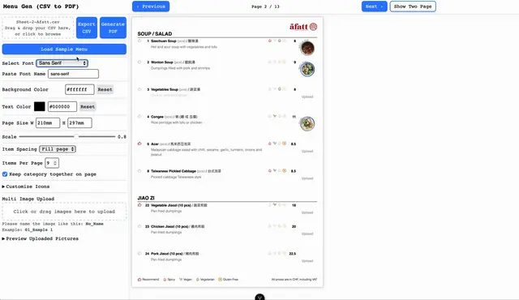
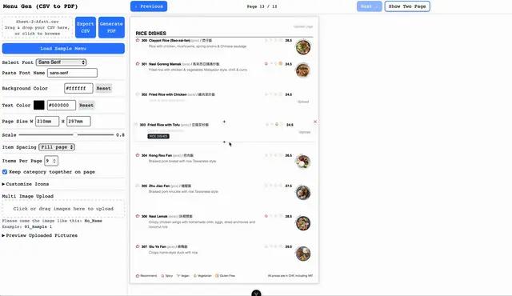
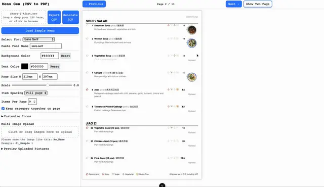
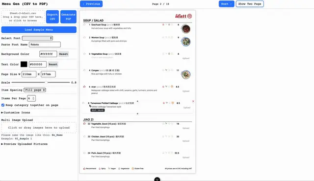
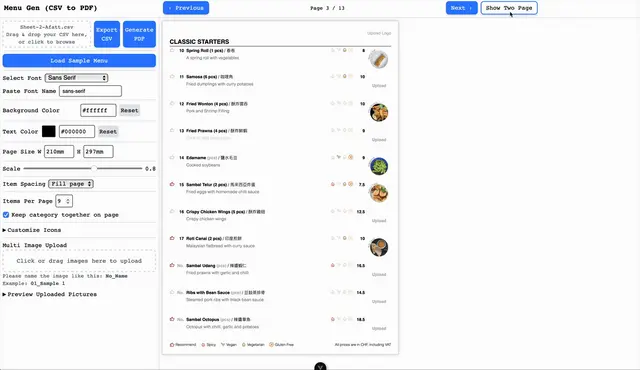

<div class="contentSection">

## Overview

MenuGen is a restaurant menu management platform that enables restaurants to create, update, and maintain professional menus through an interactive web application.

Instead of repeatedly editing design files, users can import structured menu data, edit content visually, preview layouts in real time, and generate print-ready PDFs that closely match the browser preview.

The project separates content management from presentation, allowing restaurants to update menu content while preserving a consistent visual design.


#### Key Highlights

- Designed and developed a full-stack web application from concept to deployment.
- Engineered a deterministic HTML-to-PDF rendering pipeline using Puppeteer.
- Built an asset optimization pipeline for images and SVGs with Sharp.
- Implemented asynchronous PDF generation to improve responsiveness.
- Adopted a local-first architecture with zero onboarding.
- Containerized the application with Docker and deployed it to production.


#### Project Origin

This project began after I completed the restaurant's visual menu designs in Figma and Canva.

Although the design system was complete, every menu update required reopening the original design files, making manual edits, checking layouts, and exporting new PDFs. Even small content changes became repetitive and difficult to maintain.

Rather than continuing to update static designs, I decided to transform the design system into a web application.

The result is MenuGen — a platform that preserves the original visual design while allowing menu content to be managed through structured data and exported as production-ready PDFs.


#### The Problem

Updating restaurant menus is often repetitive and time-consuming.

Typical workflows involve editing design files whenever prices, seasonal dishes, or descriptions change. This creates unnecessary manual work, especially for businesses that update menus frequently or support multiple languages.

#### The Solution

MenuGen transforms structured menu data into an interactive editing experience.

```
CSV
↓
Interactive Editor
↓
Live Preview
↓
Print-ready PDF
```

Instead of editing layouts manually, restaurant staff only maintain structured content while the application preserves the visual design automatically.

</div>


<div class="contentSection">

## Product Philosophy

This architecture intentionally prioritizes simplicity and rapid iteration over persistence, making it suitable for validating the core workflow before introducing SaaS capabilities.

#### Design Principles

- No account required
- No database
- Local-first editing
- Minimal onboarding
- Fast workflow

Menu data remains inside the user's browser and is only sent to the backend when generating a PDF.

This approach reduces infrastructure complexity while allowing users to start immediately.


#### Trade-offs

##### Benefits

- Better privacy
- Zero onboarding
- Simple deployment
- Faster development


##### Limitations

- No persistent storage
- No collaboration
- No version history

</div>


<div class="contentSection">

## Engineering Highlights

- Built a deterministic HTML-to-PDF rendering pipeline using Puppeteer to ensure exported documents match the browser preview.
- Designed an asset processing pipeline using Sharp to optimize images and SVGs before server-side rendering.
- Implemented asynchronous PDF generation to improve responsiveness and prepare the architecture for future scaling.
- Designed a CSV-driven workflow that separates structured menu data from presentation.
- Adopted a local-first architecture to validate the core editing workflow with minimal onboarding.

</div>


<div class="contentSection">

## System Architecture

The architecture separates user interaction, asset processing, and document rendering to keep the editing experience responsive while handling resource-intensive PDF generation.

```
CSV Upload
↓
Vue 3 + Pinia
↓
Application State
↓
Interactive Editor
↓
Live Preview
↓
Express API
↓
Asset Processing Pipeline
↓
PDF Generation Queue
↓
Puppeteer
↓
PDF Output
```

## PDF Rendering Pipeline

```
User HTML
↓
Asset Scanning
↓
Image Optimization (Sharp)
↓
SVG Processing
↓
Base64 Inlining
↓
Puppeteer Rendering
↓
Print-ready PDF
```

</div>


<div class="contentSection">

## Technical Challenges

#### Pixel-perfect Rendering

Keeping browser previews identical to exported PDFs was the main engineering challenge. Browser rendering and PDF generation environments handle layouts, fonts, and assets differently, requiring careful control over rendering behavior.

#### Reliable Asset Loading

Images stored in different locations can behave inconsistently during server-side rendering.

To guarantee reliable output, all required assets are processed before rendering.


#### Performance

Large images significantly increased rendering time and PDF size.

An image optimization pipeline using Sharp reduces asset size while maintaining print quality.

</div>


<div class="contentSection">

## Interactive Demo - See It In Action

#### Inline Edit



#### Edit Items



#### Upload Multi Pictures



#### Customize Icons



#### View in Single and Two Page



</div>


<div class="contentSection">

## Future Evolution

The current version focuses on validating the core editing workflow through a privacy-first architecture.

The next stage of MenuGen is transforming it from a session-based editing tool into a collaborative SaaS platform.

- User authentication
- Persistent menu storage
- Cloud object storage
- Restaurant workspaces
- Version history
- AI-assisted menu translation and description generation

These additions build upon the existing document generation pipeline without changing the core editing experience.

</div>


<div class="contentSection">

## Takeaways

#### What I Learned

Building MenuGen reinforced several engineering principles.

- Product requirements often drive architectural decisions more than technology choices.
- Separating content from presentation improves maintainability.
- Reliable document generation requires deterministic asset handling.
- Building the simplest architecture that solves today's problem often creates a better foundation than over-engineering for hypothetical future requirements.


#### Impact - What this project demonstrates

- Product thinking from identifying a real workflow problem
- End-to-end full-stack development
- Translating design systems into reusable software
- Engineering trade-offs and architectural decisions
- Production deployment and operational considerations

</div>


<div class="contentSection">

#### You can explore my side project on GitHub

<div>
  <a href="https://github.com/yingshiuan/menuGen" target="_blank" rel="noopener noreferrer">
    
  </a>
</div>

#### Try the demo

<div>
If you'd like to try Menu Generator, please click here:
<a
  href="https://menugen.insdash.ch"
  target="_blank"
  rel="noopener noreferrer"
>
  Menu Generator
</a>
</div>

</div>
