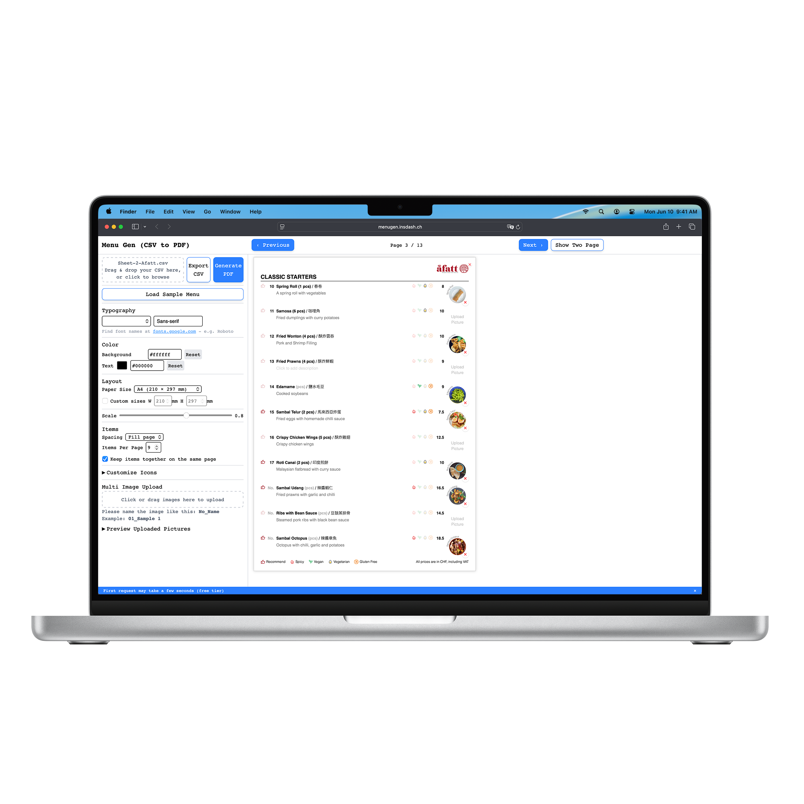

<div class="contentSection">

## Overview

MenuGen turns a spreadsheet into a print-ready restaurant menu. The editor's live preview is not a picture of the document — it *is* the document, and the PDF is printed from the same markup.

I built it because I had already done the job by hand. In 2024 I designed a [modular menu system](/yingsc/projects/afatt) for A Fatt, a Malaysian Chinese restaurant in Zürich — around 90 dishes across 20 sections, each with a name, a Chinese name, a price, a description, dietary tags and a photo. It worked, and the restaurant still uses it. But every price change went back through Figma and Canva, where editing text means editing a layout: a two-word description lands a dish on the next page, and the next page has to be checked too.

The design was finished; the maintenance was not, and it would outlive the design by years. MenuGen is that problem solved for the general case — built afterwards, on my own, with A Fatt's menu as the fixture.

#### Key Highlights

- **The spreadsheet is the schema.** Six columns describe a dish; every *other* column in the CSV becomes a dietary tag with an icon you assign. A restaurant adds "Halal" by typing a header in Excel, not by waiting for a release.
- **The preview was lying to me, and the lie lived on my laptop.** Chinese dish names rendered in the browser and disappeared from the PDF, because my Mac had CJK fonts installed and a slim render container has none.
- **The phone is a camera, not a small screen.** Dish photographs are taken in the restaurant, on a phone, by whoever cooked it — so capture, crop and placement all have to work under a thumb.
- **One browser, one free instance.** Puppeteer needs a Chromium per render, so the API hands back a job id and a single worker drains a queue. It is a deliberate ceiling, not a scaling story, and I would rather say which.



#### The Problem

Design files put content and layout in the same place, so the cost is never in the edit — it is in checking every page after it. And it multiplies for a bilingual menu, where the same change has to land in the German file and the English one with nothing but attention keeping them in step. The work is never hard, which is exactly why it drifts back to the designer months after a project has closed.

The tools that already do this do it for a different operator. InDesign's data merge has been pouring spreadsheets into layouts for twenty years, and Canva's bulk features get close — but both put the layout file back in front of whoever runs them, so either the restaurant learns a design tool or the designer stays in the loop permanently. That loop was the thing to remove, not relocate. MenuGen's bet is that if the layout is code, nobody has to open it.

#### The Solution

Content in a spreadsheet, layout in code, and one button between them.

```
CSV
↓
Interactive Editor
↓
Live Preview
↓
Print-ready PDF
```

</div>

<div class="contentSection">

## The Preview Is the Document

The obvious way to build this is to write the layout twice — once in Vue for the screen, once in a template for the PDF — and then spend the rest of the project keeping them equal. I did not want that job, so the export sends the preview's own `innerHTML` to the server, and the server's work is to take the interface back out of it.

Every field is editable in place, and the thing being edited is the thing that prints.

<video
  src="/yingsc/media/projects/menu-generator/2-inlineEdit.mp4"
  poster="/yingsc/media/projects/menu-generator/2-inlineEdit.webp"
  muted
  loop
  playsinline
  controls
  preload="metadata"
  aria-label="Editing menu text inline in the live preview"></video>

Three passes, over a JSDOM copy of what the browser sent:

- **Sanitize.** Every `<input>`, `<textarea>` and `<select>` is replaced by a `<span>` holding its value. The editable menu becomes a printed one without a second stylesheet, because the text was always the text — the input was just wearing it.
- **Inline.** Every image becomes a base64 data URI, resized through Sharp on the way: uploads to 300px at quality 70, files from disk to 200px, SVG icons rasterised to 96px PNG. Nothing in the printed page has to fetch anything.
- **Hide.** Anything marked `data-ui-only` is set to `display: none` — delete buttons, drop zones, the "click to add description" placeholders that exist to invite an edit rather than to be printed.

Only then is the document wrapped in a head carrying the compiled Tailwind stylesheet, read straight off disk so the print and the screen share one source of truth for spacing.

That last point is the whole argument. Rendering fidelity here is not the achievement of a rendering pipeline; it is a consequence of never having built a second layout to be unfaithful to.

</div>

<div class="contentSection">

## The Spreadsheet Is the Schema

The import is the product decision I am most pleased with, and it is almost entirely a decision about columns.

Six of them describe a dish: `No.`, `Price`, `Name`, `Measure`, `Chinese Name`, `Description`. Every other column in the file is treated as a **tag** — registered at upload with a placeholder icon you then assign and colour. A Fatt's menu arrives with Recommend, Spicy, Vegan, Vegetarian and Gluten Free; a restaurant that needs Halal or a chef's pick adds a column in Excel and it appears, no deploy and no conversation with me.

<video
  src="/yingsc/media/projects/menu-generator/1-csv.mp4"
  poster="/yingsc/media/projects/menu-generator/1-csv.webp"
  muted
  loop
  playsinline
  controls
  preload="metadata"
  aria-label="Dropping a CSV into MenuGen and seeing the menu build itself"></video>

Two smaller rules do a similar amount of work. A row with a name but no number and no price is a **section heading**, not a dish — so `SOUP / SALAD` sits in the sheet exactly where it sits on the menu, and the spreadsheet stays readable as a spreadsheet. And photographs are matched to dishes by filename: drop forty images at once and each one finds its item as `Name`, `01_Name` or `1_Name`, compressed to 200px in the browser before it ever reaches application state.

<video
  src="/yingsc/media/projects/menu-generator/3-iconEdit.mp4"
  poster="/yingsc/media/projects/menu-generator/3-iconEdit.webp"
  muted
  loop
  playsinline
  controls
  preload="metadata"
  aria-label="Assigning icons and colours to tag columns"></video>

The export goes back the other way, tab-separated, with an `X` in each tag column the dish carries — so the file that came out of a restaurant's spreadsheet can go back into it.

That matching used to fail in silence. A photograph whose filename matched nothing was discarded where it was compressed — and because the list of uploaded files is computed from the dishes themselves, it then appeared in neither the menu nor the list of what you had just uploaded. Forty photos went in, thirty-eight landed, and the interface said the same thing either way. It now names what it could not place — *3 of 5 files were not added*, each filename and its reason — directly above the line that explains the naming rule which fixes it. A batch operation that reports only its successes leaves you to audit it by hand, which was the work the batch existed to remove.

</div>

<div class="contentSection">

## The Phone Is the Camera

A dish photograph is taken in the restaurant, on a phone, usually by whoever cooked it. Every decision about images follows from that being the shortest path between the dish and the menu.

The upload inputs are `accept="image/*"` and deliberately carry no `capture` attribute. On a phone that opens the native sheet — Take Photo, Photo Library, Choose File — so the picture taken thirty seconds ago and the one taken last week arrive by the same door. Adding `capture` would have forced the camera and broken the more common of the two.

<video
  src="/yingsc/media/projects/menu-generator/4-uploadPicture.mp4"
  poster="/yingsc/media/projects/menu-generator/4-uploadPicture.webp"
  muted
  loop
  playsinline
  controls
  preload="metadata"
  aria-label="Uploading and cropping a dish photograph"></video>

What comes back from a phone camera is four thousand pixels of plate for a slot two centimetres wide, so the cropper is the product rather than a nicety — at 903 lines it is the largest component in the app. Touch is a first input rather than a mouse fallback: coordinates are normalised across `MouseEvent` and `TouchEvent`, and drag and resize both bind `touchmove` with `{ passive: false }`, so pulling one of the eight handles moves it instead of scrolling the page out from under you. That last detail is the difference between a cropper and a cropper you can use.

The crop runs on the client through a canvas: the frame's on-screen coordinates are mapped back through the letterboxing offsets into the source image's natural coordinates, and the region is drawn out as a data URI, so nothing round-trips to a server to find out what a photograph will look like.

The cost is that the output canvas is sized to the frame *as it appeared on screen* — 240px square for a dish — so a crop downsamples to display size instead of keeping the resolution inside the selection. At the size these print, beside a dish name, that has held. It would not hold for a menu that wanted a bigger picture.

</div>

<div class="contentSection">

## The Fonts Were Lying to Me

Fonts took eleven commits across two days in March, and produced the only bug in this project that I would call embarrassing.

You choose the menu's typeface by typing a Google Fonts name. Pick a display serif and the Latin text is exactly what you asked for — but it has no Chinese glyphs, so `酸辣湯` falls through to whatever the renderer has installed. On my Mac that is a perfectly good system CJK font, and the preview looked right. Inside a slim Linux container there is nothing to fall through to.

**The preview was correct for a reason that only existed on my machine.** That is worse than a preview that is visibly wrong, because there is nothing to notice.

The fix is to stop leaving the fallback to chance and pin it on both sides of the wall: `'<chosen font>', 'Noto Sans TC', sans-serif`, written into the PDF's head *and* into the preview component's computed style, with Noto Sans TC linked in the app's own `index.html` too. The server also parses the first family out of the CSS stack and checks it against a list of system fonts, so it never asks Google Fonts for a file called `sans-serif`.

An earlier version had solved this by committing nine Noto Sans TC weights into the repository — 64 MB of font in a Git history to render Chinese text. Deleting them for a stylesheet link is the version that survived, backed at the OS layer: the Docker image installs `fonts-noto-cjk` and the WenQuanYi families, so a page that never reaches the network still has glyphs.

#### Every wait needs a ceiling

The second half was *when* to print. `networkidle0` waits for the network to go quiet, which a document full of inlined base64 makes slow and fragile; `domcontentloaded` does not wait for a webfont at all, so the PDF prints in the fallback and looks like a bug in the layout.

So the page loads twice: the head alone with an empty body at `networkidle0`, resolving the font requests and nothing else, then the real document at `domcontentloaded`, needing no network. After that, `document.fonts.ready` raced against five seconds, and every image awaited on `onload`/`onerror` with a three-second cap. Every wait has a ceiling. A font CDN having a bad afternoon costs a restaurant its chosen typeface, not its menu.

</div>

<div class="contentSection">

## One Browser on a Free Instance

Puppeteer launches a Chromium per render. Two people exporting at the same moment on a small free instance is two Chromiums, and the answer to that is not a bigger timeout.

So the export is a job, not a request. `POST /generate-pdf` returns a `jobId` immediately, a single `processing` flag keeps exactly one render in flight, the browser polls `/job/:id`, and finished jobs are swept on a five-minute TTL. The renderer logs RSS either side of each PDF, which is how I knew where the ceiling was rather than where I assumed it was.

Being exact: it is a queue in an array in one process. Jobs do not survive a restart, and none of it survives a second instance. For one worker and a single-digit number of concurrent users that is the honest size of the problem — naming it as scaling groundwork would be overselling a `while` loop.

Running in two places produced one more lesson. The Docker image installs Chromium at `/usr/bin/chromium`, so that path was hardcoded — and on Render, where the image is not used, there is nothing there. It is now `process.env.CHROMIUM_PATH || null`: the environment variable where the container knows better, Puppeteer's bundled Chromium everywhere else. A default that is correct in one environment is a bug in the other.

#### The sixty seconds I did not fix

A free instance sleeps, and waking it takes up to a minute. I had two options — pay for a warm instance, or tell the truth — and for a portfolio deployment the second is the better product decision anyway.

So the export overlay says so: *the first export may take up to 60 seconds while the server starts.* A dismissible banner repeats it before anyone presses the button. And failure stopped being a `window.alert` and became an in-page state with a **Retry Export PDF** button and the reassurance that the work is still there.

An export that can fail at fifty-five seconds and offers one click to try again is a different product from one that fails at fifty-five seconds and says so in a dialog. The rendering code is identical in both.

</div>

<div class="contentSection">

## The Export That Did Nothing on a Phone

The bug I would not have found on the machine I built it on — and it arrived in the commit meant to let me test on another one. It also landed on the surface this product can least afford: the phone is where the photographs come from.

The export ended in one anchor: create it, give it the blob URL, append, click, remove. The mobile branch was inserted into the middle of that, and it built a *second* anchor inside a `FileReader` callback — `const a` again, shadowing the first — gave it a data URL and a `download` filename, then let it fall out of scope. Nothing ever clicked it. The one that did get clicked was the outer anchor: a blob URL with no `download` attribute, which is exactly what iOS Safari will neither display nor save.

So the button spun for its full minute, the overlay cleared, and nothing happened. No error, no console message, nothing to report beyond "it doesn't work" — the PDF had been generated correctly and dropped in the last five lines.

It shipped in the pass that made the editor responsive and put the dev server on the local network for cross-device testing, which is the joke I have to live with: the change that let me open the app on a phone is the change that stopped the phone from getting a file.

The fix is smaller than the bug. Detect iOS honestly — an iPad reports itself as `MacIntel` and gives itself away by its touch points rather than its user agent — then simply navigate, `window.location.href = url`, because Safari will not honour a programmatic download anyway. Everywhere else keeps the anchor and the new tab, with `URL.revokeObjectURL` on a ten-second timer so a long session stops accumulating blobs.

What I took from it is not about Safari. Two anchors named `a` in one function is what a reviewer catches and a solo project does not — and the deeper miss is that the success path carried no assertion. Every failure was handled and reported; the one that reported success and produced no file was the one nothing was watching.

</div>

<div class="contentSection">

## No Accounts, No Database

Menu data lives in the browser and leaves it only to be printed. There is no sign-up, no persistence, no user table.

That reads as a privacy feature, and it is one, but it was a scope decision first. The question the project existed to answer was whether managing a menu as structured content beats managing it as a design file, and neither auth nor storage helps answer it. They are the cost of the *next* question, and paying it early would have bought a slower answer to this one.

#### What it buys

- Someone can try it in the time it takes to drag a file onto the page.
- No account, no data retained, nothing to breach.
- One frontend, one stateless backend, no migrations to reason about.

#### What it costs

- Close the tab and the work is gone. There is no autosave, and the CSV export is the only way back.
- No collaboration, no history, no reopening last season's menu.
- The workaround is the export button, which is fine for a designer and thin for a restaurant.

If MenuGen went further, the first thing added would be storage, and every trade-off above would invert.

</div>

<div class="contentSection">

## System Architecture

There is one reason this has a backend at all: a print-faithful render needs a real browser to drive, and Chromium does not run inside a browser tab. Parsing, editing, layout and the live preview all happen on the client and never leave it. The split falls where it does because the server's whole job is the part that needs a machine.

```
                USER
                 |
                 v
        Vue 3 Frontend + Pinia State
                 |
        ------------------
        |                |
        v                v
 Interactive Editor     Live Preview
        |
        |
        v
     Menu Data Model (CSV / JSON)
                 |
                 v
          Express API
                 |
        ------------------
        |                |
        v                v
 Asset Pipeline       PDF Renderer
    Sharp             Puppeteer
        |                |
        ------------------
                 |
                 v
          Print-ready PDF
```

Vue 3 and TypeScript with Pinia on Vercel; Express on Render, containerised with Docker for local work. Both halves are stateless, which is what makes the queue's one real cost so small: a restart loses a job in flight and nothing else.

</div>

<div class="contentSection">

## The User I Built For Was Me

A Fatt has the menu MenuGen was built from, and A Fatt does not use MenuGen. A price change goes through the Canva system I delivered in 2024; a new layout still comes back to me. That is the outcome, and it is worth more to me than the demo.

It is not a gap in the features. MenuGen asks you to keep your menu as a spreadsheet, to name a photograph `10_Spring Roll` so it finds its dish, and to know that "Playfair Display" is a thing you can type into a box. Each of those is free if you already work in files and structured data, and each is a wall if you do not. For anything that changes the menu, the owner's workflow is to ask a person — and asking a person is not a workaround for missing software. It is a preference the software has to beat.

So the spreadsheet-as-schema decision cuts both ways, and I would rather say so than keep it as the clever part. It is the right model for *maintaining* a menu and the wrong front door for *starting* one, because it assumes a user who already has their menu as data. That describes a designer, an operations manager at a group with several sites, a younger owner already running the business out of a phone and a spreadsheet. It does not describe every restaurant, and it did not describe this one.

The finding was available in week two. I could have handed the owner a price change and watched what they did with it; instead I spent four months building, and learned the same thing by noticing which tool they kept opening.

What I can defend: the tool works, and its segment is narrower than "restaurants". What I cannot defend yet: that the narrower segment adopts it. The next move is not a feature — it is making the first dish typeable, and keeping CSV as the way data leaves and returns rather than the way it has to arrive.

</div>

<div class="contentSection">

## Where It Stands

MenuGen is live at [menugen.insdash.ch](https://menugen.insdash.ch). It opens on four placeholder rows rather than a finished menu, so the first thing a visitor can do is edit one instead of clearing ninety. The menu it was built and tested against is A Fatt's: 90 dishes across 20 sections, bilingual, tagged, photographed, thirteen pages in the preview. It is a working product tested against real data — one restaurant's. That is what makes its edge cases real, and what leaves me unable to name the ones it has not met.

</div>

<div class="contentSection">

## What I Took From It

- **Two representations of one thing will drift, so keep one.** Preview fidelity was never a rendering problem — it was the decision not to write the layout twice, and every claim downstream rests on that rather than on Puppeteer.
- **A preview that is right by accident is worse than one that is wrong.** The Chinese glyphs were correct on the only machine that could not report the problem. Fallbacks that matter get written down, not inherited from whatever the developer's OS happens to have.
- **Waits need ceilings, and success paths need assertions.** A font stall, a download that never fired, and an image that decoded to nothing and left the spinner running forever — each one was the code waiting for something to be true with no plan for it not being. That last was a missing `img.onerror` beside a handled `reader.onerror`: the failure I had thought of, and the one I had not, four lines apart. It surfaced while I was writing tests for a different bug, which is most of the argument for writing them.
- **A data model is a claim about who the user is.** Making the spreadsheet the schema was the best decision in the build and the one that decided who could use it. Elegance in the model came out as a prerequisite in the user, and I did not see it until I noticed who was still opening Canva.
- **Coverage is not correctness.** My first test suite exercised a CSV parser nothing called, while the parser the product actually runs went untested. I deleted the dead one and moved its assertions onto the live path, including the quoted comma the naive version would have split in half.

#### Where I Stopped

Authentication, stored menus and multi-restaurant workspaces are all scoped and none of them are built, because none of them were needed to find out whether the core idea worked. Translation is the one I want to build — the model already carries a name and a Chinese name per dish, so a bilingual menu today is two columns somebody types twice. It is not the one I would build next. Next is the empty state, because the finding above is that the tool loses people before it ever gets the chance to be useful.

What I would not build is a design tool. MenuGen wins by refusing to be one — the layout is code precisely so that nobody has to open it — and every feature that lets a user nudge the layout takes back the thing the project was for.

</div>

<div class="contentSection">

#### GitHub Repository

<div>
  <a href="https://github.com/yingshiuan/menuGen" target="_blank" rel="noopener noreferrer">
    
  </a>
</div>

#### Try the demo

<div>
If you'd like to try Menu Generator, please click here:
<a
  href="https://menugen.insdash.ch"
  target="_blank"
  rel="noopener noreferrer"
>
  Menu Generator
</a>
</div>

</div>
