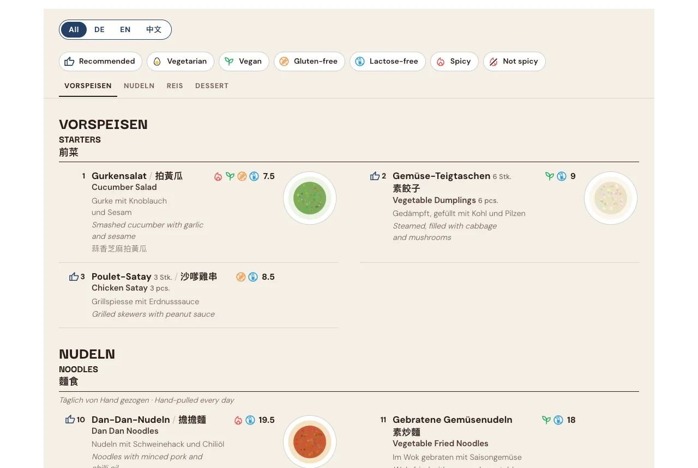
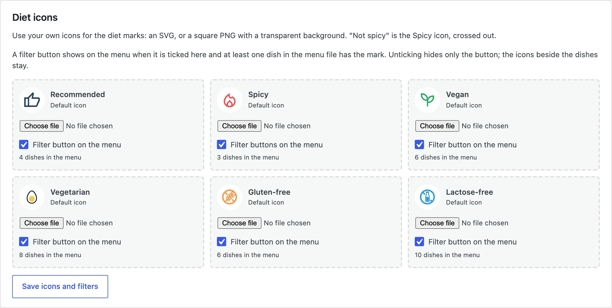
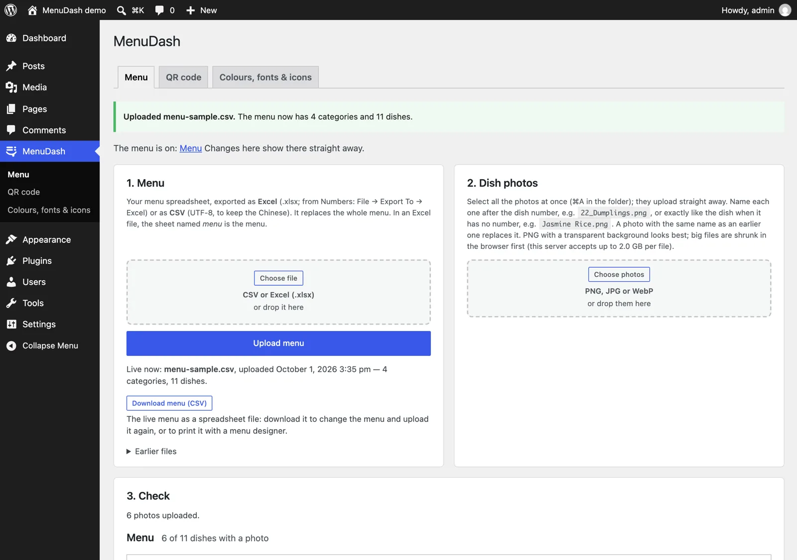
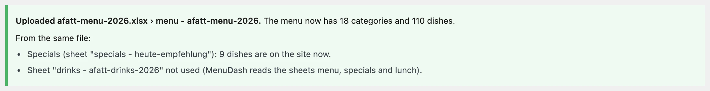

## Overview

Since 2024, A Fatt has kept the menus I designed for them up to date on their own, in Canva, without calling me: an English one and a German one, each with Chinese alongside. Guests scan a QR code at the table and open them as PDFs on their phone. In 2026 they came back with a new request: a third menu, of only their vegan and vegetarian dishes.

Designing it was the easy part. Every vegan and vegetarian dish now lived in three PDFs, so every price change was three edits, and one missed edit would put the menus out of step, in front of the guests who read a menu most carefully. Guests had three QR codes to choose from. And the PDFs had a problem of their own: a PDF has one fixed page size, and it doesn't fit every phone's screen.

I had already shown them [menuGen](https://yingshiuan.github.io/yingsc/projects/menu-generator/), my own tool that prints every version from one spreadsheet, and they kept their Canva menus. It fixed the work behind the menu, and a restaurant judges a menu by what its guests see. So I asked a different question: instead of handing each guest the English, the German or the vegan and vegetarian menu, why not put all of it on the website they already had, as a page instead of a file? Collect every dish once, in one Excel sheet, with a column per language and a mark per diet. One sheet means one edit, with nothing left to fall out of step. The page fits whatever screen opens it. And the vegan and vegetarian menu becomes a filter: instead of the restaurant keeping a menu for each kind of guest, each guest filters the one menu on their own phone.

MenuDash is the WordPress plugin I designed and built to do that. It runs the [menu page on afatt.ch](https://afatt.ch/menu/): 110 dishes in three languages, filtered by diet, rebuilt whenever the owner uploads the sheet. Then, because the problem wasn't specific to one restaurant, I made it a product. The core and its theme are open source: [MenuDash on GitHub](https://github.com/yingshiuan/menudash) · [MenuDash Theme](https://github.com/yingshiuan/menudash-theme).

**Where it stands:** live on one restaurant's site since September 2026. The add-ons and the theme are built, not yet installed there.

#### Key Highlights

- **I turned a layout problem into a data problem.** The third PDF they asked for could disagree with the other two. Online, it became a filter on one sheet that can't disagree with itself.
- **I designed for two users.** The guest wants their language and their diet in one tap. The owner wants to change a price without calling me.
- **I designed the failure path first.** A wrong file gets a red report and is refused, and the live menu stays online.
- **I split the product where the customers split.** A free core for every café, paid add-ons for a full restaurant, and code where each add-on works on its own.

## One Sheet, Two Users

The whole product hangs on one decision: the spreadsheet is the source, and everything the guest sees is a view of it. That made the sheet both the owner's interface and the code's data model, so I designed it for both.

**For the owner, it had to be the sheet they'd write anyway.** A dish is a row; a category is a row with a name and no price. Columns are found by their title, in English or German, so the order doesn't matter and extra columns are ignored. It reads the file the way Swiss Excel writes it, with semicolons, and takes a whole Excel workbook in one upload, each sheet going where it belongs. A missing translation falls back to another language instead of leaving a gap.

**For the guest, the filters had to mean what a guest means.** Vegetarian includes vegan, because a vegetarian can eat it. Spicy and Not spicy switch each other off, because both at once would show nothing. Categories with nothing left are hidden. The guest reads all three languages at once or one at a time, and on a phone a Chinese name that doesn't fit beside the German one moves to its own line.

A filter button only appears when at least one dish has that mark, so a guest never taps Gluten-free and gets an empty menu. The owner decides which buttons the guest sees, and can swap in their own icons. Switching a button off hides only the button; the marks beside the dishes stay, because they're still true.

**And for both of them, it had to be a real web page.** The menu is HTML in all three languages, not a PDF or a picture, so it works without JavaScript and search engines read every dish.

## Designing the Failure Path

Once the menu lives in one sheet, that sheet has to be right, because nobody re-checks a layout anymore. And the person uploading it isn't the person who designed the data. So I designed the upload around getting it wrong:

- **Every upload gets a report.** Green: fine. Yellow: the menu went live, but something looks odd. Red: the file wasn't used, and the old menu stays online.
- **It checks for the mistakes a restaurant actually makes:** a file in the wrong encoding, which would lose the Chinese; the wrong file entirely; two dishes sharing a number; the same dish listed twice with different diet marks.
- **Nothing is final.** The last five uploads are one click away, and the live menu downloads as a file to change and upload again.

The twin check proved itself on their real menu. Duck Pancakes appeared in two categories, vegetarian in one and unmarked in the other. A guest filtering for vegetarian, the very guest the new menu was for, would have found only one of them. The menu was corrected.

## From a Client Job to a Product

Once the menu worked, the rest of what guests check on a restaurant's site turned out to be the same problem: opening hours, a holiday closure, today's specials, gift cards. Each is something the owner changes in one place and forgets in the others. I built them on the same dashboard page, and by version 1.11 one plugin did all of it.

Then I had to decide how to sell it. My first plan was one package at a lower price. But a small café only needs the menu, and a full restaurant wants all of it, so one price fits neither. At 2.0 I split it along the same line as the customers:

| | What it does | Who needs it |
|---|---|---|
| **MenuDash** (free) | The menu, photos, diet filters, QR table cards, the meat and fish origin list Swiss law requires | Every restaurant and café |
| **Restaurant** | Details entered once, opening hours, an "open now" badge, a holiday notice that takes itself down | A restaurant with a real website |
| **Specials** | Today's specials and the lunch menu of the week | A kitchen that changes its offer |
| **Gift Cards** | Gift card orders by e-mail, nothing paid online | A restaurant that sells gift cards |
| **Statistics** | Which dishes guests look at, without cookies | An owner who wants to know what works |

**Why the core is free.** The code is GPL, like WordPress, so anyone who buys a zip may pass it on. Rather than fight that with licence keys, I asked what an owner actually pays for. Most never install a plugin themselves; they pay for someone to set it up, put their menu into the sheet, and answer when something changes. So the business sells the setup and the care: a one-time setup, and a yearly fee for the add-ons' updates and help. The free core is the shop window on GitHub, and it means a restaurant's menu never depends on me.

**Why there's no shop yet.** Checkout, licence keys and automatic updates only pay off once restaurants I don't know come looking. I planned how they would work and left them unbuilt; until then, every customer is one I set up myself.

## Architecture That Follows the Business

A pricing split only works if the code splits cleanly too. A café on the free core can't see broken pieces of features it didn't buy, and a restaurant that adds Gift Cards next year can't have to reinstall anything.

- **Each add-on is its own plugin** that waits for the core and plugs in through hooks. Without it, its parts show nothing, so a page built for all of them still works with the core alone.
- **The add-ons don't need each other.** Gift Cards uses the phone and address from Restaurant when it's installed, and its own fields when it isn't.
- **A browser test runs the core alone and each add-on without the others,** so every package works, including ones nobody has bought yet.
- **One export writes two repositories,** the public core and the private add-ons, and refuses to write the public copy if the client's name, address or photos turn up in it, or if add-on code has leaked into the core.

The theme follows the same rule. It stores no address, phone or hours of its own; it reads them from MenuDash on every page view, and fills in more as add-ons are installed. A restaurant can start with the menu and grow into a full site without a rebuild.

## How I Built It

I built MenuDash with Claude Code. I designed the product and the data model, wrote the specifications, reviewed every change and decided what shipped. The parser is tested against A Fatt's real spreadsheet as well as made-up ones, and the whole thing runs locally in WordPress Playground, so a site with the client's menu starts with one command.

**I didn't wait for it to be finished.** Three days in, at version 1.1.3, I installed it on afatt.ch to test it against the real site and the real menu, and kept updating it there as each new version shipped. Twelve days later it reached a stable version, 2.7. Testing on the client's site while building is how the real menu's problems showed up early instead of after launch.

**The last step before a release is a security review.** A plugin that takes files from a restaurant owner and a form from any visitor is an open door if nobody checks it, and code that works isn't the same as code that's safe. So before a version ships, I run a review of how it could be abused, and what turns up is fixed before it goes out. Those reviews are where most of the hardening came from:

- **A diet icon can't carry a script.** Uploaded SVGs are cleaned down to plain shapes, and a review found one more way in, a file written in a different text encoding, which is now refused too.
- **A huge photo can't crash the server.** Images over 40 megapixels are refused before they're opened.
- **An Excel file is read as if it were hostile.** A workbook is a zip of XML files, so it is a classic way to attack a server. MenuDash reads only the sheet parts, each with a size cap; refuses XML entities and any path outside the workbook; stops at 3,000 rows by 60 columns; never runs a formula, using the saved values instead; refuses macro workbooks; and never stores the workbook itself, only the CSV made from it.
- **Stored menu files can't be guessed from the web,** because a menu file can hold columns the public page never shows.
- **The gift card form holds up against spam** without needing a login: a hidden field, a signed minimum time, a link filter, and limits per visitor and per day.

## Where It Stands

The core has run A Fatt's menu page since late September 2026, now at the stable version 2.7. The four add-ons and the theme are built, offered through insdash, and not on A Fatt's site yet. A Fatt is the first restaurant running it; the split is built for the ones that come next.

## What's Still Open

- **The owner's side isn't proven yet.** She's trained to upload the menu. Whether she does it month after month without me is the real result, and it's weeks old.
- **The guest's side has no data yet.** Statistics is built to show which dishes guests look at, but it isn't installed on afatt.ch, so I can't yet say what guests do with the filters.
- **I'd get the second customer before the third add-on.** It grew from one menu page into a core, four add-ons and a theme in two weeks, for one restaurant. The split is a bet on restaurants I haven't met yet.

