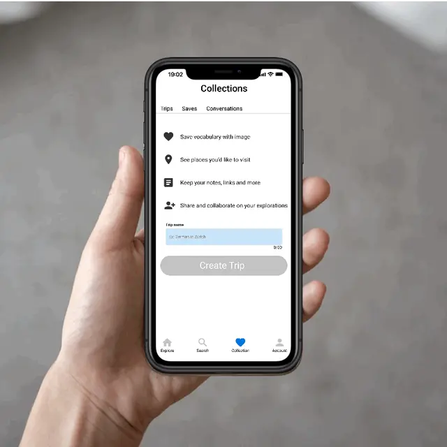

## Background

Our brain stores information in a way that is easy to recall, such as visual images, body memories, or a scenario. There have more things that we instantly associate with our memories. Hence, that connection makes the information more memorable and easy to recollect. In this age, people have increasingly relied on the internet and personal devices for self-directed learning, such as smartphones, tablets, and laptops. Duolingo, Mondly, and Busuu have made tremendous in language learning. They provide easy-to-understand lessons about foods, people, objects, and conversations that most users are familiar with. The learning experiences help users associate them with foreign language words. Even though they make the language learning process much easier than it used to be, we still agree that learning a language effectively is all about placing yourself in the environment. We recognized this gap and used augmented reality to engage and motivate users to build their knowledge on real-world observations. Users can practice and learn languages via an understanding of different cultures and exploration of attractions around the world.

#### Challenge

How do we engage with the individual learning pattern and help learners to practice everyday phrases?

#### Solution

Make connections to learn basic vocabulary from observations and use full sentences in our everyday environment.

#### A glimpse at behind the scene

Competitive Audit, User Research, Prototype, UI Design, Usability Testing

## Research

#### The Product's Goal

Focus on learning the necessary vocabulary in complete sentences by observing your context using augmented reality. For listening, reading, writing, and speaking, the map mode provides users with daily phrases and memory links. Create fun and immersive learning environment that keeps motivation high.

  

Learn and Practice

Learn languages and practice immersively.

Travel and Explore

Enrich your life and explore the world.

Languages and Cultures

Associate memory through cultures.

## Technology Research

Given the technical challenges we face, we need to study current computer vision techniques and the feasibility of implementing this application.

#### We summarize the following requirements:

- The app should be able to recognize real world objects using camera and create labels in different languages.

- The object recognition and label generating should be in real time as the user scans their surroundings by camera.

- The location should connect to the real world map and display a corresponding introduction and simple dialogue.

#### Open source object recognition API
[YOLO](!https://github.com/WongKinYiu/yolov7), [TensorFlow](!https://www.tensorflow.org/),[ML Kit](!https://developers.google.com/ml-kit), [Google Map Platform](!https://developers.google.com/maps)

## Competitor Analysis

Based on a brief analysis of competitors. Duolingo, Mondly, and Tripadvisor became our references for competitors and products. I'm focused on enhancing the learning patterns of everyday phrases using augmented reality and creating a product that helps users learn in their surroundings.

- Enhance learning pattern with daily phrases.

- Observation using augmented reality.

- Connect our memories with travel experiences.

## User

There has three main users groups, namely language learners, mobile users and travelers.

#### Persona

Understanding multilingual learners and users who are the first time learning a foreign language.

Alex is a busy IT consultant who speaks multilingual languages. He needs to practice the language and experience different cultures because he can travel and communicate without the language barrier.

      Joan is a tidy housewife who learning her first foreign language. She needs to practice the language and explore something new at her odd moment because she can travel to different countries and visit her children abroad.

#### Takeaway

##### Motivation
- Need to learn a new language when they move to a place where most people speak in a different language.

- Already in a main languages course and wants more resource to memorize daily phrase.

##### Techniques
- Want to find more chances to practice in daily life.

##### Thoughts
- Want to communicate when they are traveling.

- Set goals and improve myself step by step.

##### Frustration
- There is no one to practice the language with.

- Learning is not restricted by location.

## Design

Before designing, we decided to start with a storyboard and diagram what the Multi-Multi experience for our users. People are motivated to learn a new language based on work-related goals, migrate to a new environment, want to learn more about a culture or a new language.

#### Storyboard

1. One day, when users study and practice languages.

2. They think “I want to speak in German when traveling to Switzerland." Before I go traveling, how I will communicate when I go to restaurants, hotels, museums, or events?

3. Users open the “Multi-Multi” application.

4. Search the place they want to visit on the map mode. The user finds a "Zurich ice cream shop". There is a dialogue on the screen showing how to order ice cream in German.tg

5. The user turns on the camera using augmented reality and learns the vocabulary of the objects around them.

6. After a few days, the user remembers more vocabulary and associates the conversations they learned with places on the map.

7. Users practice language by exploring the world and associating with scenes to build their language skills.

8. Users learn language through daily observation and enjoy the fun of exploring the world of the language they are learning.

## User Flow & Information Architecture

#### User Flow

We wireframe the following task flows: registration, observing mode, exploring map mode, dashboard, collection, and set language preferences.

#### Information Architecture

Here I work on designing a responsive website and mobile app. I use a Multi-Multi sitemap to guide the organization of each screen design to ensure a coherent experience across devices. The purpose of the user flow is to provide the user with appropriate additional material, link the user's memory with the language, and be motivated by more local cultures. To ensure learning goals, we annotated endpoints in the information architecture for users to learn vocabulary, dialogue, reading and listening in observation patterns and exploration maps. Next, we will wireframe several layouts for users to test which kind of layout provides a better learning experience.

## Prototype

#### Paper Wireframes

Paper wireframes help organize the main layout, interactions, user flow, and UI design. I can quickly iterate to find a suitable layout, then think about the main user flow.

#### Low Fidelity Prototype

In the low-fidelity prototype, I start with the user flow, the goal is to make sure the user can smoothly switch between each feature. In mid-fidelity prototypes, I focus on details of functionality and interaction behavior. Then go for the first usability study.

<!-- * Default image -->

 

<!-- Hover image -->

## Usability Study

I conducted two rounds of usability studies. Findings from the first study helped guide the designs from wireframes to mockups. The second study used a high-fidelity prototype and revealed what aspects of the mockups needed refining.

1. Sign in and onborading

2. Home screen and explore the app

3. Search on Map

4. Observe with AR

5. Make notes

6. Learning pattern

#### Round 1 - Medium Fidelity Prototype

##### Insight

###### Onboarding and user flow

- Prototype should be made more efficient or the task should be a little more detailed.

- Onboarding should to get understanding of users' preference, such as choosing languages, practice frequency and learning purpose.

- Switching between functions is confusing.

###### Search and Observe functions

- For a great searching and observing experience, Search on the map and Observe with AR should put on the homepage.

- Could have some instructions about the observe with AR, add vocabulary and conversation to the collections before start the function.

- Let users set their favorite tabs in addition to the default tabs.

###### Learning materials and others

- Finding Round 1 was difficult with this prototype, hence all the following tasks became confusing. But main functions still work.

- Practice with attractions help users to connect their memories.

- Whether Offer more tips of organize notes and learning.

#### Round 2 - High Fidelity Prototype

The second round will focus on future product trends

##### Insight

###### Learning materials and Languages

- Whether add more Materials on current functions?
  - Search on the map- Reading, Speaking
  - Observe with AR - Vocabulary

- Whether to provide material according to the learning pattern.

###### Interaction

- Create a new page for the new language when the user switches other languages during the search and watch functions.

## High Fidelity Prototype

Here is the multi-multi prototype on Figma.

## Main Feature

#### Get new vocabulary by observing with Augmented Reality

Users explore environments around and practice relative vocabulary. Make connections between the environment and your remembering.

#### Learn daily phrases by searching on the map

Search places around you or all over the world to get more daily phrases and practice conversation.

#### Read introductions and practice conversations based on attractions

Read the introduction of the attraction, an overview of cities, and the origin of events

#### Make your notes and associate with your memories

Take notes about vocabulary, conversations, and introductions by saving sights to your list. Create personal memos for you to use during the trip

## Cross Platform

## Design System

## Takeaways

#### Impact

Users said that the application maintained their motivation and brought them new explorations. They learn and practice the language step by step, and the app encourages them to explore all over the world.

#### What I learned

I learned that even though the problem I'm trying to solve is big. Diligently complete each step of the design process and align it consistently with specific user needs. It helped me come up with solutions that are both feasible and useful.

## Next Steps

#### Function and official event

- Friend mode, social mode or hold an event for users to find and search using the camera.

#### Usability testing

- Follow-up usability testing of new websites and applications.

- Conduct another round of usability studies for users who speak different languages to validate whether pain points experienced by users have been effectively addressed.

#### Update content

- Update the application according to user needs and add more user learning materials, such as basic conversations, vocabulary cards, event articles or introductions to sights, etc.  

<iframe style="border: 1px solid rgba(0, 0, 0, 0.1);" width="100%" height="100%" loading="lazy" src="https://www.figma.com/embed?embed_host=share&url=https%3A%2F%2Fwww.figma.com%2Fproto%2FFhMhHhAU9LUR6iTYLXvz6X%2FMulti-Multi-App%3Fpage-id%3D150%253A1912%26node-id%3D150%253A3137%26viewport%3D463%252C530%252C0.09%26scaling%3Dscale-down%26starting-point-node-id%3D150%253A3137" allowfullscreen></iframe>

## Reflection

I have always been a self-taught person, learning different skills from coding and robotics to languages. When studying in Switzerland, the first step in learning German was to go to the supermarket to learn food names. Learn from the little thing I do twice a week. These learning experiences inspired the idea of designing this language application. Establishing connections with good experiences in life is a great help in practicing a language. Most people like to travel the world. I took advantage of traveling to design a learning environment that allows users to practice vocabulary and dialogue when planning a trip. When users are on a trip, they can have small conversations easily and naturally. I hope I can launch this application as one of my side projects and use this product to help more people learn.

