

## Background

Learning is most effective when knowledge is tied to real-world experiences. Traditional language apps like Duolingo, Mondly, and Busuu simplify vocabulary acquisition but lack immersion in daily contexts. Multi-Multi bridges this gap by using **augmented reality (AR)** to connect vocabulary and conversations to real-life environments. Users can practice language in context—while exploring cities, visiting attractions, or interacting with everyday objects—enhancing memory retention through experience and context.

#### Challenge

How can we engage individual learning patterns and help learners practice everyday phrases naturally?

#### Solution

Use AR to label and contextualize real-world objects and scenarios, enabling learners to acquire vocabulary and sentences directly from their environment.

#### A glimpse at behind the scene

Competitive Audit, User Research, Prototype, UI Design, Usability Testing

## Research

#### The Product's Goal

Create an immersive environment that helps users learn essential vocabulary and complete sentences through observation and interaction. The map mode supports listening, reading, writing, and speaking exercises while linking phrases to real-world locations.

  

Learn and Practice

Immersive learning that reinforces vocabulary.

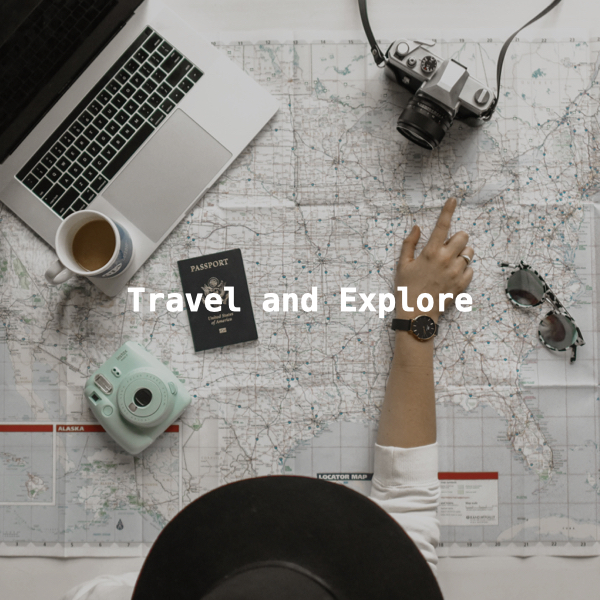

Travel and Explore

Connect language learning to real-world exploration.

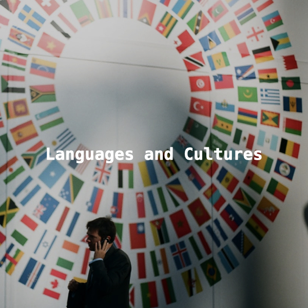

Languages and Cultures

Strengthen memory by associating phrases with cultural contexts.

## Technology Research

To address technical challenges, we explored current computer vision methods and the feasibility of implementing this app.

#### We summarize the following requirements:

- Real-time object recognition using the device camera.
- Multi-language label generation for detected objects.
- Integration with maps to display locations, dialogues, and relevant content.

#### Open source object recognition API

[YOLO](!https://github.com/WongKinYiu/yolov7), [TensorFlow](!https://www.tensorflow.org/),[ML Kit](!https://developers.google.com/ml-kit), [Google Map Platform](!https://developers.google.com/maps)

## Competitor Analysis

Multi-Multi draws inspiration from Duolingo, Mondly, and Tripadvisor. Its differentiation lies in:

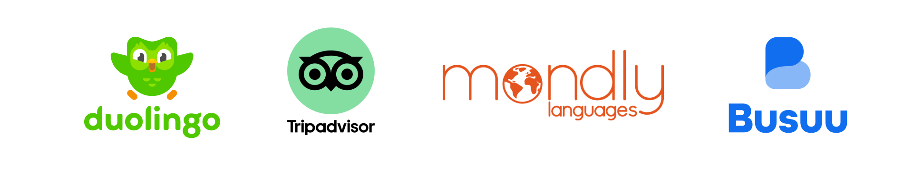

- Daily phrases tied to real-life scenarios.
- Immersive observation using AR.
- Memory-linked learning experiences through travel and cultural exploration.

## User

**Target Users:** Language learners, travelers, mobile-first users.

#### Persona

  A multilingual IT consultant who travels frequently. Needs to practice language in context to communicate naturally abroad.

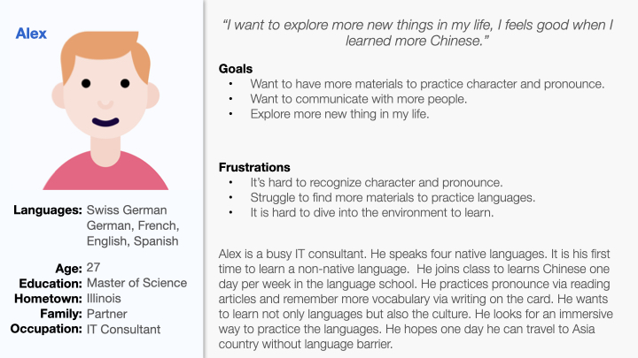

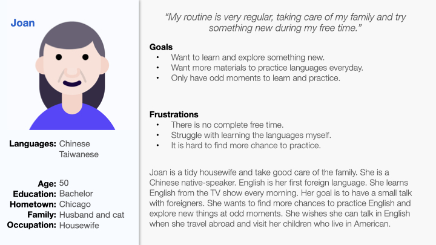

  A housewife learning her first foreign language. Uses small pockets of free time to explore culture and practice language for trips.

#### Insights

##### Motivation

- Learn new languages for relocation, travel, or personal growth.

##### Techniques

- Seek opportunities to practice in daily life.

##### Frustration

- Limited access to practice partners; location-independent learning needed.

## Design

We started by creating storyboards to visualize user experiences. Multi-Multi supports both goal-driven and curiosity-driven learning.

#### Storyboard

The app supports goal-driven and curiosity-driven learning. Users:

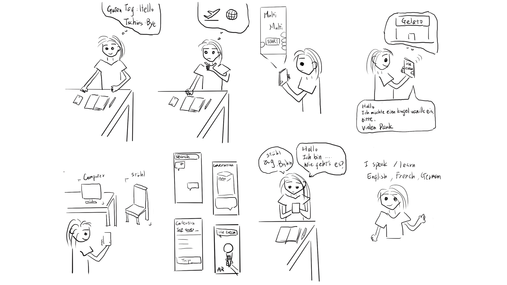

1. One day, when users study and practice languages.

2. They think “I want to speak in German when traveling to Switzerland." Before I go traveling, how I will communicate when I go to restaurants, hotels, museums, or events?

3. Users open the “Multi-Multi” application.

4. Search the place they want to visit on the map mode. The user finds a "Zurich ice cream shop". There is a dialogue on the screen showing how to order ice cream in German.

5. The user turns on the camera using augmented reality and learns the vocabulary of the objects around them.

6. After a few days, the user remembers more vocabulary and associates the conversations they learned with places on the map.

7. Users practice language by exploring the world and associating with scenes to build their language skills.

8. Users learn language through daily observation and enjoy the fun of exploring the world of the language they are learning.

#### Insight

1. Plan a trip or set a learning goal.
2. Search destinations via map mode for daily phrases.
3. Observe surroundings through AR to acquire vocabulary.
4. Practice and reinforce memory by linking phrases with locations.

## User Flow & Information Architecture

#### User Flow

Tasks: Registration → Observation Mode → Map Exploration → Dashboard → Collection → Language Preferences.

Multi-Multi sitemap ensures a coherent cross-platform experience while connecting memory with language learning.

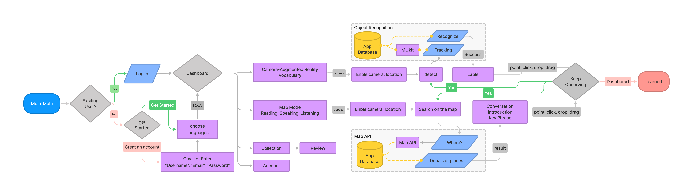

#### Information Architecture

I designed the information architecture to support both the responsive website and the mobile app. The Multi-Multi sitemap guided how each screen was organized to ensure a consistent and intuitive experience across devices.

The goal was to structure content in a way that provides learners with relevant materials at the right time—connecting vocabulary, dialogues, reading, and listening tasks with real-world observations and map-based exploration. We annotated key learning endpoints throughout the IA to highlight where users build memory links, discover new content, and reinforce skills.

With the IA defined, we moved into wireframing to explore layout options and test which structures supported the strongest learning experience.

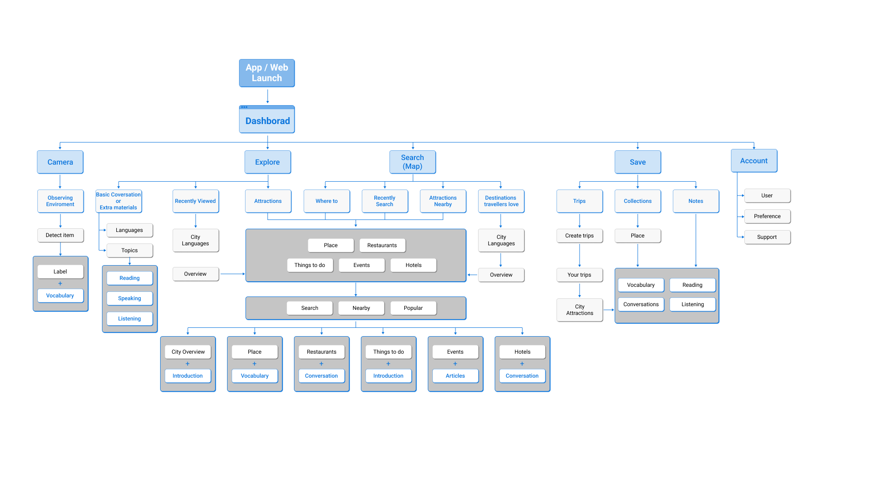

## Prototype

#### Paper Wireframes

Paper wireframes help organize the main layout, interactions, user flow, and UI design. I can quickly iterate to find a suitable layout, then think about the main user flow.

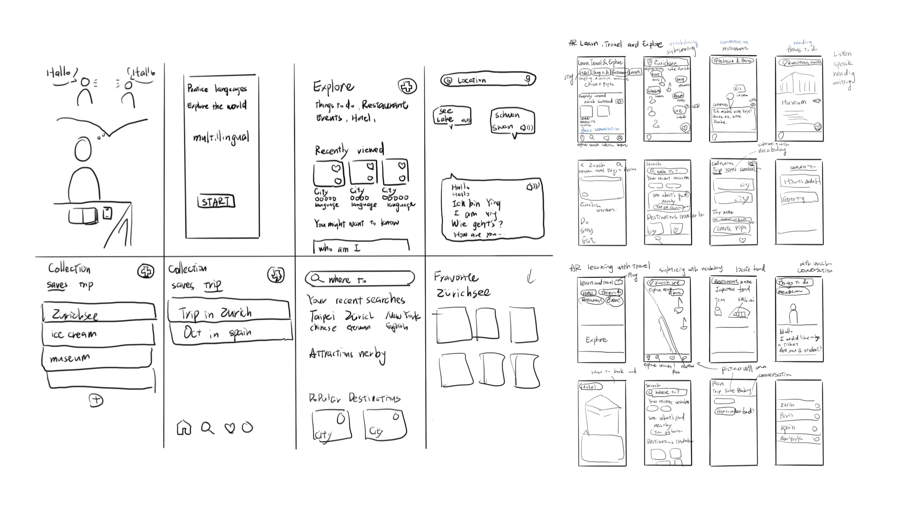

#### Low and mid Fidelity Prototype

In the low-fidelity prototype, I start with the user flow, the goal is to establish main layout, interaction, and flow.

In mid-fidelity prototypes, I focus on smooth navigation, feature discovery, and interaction behaviors.

<!-- * Default image -->

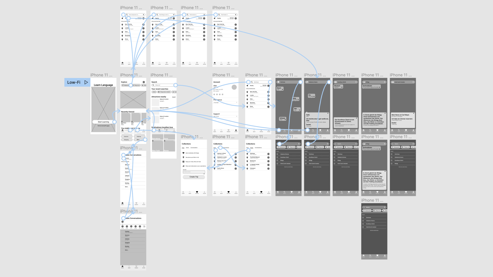

<!-- Hover image -->

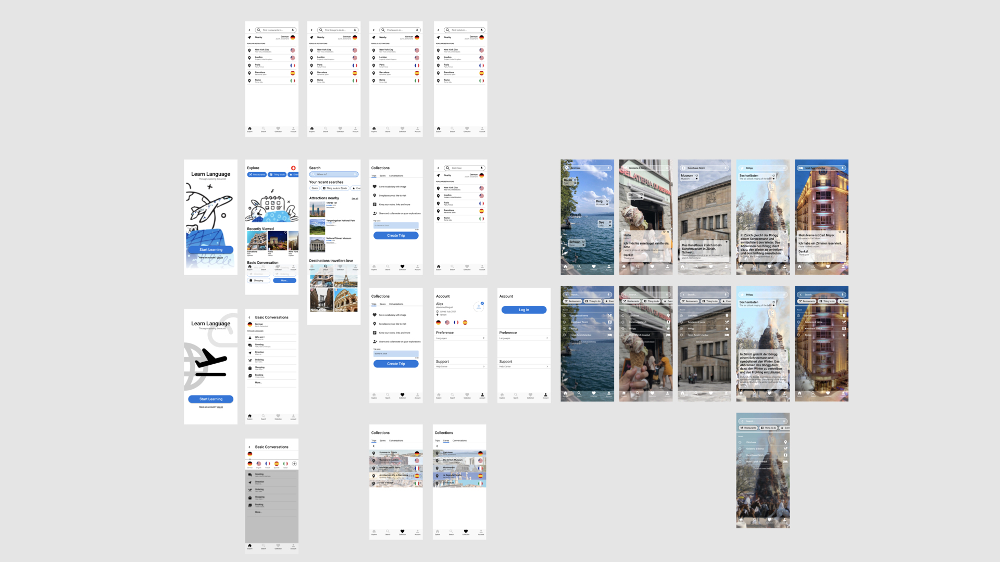

## Usability Study

Two rounds of usability studies guided design evolution:

1. Sign in and onborading

2. Home screen and explore the app

3. Search on Map

4. Observe with AR

5. Make notes

6. Learning pattern

#### Round 1 - Medium-fidelity prototype

##### Insight

###### Onboarding and user flow

- Prototype should be made more efficient or the task should be a little more detailed.

- Onboarding should to get understanding of users' preference, such as choosing languages, practice frequency and learning purpose.

- Switching between functions is confusing.

###### Search and Observe functions

- For a great searching and observing experience, Search on the map and Observe with AR should put on the homepage.

- Could have some instructions about the observe with AR, add vocabulary and conversation to the collections before start the function.

- Let users set their favorite tabs in addition to the default tabs.

###### Learning materials and others

- Finding Round 1 was difficult with this prototype, hence all the following tasks became confusing. But main functions still work.

- Practice with attractions help users to connect their memories.

- Whether Offer more tips of organize notes and learning.

#### Round 2 - High-fidelity prototype refined language switching, content presentation, and memory-linked learning patterns.

The second round will focus on future product trends

##### Insight

###### Learning materials and Languages

- Whether add more Materials on current functions?
  - Search on the map- Reading, Speaking
  - Observe with AR - Vocabulary

- Whether to provide material according to the learning pattern.

###### Interaction

- Create a new page for the new language when the user switches other languages during the search and watch functions.

## High Fidelity Prototype

Here is the multi-multi prototype on Figma.

## Main Feature

#### Get new vocabulary by observing with Augmented Reality

AR Vocabulary: Scan surroundings to learn object names and phrases, connecting environment with memory.

#### Learn daily phrases by searching on the map

Map Mode: Explore global locations to practice daily phrases and dialogues.

#### Read introductions and practice conversations based on attractions

Attraction Introductions: Read cultural and historical context, then practice dialogues.

#### Make your notes and associate with your memories

Personal Notes: Create memos that connect vocabulary, conversations, and phrases to real-life experiences for easy reference during your travels.

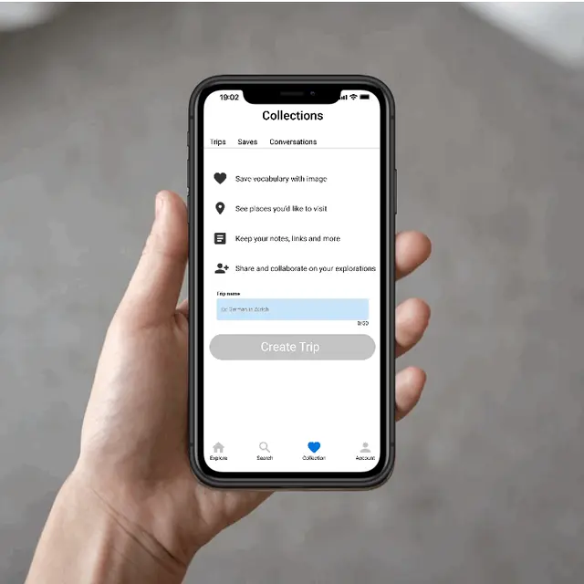

## Cross Platform

Supports mobile and web, maintaining consistent experience and learning pathways.

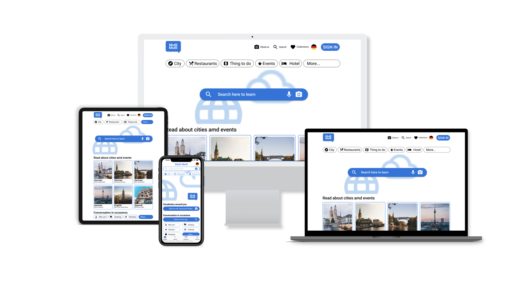

## Design System

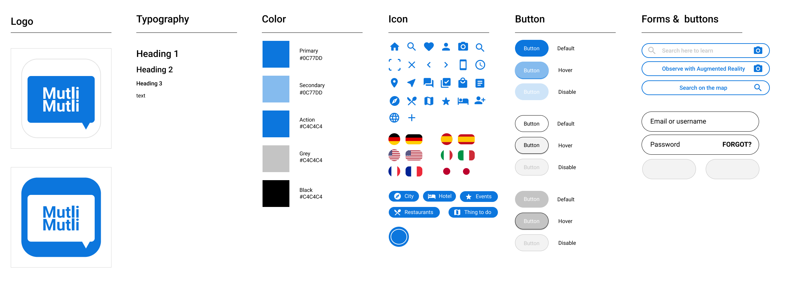

## Takeaways

#### Impact

The app keeps users motivated by tying language learning to exploration. Learners practice step-by-step in immersive contexts, reinforcing retention.

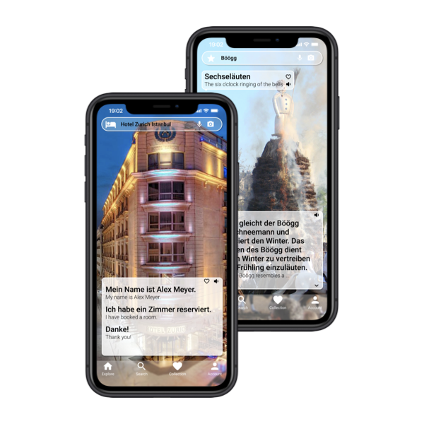

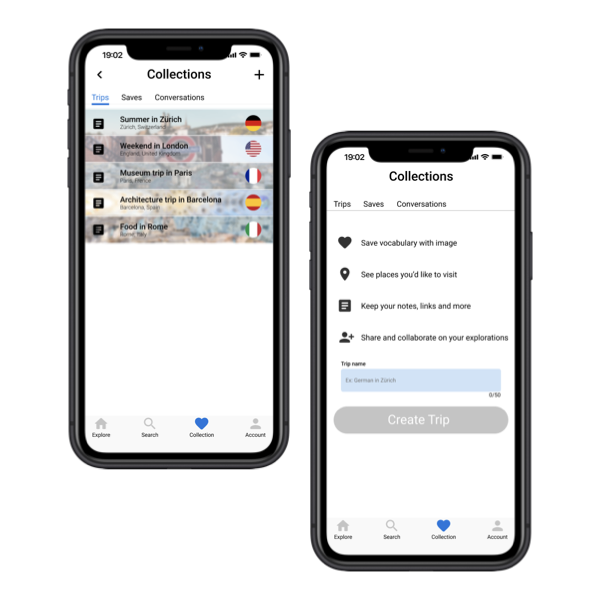

#### What I learned

Designing Multi-Multi reinforced the importance of integrating UX design with technical feasibility. AR and object recognition research taught me how to make designs practical while preserving user engagement. Aligning learning experiences with real-world context maximizes motivation and memory retention.

## Next Steps

#### Function and official event

- Introduce friend/social mode and collaborative events.

#### Usability testing

- Conduct usability tests for multilingual users to refine pain points

#### Content Updates

- Expand library: basic conversations, vocabulary cards, articles, attraction introductions.

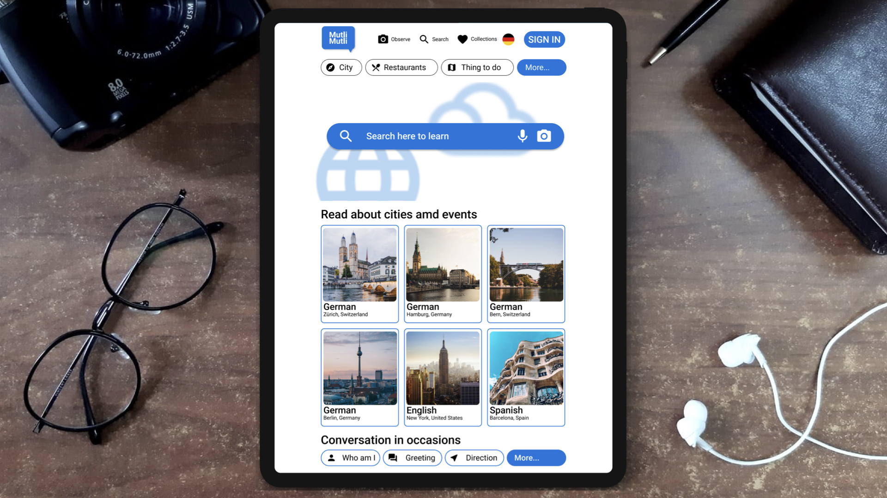

<iframe style="border: 1px solid rgba(0, 0, 0, 0.1);" width="100%" height="100%" loading="lazy" src="https://www.figma.com/embed?embed_host=share&url=https%3A%2F%2Fwww.figma.com%2Fproto%2FFhMhHhAU9LUR6iTYLXvz6X%2FMulti-Multi-App%3Fpage-id%3D150%253A1912%26node-id%3D150%253A3137%26viewport%3D463%252C530%252C0.09%26scaling%3Dscale-down%26starting-point-node-id%3D150%253A3137" allowfullscreen></iframe>

## Reflection

I’ve always been a self-taught learner, exploring skills from coding and robotics to languages. When I studied in Switzerland, I discovered that the simplest experiences—like learning food names at the supermarket—could make language learning tangible and memorable. This inspired Multi-Multi: an app that connects vocabulary and dialogues to real-world observations and travel experiences, allowing users to practice naturally and build confidence.

By tying vocabulary and dialogues to daily life and travel experiences, Multi-Multi demonstrates how UX design, technical research, and immersive AR can combine to create meaningful, memory-linked learning experiences. It reinforced the importance of breaking big problems into manageable steps, aligning design decisions with user needs, and creating solutions that are both practical and engaging.

