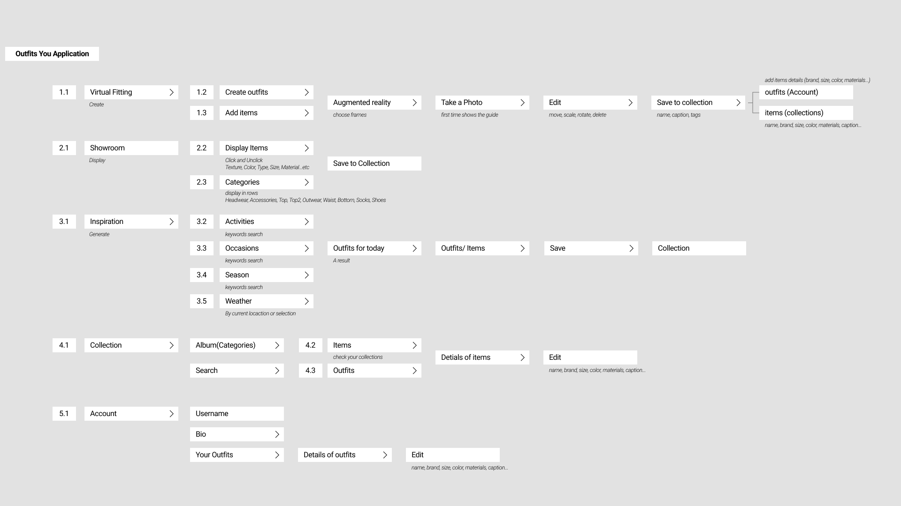

## Background

Thanks to the booming Internet, many shopping habits have shifted from brick-and-mortar stores to online shopping. Start-up brands start with small e-commerce businesses to save on rent retail. They want to provide a better shopping experience and maximize revenue with limited resources. Customers consider the texture, color, type, size, material, and price when shopping for fashion items, and they also want to know how clothes look on them. We want to connect brands and customers through virtual fitting room experiences and showrooms to address sizing and increase overall retail loyalty and customer fit confidence.

#### Challenge

How can we help people understand the texture, color, type, size, and material of clothes through virtual fitting and showrooms?

#### Solution

Design an augmented reality app, OUTFITS YOU, where people can find their style by creating and trying on clothes. Users can also get weather- and occasion-specific clothing inspiration through the brand's virtual showrooms.

#### A glimpse at behind the scene

Competitive Audit, User Research, Prototype, UI Design, Usability Testing

## Research

#### The Product's Goal

Help people explore different styles of clothing through virtual fittings and find out what suits them. Create showrooms of material details to enhance the fitting experience.

  

Look and Find

Get inspired by the weather or the occasion to find outfits you want to make.

Create and Explore

Create your own outfits and explore the Fashion Virtual Showrooms.

Try and Collect

Try them on in the virtual fitting room and learn more about fashion details.

## Technology Research

Given the technical challenges we face, we need to study current computer vision techniques and the feasibility of implementing this application.

#### We summarize the following requirements:

- The app should be able to use the camera to recognize body shapes, poses, and faces.

- Match clothes according to the user's body type in the virtual fitting room.

- Use on-device Camera, LiDAR, and Inertial Measurement Unit to measure the dimensions of items. (Simultaneous localization and mapping)

- Build a material preference database for digital showroom display materials, including textures, colors, types, sizes and materials, etc. 1. Automatically build when the user takes a photo of items. 2. Brands provide materials and assist them in building.

- Generate clothing suggestions based on weather, occasion, etc.

#### Open source Pose, Face Detection API
[YOLO](!https://github.com/WongKinYiu/yolov7), [TensorFlow](!https://www.tensorflow.org/),[ML Kit](!https://developers.google.com/ml-kit)

#### Augmented Reality API
[ARKit (LiDAR)](!https://developer.apple.com/augmented-reality), [Augmented Reality(iOS)](!https://developer.apple.com/design/human-interface-guidelines/technologies/augmented-reality/),[ARCore](!https://developers.google.com/ar)

#### Visual-Inertial Odometry(VIO)
[Understanding World Tracking](!https://developer.apple.com/documentation/arkit/configuration_objects/understanding_world_tracking)

## User

We focus on people who are interested in fashion design, targeting the younger and older generations.

#### Persona

Understanding Persona and Scenario was crucial to finding out users' needs (15 to 60+).

Millie is a passionate scientific researcher and she wants to know what style suits her. When she sees new fashion items, she needs to try different clothes.

Chris is a retired stylish professor who wants to keep up with trends. He needs to understand fashion because he can try new items and share his clothes on social media.

#### Takeaway

##### User needs
- Want to learn more details about clothes and trying on when shopping online or looking for a specific item.

- Easily get clothing inspiration for weather, occasion, and more.

##### Accessibility
- Intuition way and easy to access. The interface and interaction should be suitable for people of different ages.

- Whether to design the application cross-platform.

##### Identify
- Provide a way for brands to showcase virtually their products in more detail.

- A way to interact with customers and make them identify with the brand.

## Design

We start with a storyboard depicting how the user wants to dress on a specific occasion. Here we want to help brands showcase their products to customers and offer virtual try-on and digital showrooms.

#### Storyboard

1. The user is going to go hiking on a sunny day, what clothes is he thinking about?

2. He decides to buy something new for his excursion and searches the Internet.

3. He wants some inspiration and chooses the outfit you apply.

4. He uses weather and activity as references to get ideas. The app provided a costume at his request.

5. He wants to buy a new product and know more details. He took a photo online and used creative patterns to combine it with clothes he already owned.

6. In the fitting room mode, he can see what the clothes look like on him. Each item can be edited.

7. He discovered that there was a digital showroom to get more detailed information about each item.

8. The user is satisfied with the outfits and wants to use the application next time.

## User Flow & Information Architecture

#### User Flow

In the user flow, we know that there are three main actions, creating outfits, browsing items, and getting ideas. Users can edit and save their favorites to collection at the end of each function. Here, we built a generative preference system to help users and brands figure out what's right for each other. To create clothing features, we use detection and measurement systems to understand the dimensions of body and items.

#### Information Architecture

Starting from technical research, we have organized three main functions, virtual fitting room, showroom and clothing inspiration. In information architecture, we elicit the goals, processes, and actions of each function. In the user flow, we'll dive into that user's interaction with each feature.

## Prototype

#### Paper Wireframes

Paper wireframes help organize the main layout, interactions, user flow, and UI design. I can quickly iterate to find a suitable layout, then think about the main user flow.

#### Low Fidelity Prototype

In the low-fidelity prototype, I start with the user flow, the goal is to make sure the user can smoothly switch between each feature. In mid-fidelity prototypes, I focus on details of functionality and interaction behavior. Then go for the first usability study.

<!-- * Default image -->

 

<!-- Hover image -->

## Usability Study

I conducted two rounds of usability studies. Findings from the first study helped guide the designs from wireframes to mockups. The second study used a high-fidelity prototype and revealed what aspects of the mockups needed refining.

#### Round 1 - Findings

1. Users want to create outfits intuitively

2. Users want to find inspiration precisely for daily outfits

##### Insight

1. Design the frame as a reference to help users take photos of items to scale.

2. Add search functions and sort by a few main categories, such as outfits, items, tags, and occasions.

#### Round 2 - Findings

1. Users want tips to help create outfits and add items

2. Users are not sure about details they should add for outfits or items to build a collection.

##### Insight

1. Add tips and tutorials to guide users.

2. Setup default categories for users to add details and a function for users can add more categories by themselves.

## High Fidelity Prototype

Here is the multi-multi prototype on Figma.

## Main Feature

#### Create outfits and save them to collections

## Takeaways

#### Impact

The application gives users an intriguing way to find out what suits them. They explore styles of outfits and clothes through Augmented Reality. It also inspires people to dress according to the occasion and weather.

#### What I learned

While designing the OUTFITS YOU app, I learned that the first ideas of the application were just the beginning of the process. Usability studies and peer feedback influenced each iteration of the app’s designs. I can aim at the users' need to design and make the application more accessible.

## Next Steps

#### Function

- Create a searchable database for users to find other people's clothing in the app.

#### Usability testing

- Follow-up usability testing of new applications.
- Identify the gap between digital and physical connectivity

#### Looking forward to next insight...

## Reflection

I have always been interested in emerging technologies and their applications in the industry. In this project, I researched to design a good AR application for users. After in-depth research, I transformed the similar design criteria and methods in my robotic arm project into this AR project. Such as environment, movement, interaction, initialization, and from digital prototype to physical experience. Continuous acquisition of knowledge, allows me to understand the problem and motivates me to integrate the knowledge I have learned into different fields. I look forward to the next challenge.

