

## Background

As e-commerce continues to grow, especially for small fashion startups, customers increasingly rely on digital channels to understand clothing. Yet many users still struggle with evaluating **texture, fit, color accuracy, body type compatibility, and styling** online.

Brands want to offer richer experiences without the cost of physical retail, while users want more confidence before purchasing.

**Outfits You** aims to bridge this gap by creating an **AR-driven virtual fitting room** and **digital fashion showroom** where users can try on pieces, explore material details, and experiment with creating outfits.

#### Challenge

How might we help users understand the **texture, color, size, fit, and material** of clothing through a virtual fitting and showroom experience?

#### Solution

An AR-powered app where users can:

- Virtually try on clothing
- Create and customize outfits
- Explore digital showrooms for material details
- Receive outfit inspiration based on **weather, occasion, and personal style**

#### A glimpse at behind the scene

Competitive Audit · User Research · UX Design · Prototyping · AR Feasibility Study · Usability Testing

## Research

#### The Product's Goal

Enable users to confidently explore clothing styles through:

- AR try-on
- Custom outfit creation
- Material exploration
- Occasion-based or weather-based inspiration

  

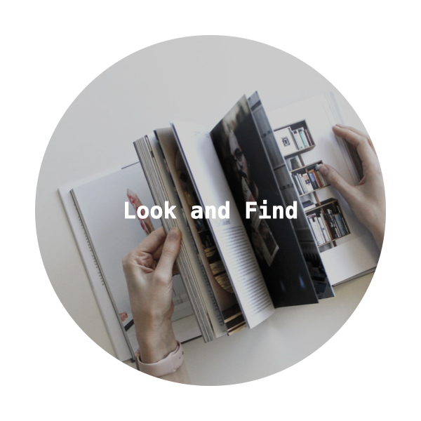

Look and Find

Get outfit ideas based on weather, seasons, and activities.

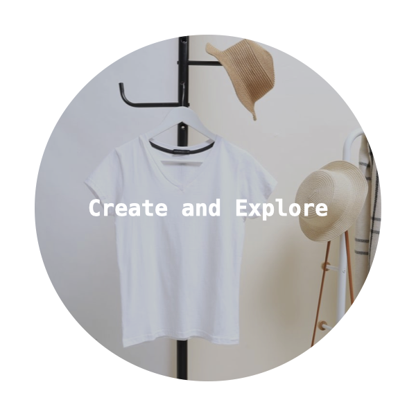

Create and Explore

Build your own outfits and browse interactive digital showrooms.

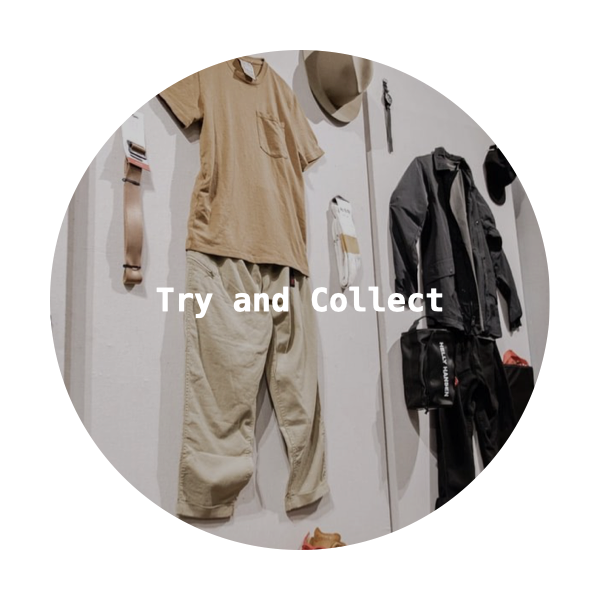

Try and Collect

Try items on via AR and learn about their materials and details.

## Technology Research

To understand the feasibility of AR virtual try-on, I explored existing computer vision and AR tools.

#### We summarize the following requirements:

- Detect body shape, pose, and face using the device camera
- Match clothing items to the user’s proportions
- Use LiDAR + IMU for accurate measurement (SLAM)
- Build a material preference database (texture, color, type, size)
- Generate outfit suggestions depending on weather and context

#### Open source Pose, Face Detection API
[YOLO](!https://github.com/WongKinYiu/yolov7), [TensorFlow](!https://www.tensorflow.org/), [ML Kit](!https://developers.google.com/ml-kit)

#### Augmented Reality API
[ARKit (LiDAR)](!https://developer.apple.com/augmented-reality), [Augmented Reality(iOS)](!https://developer.apple.com/design/human-interface-guidelines/technologies/augmented-reality/), [ARCore](!https://developers.google.com/ar)

#### Visual-Inertial Odometry(VIO)
[Apple World Tracking documentation](!https://developer.apple.com/documentation/arkit/configuration_objects/understanding_world_tracking)

## User

Target audience spans ages **15 to 60+**, focusing on anyone exploring personal style or looking for a more confident online shopping experience.

#### Persona

Millie, a researcher, wants to experiment with new styles and understand what suits her before purchasing.

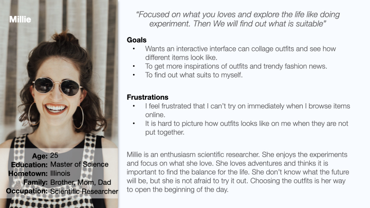

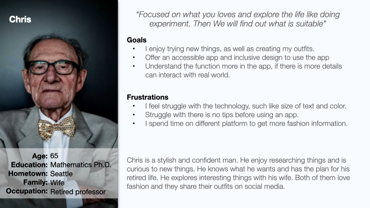

Chris, a retired professor, enjoys staying stylish and wants a simple way to explore fashion and share looks online.

#### Takeaway

##### User needs
- Understand clothing materials, texture, and fit digitally
- Get inspiration based on weather, events, or style preferences

##### Accessibility
- The interface must be intuitive for users across a wide age range
- Cross-platform accessibility is highly valuable

##### Brand–User Connection
- Brands need more interactive ways to showcase items
- Users want to feel confident and informed before buyin

## Design

The design process began with a storyboard illustrating how a user might plan an outfit for a specific occasion using Outfits You.

#### Storyboard

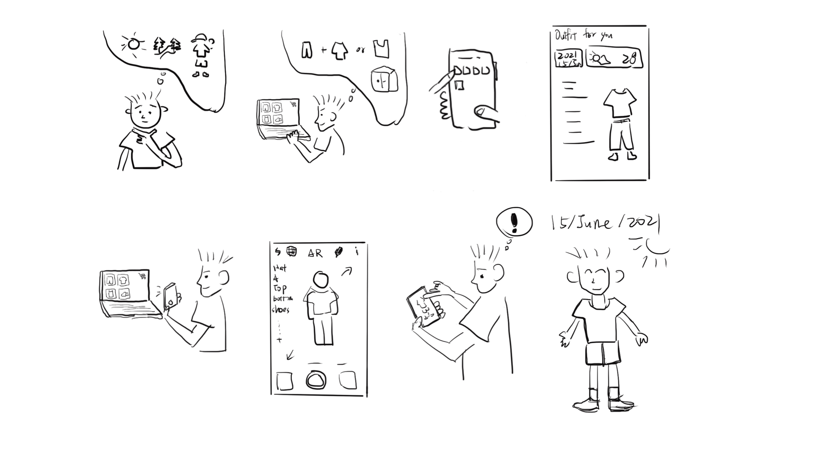

1. The user plans a sunny-day hiking trip and wants to choose the right outfit.

2. He decides to buy something new for his excursion and browses online for ideas.

3. He opens Outfits You for more inspiration.

4. The app suggests outfits based on activity and weather.

5. He selects an item, photographs similar clothing, and mixes it with pieces he already owns.

6. In AR fitting mode, he sees how the outfit looks on his body.

7. He visits the digital showroom for material details.

8. Satisfied, he saves the outfit and continues using the app.

## User Flow & Information Architecture

#### User Flow

Users navigate through three core actions:

1. Create outfits
2. Browse fashion items
3. Get personalized inspiration

A generative preference system helps match user style with brand offerings. Body and item measurements support more accurate outfit creation.

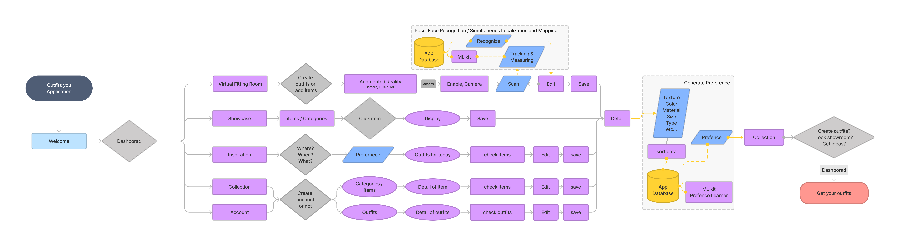

#### Information Architecture

The IA organizes the app around:

1. Virtual Fitting Room
2. Digital Showroom
3. Inspiration Hub

Each function includes clear goals, user actions, and content types. This structure informed UI decisions and guided feature prioritization.

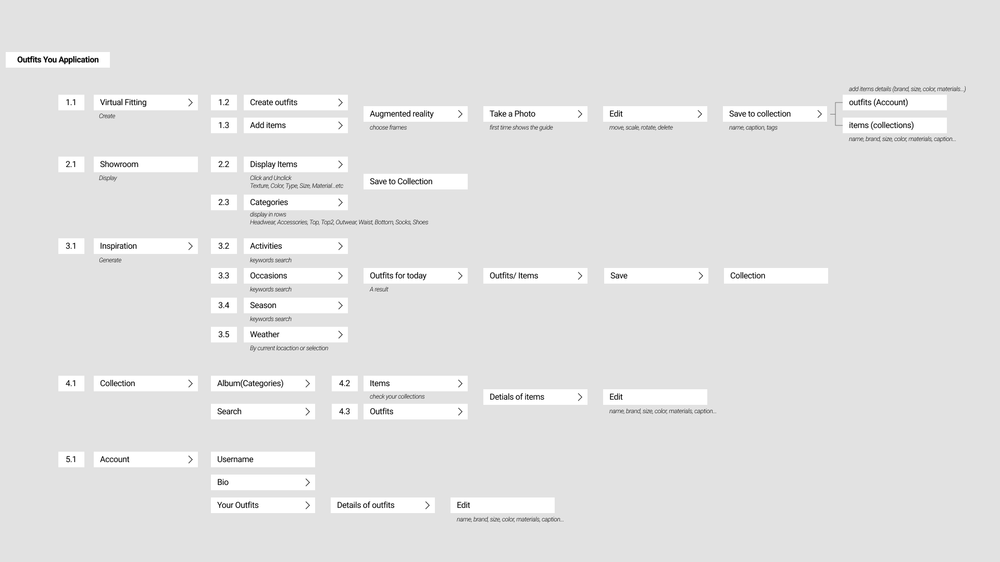

## Prototype

#### Paper Wireframes

These helped quickly explore layouts, interaction patterns, and core flows.

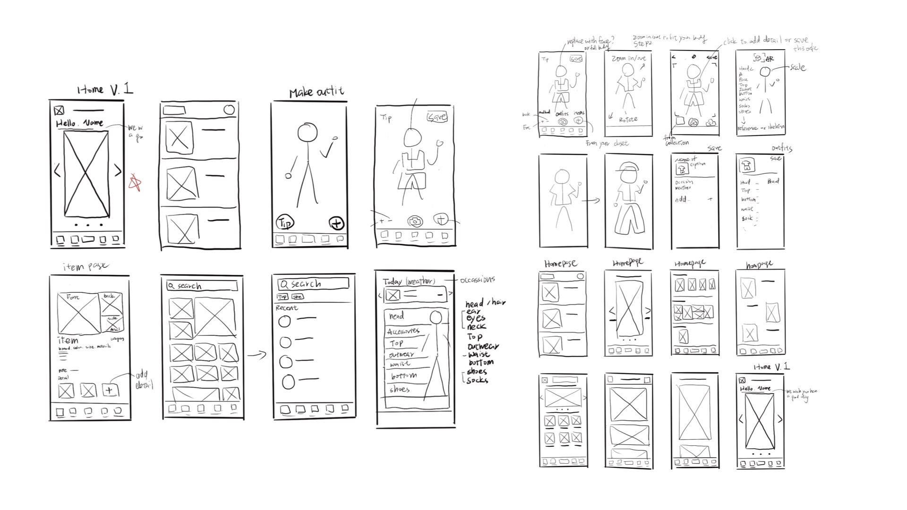

#### Low Fidelity Prototype

The early prototypes ensured the core interactions—switching between features, adding items, creating outfits—were intuitive. Mid-fidelity iterations refined details before usability testing.

<!-- * Default image -->

 

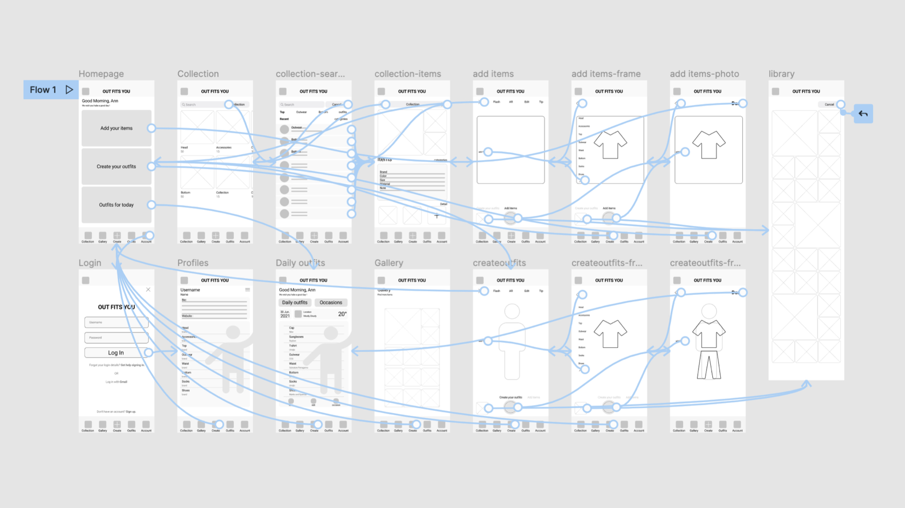

<!-- Hover image -->

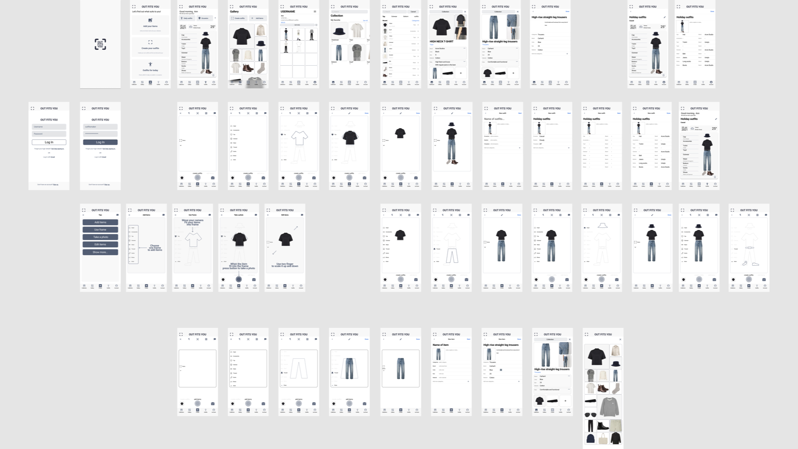

## Usability Study

Two rounds of user testing shaped the design.

#### Round 1 - Findings

**What users struggled with:**

1. Creating outfits intuitively

2. Finding precise inspiration

##### Insight

1. Add a frame reference to help capture item photos to scale

2. Add search + sorting (outfits, tags, occasions, item types)

#### Round 2 - Findings

**What users needed:**

1. Users want tips for adding items and creating outfits

2. Clear guidance on how to build collections for users

##### Insight

1. Add onboarding tips and mini tutorials

2. Use default clothing categories, allowing users to add custom ones

## High Fidelity Prototype

Here is the multi-multi prototype on Figma.

## Main Feature

#### Create outfits and save them to collections

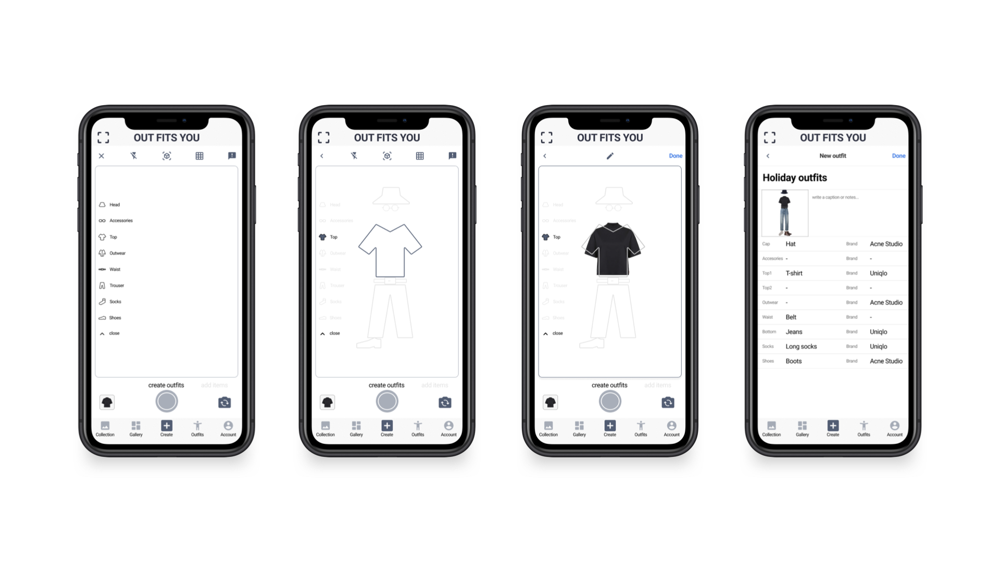

## Takeaways

#### Impact

Outfits You gives users an engaging way to understand what suits them—visually, realistically, and interactively. AR try-on encourages experimentation, while contextual suggestions help users dress with confidence.

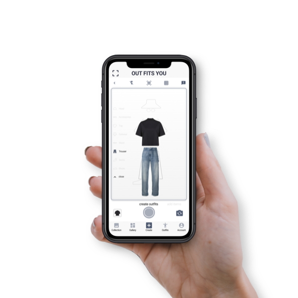

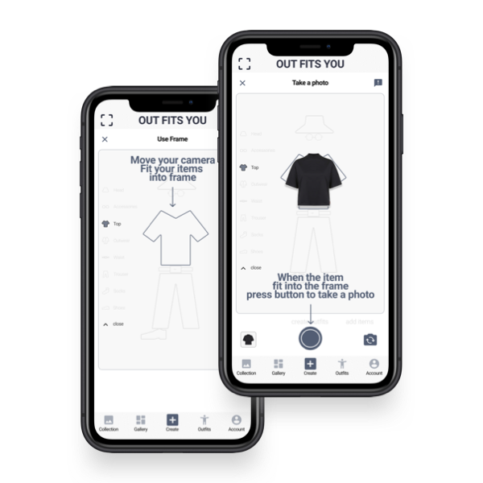

#### What I learned

This project taught me how initial concepts evolve significantly through usability testing. Repeated feedback cycles sharpened the interaction design, made features more accessible, and ensured the experience aligned with user needs.

## Next Steps

#### Functionality

- Build a searchable community outfit database

#### Usability testing

- Conduct follow-up testing on new features
- Study the relationship between physical garments and their digital representations

#### Looking forward to next insight...

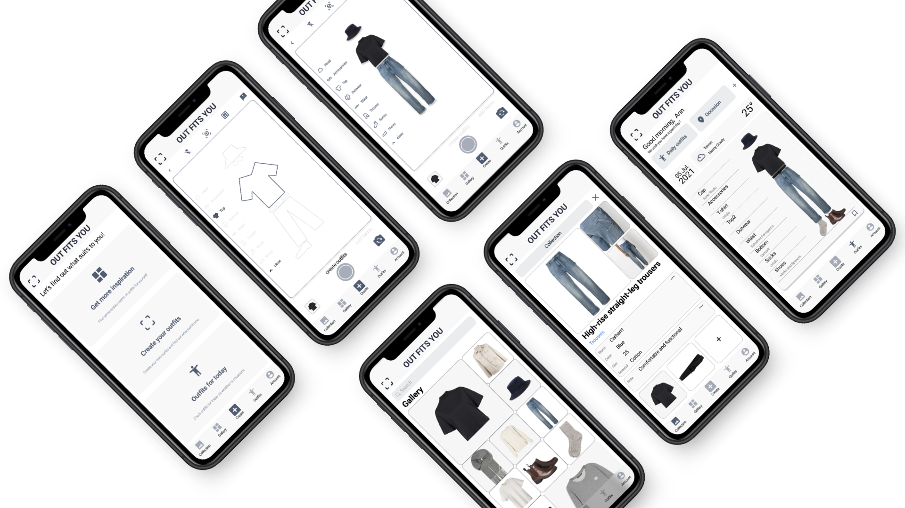

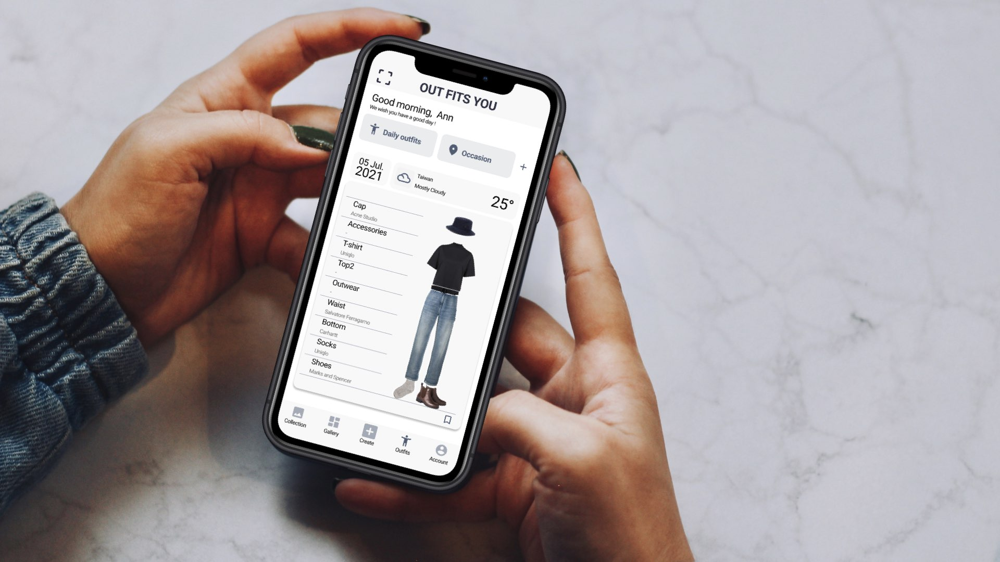

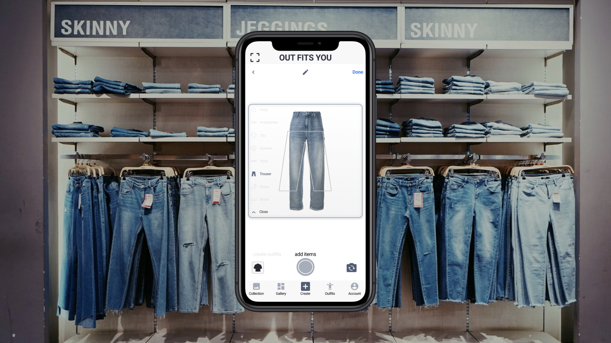

## Reflection

I’ve always been drawn to emerging technologies and how they can reshape everyday experiences. In this project, I explored AR through the lens of fashion retail and applied principles I previously developed in my robotic arm project—such as environmental awareness, interaction flow, motion behavior, and bridging digital systems with physical experiences.

This project strengthened my ability to combine technical understanding with user-centered design. Each iteration reinforced how cross-disciplinary thinking leads to more meaningful and innovative solutions. I look forward to continuing this learning journey and taking on the next challenge.

