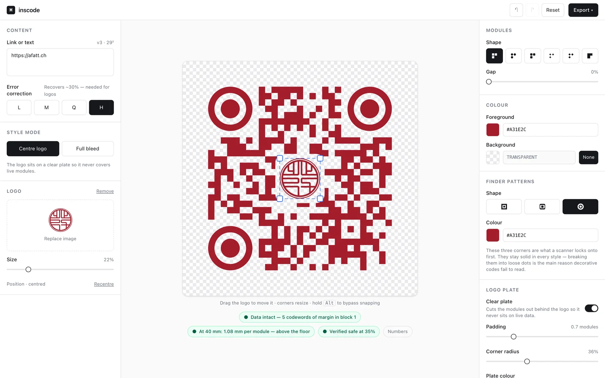
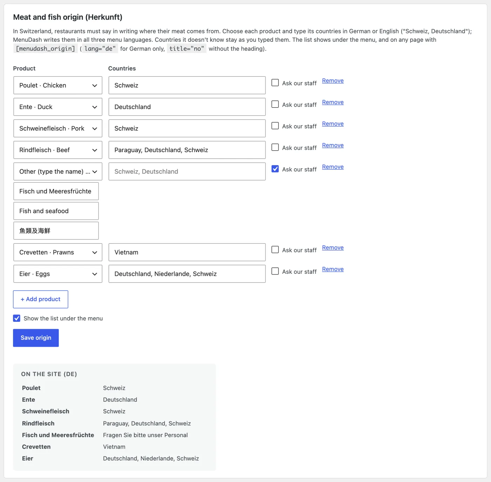
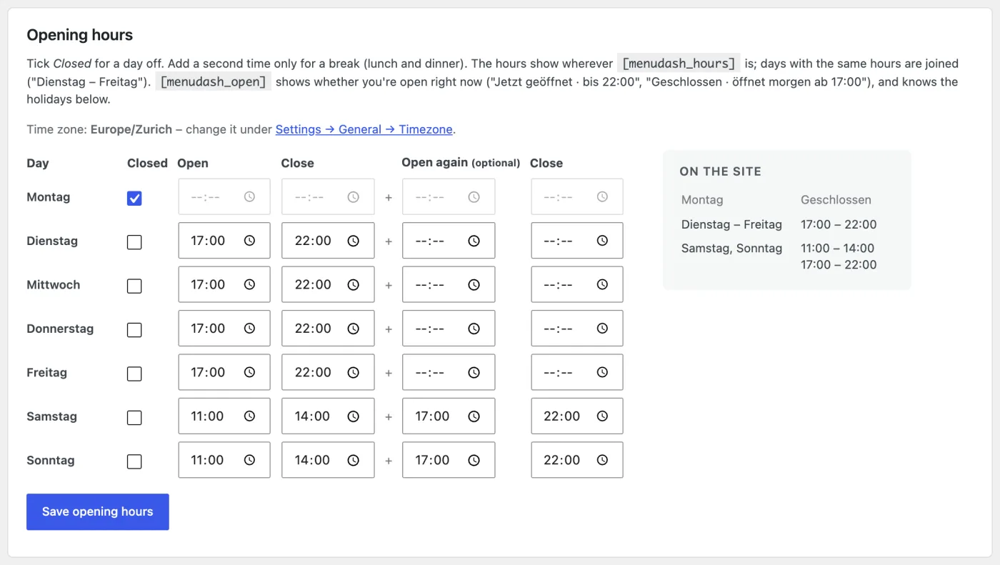
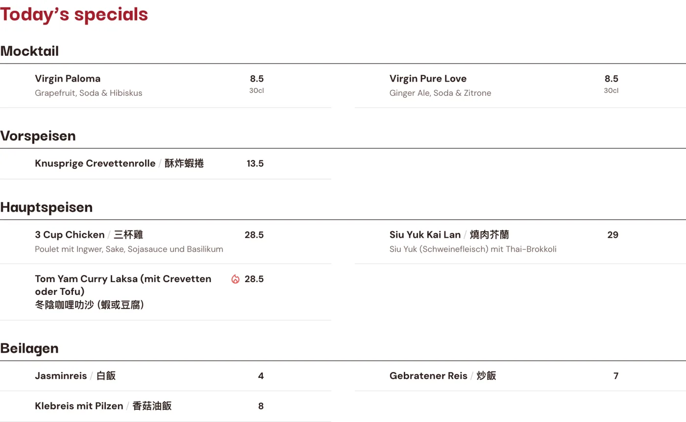
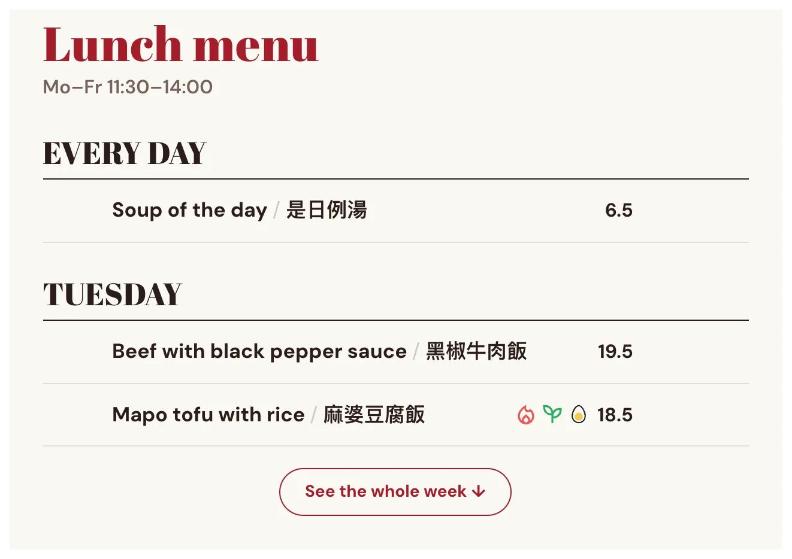
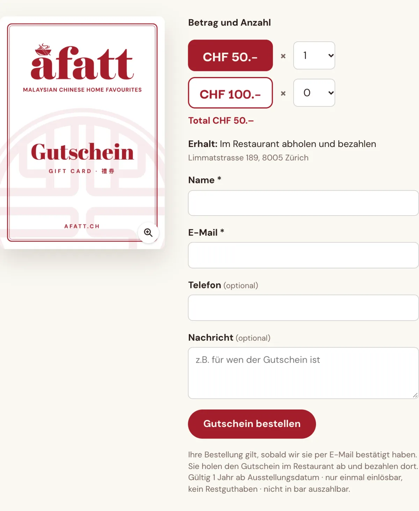
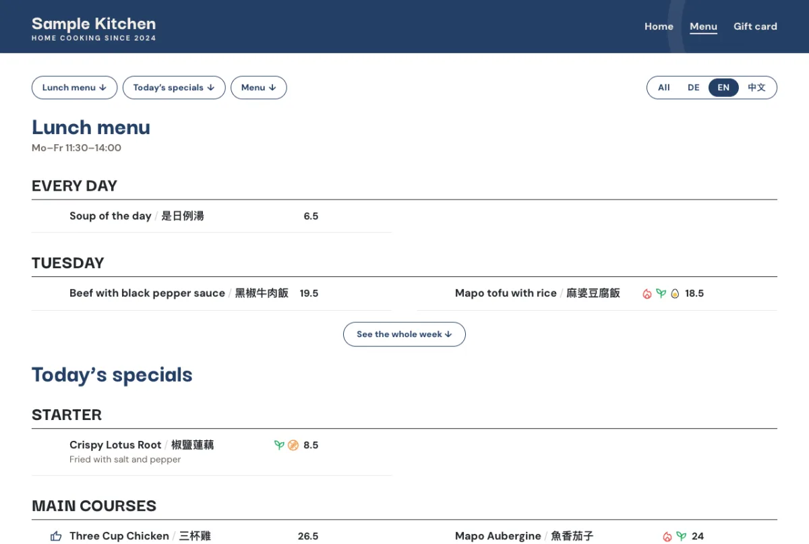
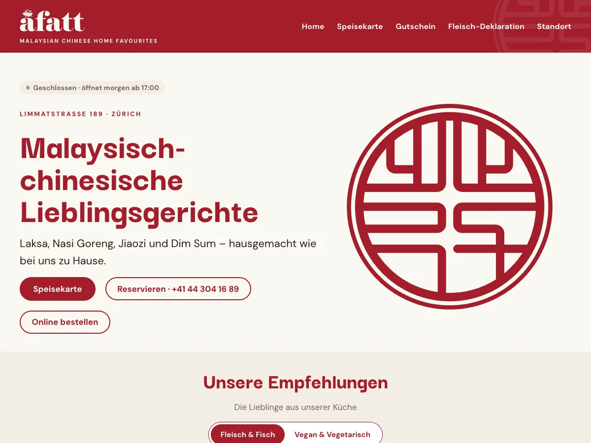

## Overview

A Fatt is a Malaysian Chinese restaurant in Zürich. Across two jobs for them, the same few questions kept coming back, and each time I stopped answering by hand and built the tool. This page is those four tools, and the job that started them.

| Tool | The question it answers | Where it stands |
| ---- | ----------------------- | --------------- |
| **[inscode](https://github.com/yingshiuan/inscode)** | Will a QR code with their logo in it still scan, printed? | Public. Their flyer is printed and scans |
| **Logo rebuild + vectoriser** | Will the logo hold at A2? | The script made their logo set; the vectoriser is private |
| **[menuGen](/yingsc/projects/menu-generator)** | Why am I redoing this layout every time a price changes? | Live, my own. No users yet, and A Fatt isn't one |
| **[MenuDash](/yingsc/projects/menudash)** | Is the menu on their website up to date? | Core public, paid for by the client, and running their menu page |

#### Key Highlights

- **Every tool started as a question from a paying job,** not as an idea looking for a user.
- **Each one checks with a machine, not by eye.** A decoder reads back every QR file, a parity suite holds the vectoriser to the script, and a validator refuses a broken menu file.
- **The print work is code too.** The client's A2 posters, gift cards and name cards come from one TypeScript dish list, so a price changes in one place.
- **I didn't sell them more software than they needed.** The menu system they run is theirs, and when I showed them menuGen, they kept it.

## The Job That Started It

**2024: "redo the menu".** I surveyed the restaurant's diners and tested printed drafts with them at the table, then handed over a trilingual, diet-tagged menu system in Canva that the staff maintain without a designer. That was on purpose: no retainer. Two years on they still run it, and it took a new dessert section without a redesign. The full research and design process is in the [original case study](/yingsc/projects/afatt).

**2026: they came back.** A paying job this time: a dessert section, an exterior flyer with a QR code, two A2 posters (the recommended dishes, and every vegan and vegetarian dish), gift cards and name cards. I built the new pieces as code:

- **Every piece is an HTML and CSS page at its real print size,** with the brand's colours and fonts in one shared stylesheet.
- **The dish list is one TypeScript file.** Mark a dish as a pick and it joins the recommendations poster; tag it vegan or vegetarian and it joins the veggie poster, as a photo card if it has a photo and in the list if it doesn't.
- **The types stop a malformed dish before the export does,** and a page that overflows draws a red dashed outline on screen before anything reaches a printer.
- **A small Python script renders every page in headless Chrome** to a print PDF and a PNG, plus a version tiled across four A4 sheets for proofing at real size.

The 2024 menu is the staff's to edit. These pieces are mine to maintain. That line was drawn on purpose in 2024, and it held.

## Tool 1 · inscode: Will the Code Still Scan?

#### The question

The flyer hangs outside the restaurant, with a QR code carrying their logo. A logo eats a QR code's error correction, and a code that has gone over the line still looks fine on screen. It fails at the printer or on the wall. I could check that by printing and scanning, over and over, or I could measure it.

#### What it checks

- **The error-correction headroom as the logo grows,** so the coverage limit is a number, not a guess.
- **The module size at the chosen print size,** because a code that scans on a screen can fail on a wall.
- **Every file it writes, read back by a real decoder** before the export counts as done. The repo's rule: *nothing is written that has not been read back*.

My own check fooled me once. Early on, a design decoded perfectly at a tiny size. The test renderer draws perfect geometry and the decoder recovers it at a resolution no phone camera could manage, so the test was measuring the renderer, not a scanner. I found it by shrinking the size until it failed and asking where the pass had come from.

#### Where it stands

Public on [GitHub](https://github.com/yingshiuan/inscode). The flyer is printed and its code scans with a phone. I built it with agentic coding: I wrote the specification and checked every result, and the model wrote most of the code. It is a tool for one client job, not a product.

## Tool 2 · Logo Rebuild and Vectoriser: Will It Hold at A2?

#### The question

A poster at A2 needs a logo that stays sharp at any size.

#### What it does

I rebuilt their logo in Python: the seal from true circles and arcs, and the wordmark traced and refitted. That script produced the logo set the posters use. Afterwards I generalised it into a browser vectoriser for other clients' logos, one that never uploads the image anywhere. Its port is held to the original script by a parity suite that has to agree within a hundredth of a pixel.

#### Where it stands

The script did the client's job. The vectoriser is private and hasn't been used on a client job yet, which is why it gets the shortest section here.

## Tool 3 · menuGen: Why Am I Redoing This Layout?

#### The question

Designing the 2024 menu showed me the part a handover can't remove. Every price change is still layout work, even in Canva, and I had done that layout by hand.

#### What it does

[menuGen](/yingsc/projects/menu-generator) is my own tool: a menu spreadsheet in, a print-ready PDF out, with the editable preview being the document that prints. The 2026 job sent it somewhere narrower. The restaurant asked for a vegan and vegetarian menu next to its English and German ones, and three menus mean one price change is three edits, with one sooner or later missed. Its September releases print every language and every diet version from one sheet, and testing them on the restaurant's real menu found two bugs the sample never had.

#### Where it stands

Live at [menugen.insdash.ch](https://menugen.insdash.ch), with no users yet. A Fatt looked at it and kept the system I had handed them. I read that as the handover working: the thing I built to outlive my involvement was tested against a replacement I wrote myself, and it held. The full story is on its [own page](/yingsc/projects/menu-generator).

## Tool 4 · MenuDash: Is the Website Up to Date?

#### The question

Guests already read the menu on their phones, as PDFs opened from a QR code that don't fit every screen. Instead of handing each guest the English, the German or the vegan and vegetarian menu, why not put all of it on the website and let the guest choose? That menu should come from the same spreadsheet as everything else, and the owner, not me, has to be able to update it. Their site already runs on WordPress, so the answer wasn't a new product. It was a plugin for the tool they already log into. And where menuGen fixed the work behind the menu, which is why they kept Canva, this changes what their guests see, and a restaurant judges a menu by that.

#### What it does

The owner uploads the menu sheet in the WordPress dashboard, as a CSV or straight from Excel. Guests read it in German, English and Chinese, together or one at a time, and filter it by diet. It is real HTML, so it works without JavaScript and search engines can read it. It also prints the meat and fish origin list Swiss restaurants have to give, in all three languages, and makes QR table cards that link to the menu.

What I cared about most is what happens when the file is wrong, because the person uploading it isn't the person who designed the data:

- **Every upload gets a green, yellow or red report.** A red file is refused, so the old menu stays online.
- **It checks for the mistakes a restaurant actually makes:** the wrong encoding (the Chinese would be lost), the wrong file entirely, two dishes sharing a number, and the same dish listed twice with different diet marks. It already finds one of those in their real menu.
- **The last five uploads can be put back with one click.**

A wrong file costs the owner a message, not the website.

I also wrote an owner guide with a screenshot of every step. The plugin is open source, and one export writes both the restaurant's install and the public repository, refusing to write the public copy if anything identifying the client appears in it.

#### From one plugin to a core and add-ons

Once the menu worked, the rest of what guests check on a restaurant's site was the same problem: opening hours, a holiday closure, today's specials, gift cards. Each is something the owner changes and forgets to change in the other places. So I built them on the same dashboard page, and then had to decide how to sell them.

My first plan was one package at a lower price. But a small café only needs the menu, and a full restaurant wants all of it. One price fits neither. So I split it along the same line as the customers: **the core is free, and four add-ons are paid, each working on its own.** The code is split the same way. Each add-on plugs into the core through its own hooks and shows nothing when it isn't installed, and a browser test runs the core alone and each add-on without the others.

#### The core (free): the menu, and what the law and the tables need

Beyond the menu itself, the core carries two things every Swiss restaurant needs. The **meat and fish origin list**, which restaurants here have to give in writing: the owner picks a product and types its countries once, in German or English, and MenuDash writes it in all three menu languages under the menu. And **QR table cards**: four A6 cards on an A4 sheet, or one A4 poster, with the logo, the menu link, a tip in the menu's languages, and optionally a Wi-Fi code guests join by scanning. The codes are drawn in the browser, so no outside service is involved.

#### Add-on · Restaurant: details, hours and holidays

The restaurant's details are entered once: address, phone, e-mail, how to get there, the delivery and reservation links, social links. Everything else on the site reads them from here.

- **Opening hours with time pickers,** a row per weekday with a *Closed* tick and an optional second time for a lunch break. Days with the same hours are joined ("Dienstag – Freitag"), so nothing has to be typed in a format.
- **An "open now" badge** in the site's time zone: "Open now · until 22:00", "Closed · opens tomorrow at 17:00", or "Closed for holidays today", because it knows the holidays too.
- **A holiday notice that runs itself.** The owner enters the first and last day. The notice appears 60 days ahead in all three languages, changes while the restaurant is closed, and disappears afterwards. Nobody has to remember to take it down.
- **Blocks for the WordPress editor** (Open now, Opening hours, Contact) and the data Google shows about the restaurant.

#### Add-on · Specials: today's dishes and the week's lunch

Two short spreadsheets beside the menu, with the same columns and the same checks. **Today's specials** show above the menu in the same style and languages; the last five files are kept, and one click takes the specials off the site. **The lunch menu of the week** has the weekdays as headings: the page shows today's lunch (or the next day's) with the whole week one tap away, and a "Served" line under the title. Both can also come in the same Excel workbook as the menu, each from its own sheet.

#### Add-on · Gift Cards: orders by e-mail

A picture of the card and an order form. Guests pick an amount and how many, and choose to pick the card up and pay at the restaurant or get it by post after paying in advance. The order arrives as an e-mail, with a copy to the guest, and the restaurant confirms by replying. **Nothing is paid online.** The owner can pause orders (over the holidays, or when the cards run out) and send a test e-mail to check the site can send mail at all. Spam is stopped by a hidden field, a signed minimum time, a link filter and limits per visitor and per day, with Cloudflare Turnstile as an option. None of it needs a session, so the form still works on a cached page.

#### Add-on · Statistics: which dishes guests look at

A dish counts as seen when half of it stays on screen for two seconds, and a photo when it is opened. Counts are kept per dish and per day, with no cookies and no IP address stored; Do Not Track is honoured, the owner's own visits aren't counted, and a dish keeps its count across menu uploads. It measures attention, not orders, and it isn't on A Fatt's site yet, so there is no data to show.

#### A theme that holds no data

A restaurant's phone number usually lives in five places: the header, the footer, the contact page, a button, the map. I built a block theme that stores none of them. Address, phone, hours and delivery links are drawn from MenuDash on every page view, and the Reserve, Order and Directions buttons are WordPress's own, linked to MenuDash and hidden while that detail is empty. The owner changes the phone number once, and saving a page in the editor can't freeze an old one into it. There is a public *MenuDash Theme*, and a version made for A Fatt.

#### Where it stands

I proposed it, the owner agreed, and A Fatt paid for the core. The core runs the [menu page on afatt.ch](https://afatt.ch/menu/). The add-ons and the theme are built and not on their site yet. The core and theme are public on GitHub ([MenuDash](https://github.com/yingshiuan/menudash), [MenuDash Theme](https://github.com/yingshiuan/menudash-theme)); the add-ons are private and set up for restaurants through insdash. A Fatt is the only restaurant running it so far. The full story is on its [own page](/yingsc/projects/menudash).

## What I Took From It

- **A test can pass for the wrong reason.** The QR check that passed at a size no phone could read taught me to ask where a pass comes from.
- **The handover is the product.** The 2024 system still runs without me, and that is why the client trusted me with the rest.
- **I'd have watched the owner sooner.** menuGen took four months of building to show what handing the owner a price change in week two would have: a spreadsheet suits someone who already keeps their menu as data, and theirs lived in Canva. MenuDash started from the tool they already use.

#### Where I Stopped

The obvious next step would be one system for all of it: menu, posters and website. The one time I offered a replacement, the restaurant kept what they had, and I take that as the answer. The tools stay separate. MenuDash is the one that grew, because its question isn't specific to one restaurant. Whether they will pay for the answer is still open: so far, A Fatt is the only one.

