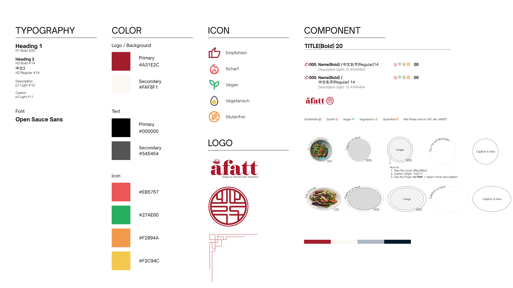
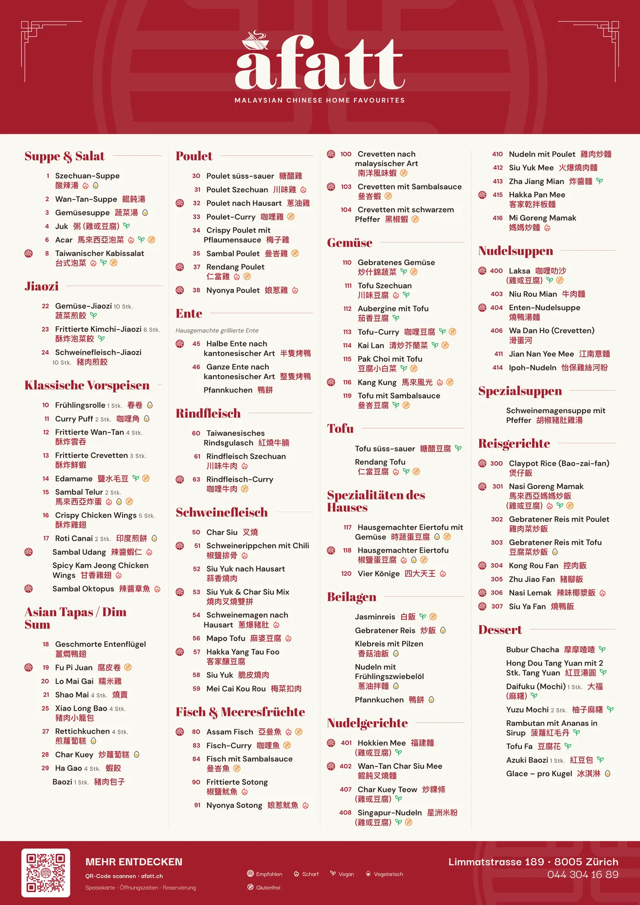

<div class="contentSection">

## Overview

A Fatt is a Malaysian Chinese restaurant in Zürich. In 2024 they asked me to redo their menu. Two years later they came back for new work, and this page is what happened across both: one client's brief, and every tool the work turned out to need.

It reads as a sequence because it happened as one. Each tool on this page started with something I watched someone struggle with, and most of the time that someone was me.

#### Key Highlights

- **Designed myself out of the job, on purpose.** The 2024 menu system was handed over so the staff never need a designer. Two years on they still update it themselves.
- **The print work is code.** Their 2026 A2 posters, gift cards and name cards are generated from one TypeScript dish list, so a dish changes in one place and every poster built from that list follows.
- **A QR code checked by a decoder, not by eye.** Their flyer carries a QR code with their logo in it. The tool I built for it reports how much of the code the logo is using up, and reads back every file it writes.
- **The layout I kept redoing became a tool of my own.** That tool is [menuGen](/yingsc/projects/menu-generator). A Fatt looked at it and kept the system I had handed them, which is the handover working.
- **The same spreadsheet, on their website.** MenuDash is an open-source WordPress plugin: the owner uploads the menu sheet, and a wrong file gets a report and a rollback, never a broken page.


#### The Problem

A restaurant menu is never finished. Prices change, dishes come and go, and every version exists in several places at once: the printed menu, the posters, the website, the English copy and the German one. None of that work is hard, which is exactly why it drifts back to a designer every few months, or quietly goes out of date.

#### The Solution

Keep the menu as data, and make everything else a view of it.

```
2024 · research → a menu system the staff run themselves
2026 · one dish list → A2 posters · gift cards · name cards
       the flyer's QR code → inscode (measured, then decoded)
       the layout I kept redoing → menuGen (my own)
       the same spreadsheet → MenuDash (their website)
```

</div>

<div class="contentSection">

## The Brief Was "Redo the Menu"

The brief was one sentence, and the constraints that mattered were never in it. A Fatt is a family business that isn't trying to expand. They had been let down by designers before, and nobody visits a restaurant for the menu. So the job was to work out what the menu actually had to do, and then make something that didn't need me.

I surveyed their diners and built three personas from the answers, alongside a look at how other Zürich restaurants present their menus. The survey showed that Zürich diners read the menu in different languages and eat in different ways, so the menu is trilingual (German, English, Traditional Chinese) and every dish carries its diet: vegan, vegetarian, gluten-free, spicy.


The system was a set of reusable modules, delivered in Canva because that is the tool the restaurant already used. The staff add dishes, change prices and edit names themselves. There was no retainer, which removed my own repeat work from the account, and that was the point. The full 2024 process, with personas, user flow and prototypes, is in the [original case study](/yingsc/projects/afatt).



#### What the diners showed me

I tested printed drafts with real diners, over a table. They found a problem I couldn't fully fix. The menu has far more dishes than photographs, and diners read a photograph as belonging to the dish description next to it, not to the dish it was taken for. The dish number and name were already there to connect them, but people weren't reading them.

Both obvious fixes were ruled out by the client's own constraints. A photo for every dish was out, because the photographs had to stay large. Spilling onto another page was out, because the page count was capped. So the menu shipped with that ambiguity, knowingly. It is the finding from this project I think about most: the test did its job, and the constraints decided what I could do about it.

</div>

<div class="contentSection">

## Two Years Later, They Came Back

In September 2026 A Fatt came back as a paying client: a new dessert section for the menu, an exterior flyer with their opening hours and a QR code, three A2 posters (the whole menu, the recommended dishes, and every vegan and vegetarian dish), gift cards and name cards.

The dessert section went straight into the 2024 system. The modular layout took a new category two years later without a redesign. Everything else I built as code.



#### One dish list, every poster

Each piece is an HTML and CSS page at its real print size, with the brand's colours and fonts in one shared stylesheet. The dish list is a single TypeScript file: every dish has a number, a German and a Chinese name, a price, its diet tags, and a photo if it has one.

- **Mark a dish as a pick and it joins two posters at once:** it gets a seal on the full menu and a card on the recommendations poster.
- **Tag it vegan or vegetarian and it joins the veggie poster:** as a photo card if it has a photo, and in the list below if it doesn't.
- **The types stop a malformed dish before the export does.** A dish with a missing field fails the build instead of printing a gap.
- **A page that overflows says so.** It draws a red dashed outline in the browser, on screen only, before anything reaches a printer.

A small Python script compiles the TypeScript, then renders every page in headless Chrome to a print PDF and a PNG, plus a version tiled across four A4 sheets for proofing at the real size. A price changes in one place, and every poster built from that list follows.


The gift cards and name cards come out of the same stylesheet, so the brand is defined once and not copied into each file.


The 2024 menu is a handover and the staff edit it. These pieces are not a handover: I maintain them and deliver the prints. That boundary was drawn on purpose in 2024, and it held. They came back for a new section and new print work, which are design jobs the handover never claimed to cover.

</div>

<div class="contentSection">

## Will the Code Still Scan?

The flyer goes on the outside of the restaurant and carries a QR code with their logo in the middle. Two questions decide whether it works, and neither is a design question: how much of the code the logo can cover before the link stops being readable, and whether the printed code is still legible at the size it is actually printed.

A logo eats a QR code's error correction, and a code that has gone over the line still looks fine on screen. It fails at the printer or on the wall. So I built [inscode](https://github.com/yingshiuan/inscode), a browser tool plus a small render service, to make that failure loud before anything is printed:

- **It reports the error-correction headroom as the logo grows,** so the limit is measured, not guessed.
- **It reports the module size at the chosen print size,** because a code that scans on a screen can fail on a wall.
- **It decodes every file it writes,** with a real decoder, before calling an export done. The rule in the repo is *nothing is written that has not been read back*.

My own check fooled me once. Early on, the design decoded perfectly at a tiny size. The test renderer draws perfect geometry and the decoder recovers it at a resolution no phone camera could manage, so the test was measuring the renderer, not a scanner. I found it by shrinking the size until it failed and asking where the pass had come from.

The flyer is printed, and its code scans with a phone. I built inscode with agentic coding: I wrote the specification and checked every result, and the model wrote most of the code. It is a tool for one client job, not a product.

</div>

<div class="contentSection">

## Their Logo, as Clean Vectors

Print at A2 needs a logo that stays sharp at any size, so I rebuilt theirs in Python: the seal from true circles and arcs, and the wordmark traced and refitted, so it stays sharp at poster size. That script produced the logo set the posters use. I later generalised its approach into a private browser vectoriser for other clients' logos.

</div>

<div class="contentSection">

## The Layout I Kept Redoing

Designing the 2024 menu showed me the part the handover couldn't remove. Every price change is still layout work, even in Canva, and I had done that layout by hand. So I built [menuGen](/yingsc/projects/menu-generator), my own tool: a menu spreadsheet in, a print-ready PDF out, with the editable preview being the document that prints.

A Fatt looked at menuGen and kept the Canva system I had given them. I read that as the handover working. The thing I built to outlive my involvement was tested against a replacement I wrote myself, and it held.

The 2026 work sent menuGen in a narrower direction. Back at the restaurant, I saw that they keep an English, a German and a vegan and vegetarian menu, so one price change is three edits, and sometimes one gets missed. menuGen's September releases are built for that: one sheet prints every language and every diet version. I tested them on A Fatt's real menu, which found two bugs the sample menu never had. **A Fatt still don't use menuGen, and this page doesn't claim they do.**

</div>

<div class="contentSection">

## The Same Sheet, on the Web

The menu on A Fatt's website should come from the same spreadsheet as everything else, and it has to be updated by the owner, not by me. Their site already runs on WordPress. So instead of a new product, I built [MenuDash](https://github.com/yingshiuan/menudash): a WordPress plugin that puts the menu into the tool the restaurant already logs into.


The owner exports the menu sheet as a CSV and uploads it in the WordPress dashboard. Guests read it in German, English and Chinese, together or one at a time, and filter it by diet. The page is real HTML, so it works without JavaScript and search engines can read it.

The part I cared most about is what happens when the file is wrong. The person uploading it isn't the person who designed the data, so every rule I would carry in my head had to be either tolerated by the parser or reported in words the owner can act on:

- **Every upload gets a green, yellow or red report.** A red file is refused, so the old menu stays online.
- **It checks for the mistakes a restaurant actually makes:** a CSV saved in the wrong encoding (the Chinese would be lost), the wrong file entirely, two dishes sharing a number, and the same dish listed twice with different diet marks. It already finds one of those in their real menu.
- **The last five uploads can be put back with one click.**

A wrong file costs the owner a message, not the website.


I also wrote an owner guide with a screenshot of every step, including how to export a CSV from Numbers on a German Mac. The plugin is open source. One export writes both the restaurant's install and the public repository, and it refuses to write the public copy if anything identifying the client appears in it. MenuDash was self-initiated, and the owner agreed to it. It is built for their site and, at the time of writing, not yet installed.

</div>

<div class="contentSection">

## Where It Stands

- **The 2024 menu system:** still running, still edited by the staff themselves, and it took a new dessert section two years later.
- **The 2026 print work:** delivered. The posters, gift cards and name cards are mine to maintain.
- **The flyer:** printed, and its QR code scans.
- **menuGen:** live at [menugen.insdash.ch](https://menugen.insdash.ch). My own tool, with no users yet, and A Fatt isn't one of them.
- **MenuDash:** built for their website, and public on GitHub.

</div>

<div class="contentSection">

## What I Took From It

- **The handover is the product.** The 2024 decision that mattered wasn't the layout. It was building something the staff could run without me, and then drawing the line of what they would still need a designer for. Both held for two years.
- **Research that finds a problem you can't fix is still worth doing.** The diner test found a real ambiguity, and the client's constraints ruled out the cheap fixes. Knowing about it is better than a menu that only looked tested.
- **Keep the data in one place and make everything else a view.** One dish list became three posters. One spreadsheet became a website. Every copy made by hand is a copy that drifts.
- **Build the tool when the question comes back.** Every tool here started as a question I kept answering by hand: will this code scan, will this line fit, did anyone update the website.
- **A test can pass for the wrong reason.** The QR check that passed at a size no phone could read taught me to ask where a pass comes from, not only whether it happened.

#### Where I Stopped

I didn't sell the restaurant more software than it needed. The 2024 system is theirs, the print work is mine, and the web menu goes into the WordPress site they already have. The obvious next step would be one system for all three. The one time I offered a replacement, they kept what they had, and I take that as the answer.

</div>

<div class="contentSection">

#### On GitHub

<div>
  <a href="https://github.com/yingshiuan/menudash" target="_blank" rel="noopener noreferrer">MenuDash</a> ·
  <a href="https://github.com/yingshiuan/inscode" target="_blank" rel="noopener noreferrer">inscode</a> ·
  <a href="https://github.com/yingshiuan/menuGen" target="_blank" rel="noopener noreferrer">menuGen</a>
</div>

</div>
