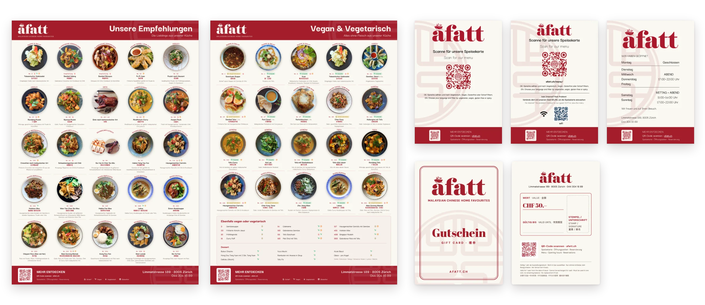

## Overview

A Fatt is a Malaysian Chinese restaurant in Zürich. Across two jobs for them, the same few questions kept coming back, and each time I stopped answering by hand and built the tool. This page is those four tools, and the job that started them.

| Tool | The question it answers | Where it stands |
| ---- | ----------------------- | --------------- |
| **[inscode](https://github.com/yingshiuan/inscode)** | Will a QR code with their logo in it still scan, printed? | Public. Their flyer is printed and scans |
| **Logo rebuild + vectoriser** | Will the logo hold at A2? | The script made their logo set; the vectoriser is private |
| **[menuGen](/yingsc/projects/menu-generator)** | Why am I redoing this layout every time a price changes? | Live, my own. A Fatt kept the system they had |
| **[MenuDash](/yingsc/projects/menudash)** | Is the menu on their website up to date? | Paid for by the client, and running their menu page |

#### Key Highlights

- **Every tool started as a question from a paying job,** not as an idea looking for a user.
- **Each one checks with a machine, not by eye.** A decoder reads back every QR file, a parity suite holds the vectoriser to the script, and a validator refuses a broken menu file.
- **The print work is code too.** The client's A2 posters, gift cards and name cards come from one TypeScript dish list, so a price changes in one place.
- **I didn't sell them more software than they needed.** The menu system they run is still the one I handed over in 2024.

I built the tools with Claude Code as the implementer. The questions, the specifications and what counted as done were mine.

## The Job That Started It

**2024: "redo the menu".** I surveyed the restaurant's diners and tested printed drafts with them at the table, then handed over a trilingual, diet-tagged menu system in Canva that the staff maintain without a designer. That was on purpose: no retainer. Two years on they still run it, and it took a new dessert section without a redesign. The research and design process is in the [original case study](/yingsc/projects/afatt).

**2026: they came back.** A paying job this time. Next to the German and English menus, each with the Chinese names, they wanted a third: a vegan and vegetarian one. Around it came a dessert section, two A2 posters (the recommended dishes, and every vegan and vegetarian dish), signs for the door and the tables (opening hours, a QR code to the menu, the guest Wi-Fi), gift cards and name cards. I built the new pieces as code. Every piece is an HTML page at its real print size, and the dishes live in one TypeScript file: mark a dish as a pick and it joins the recommendations poster, tag it vegan and it joins the veggie poster. A page that overflows draws a red outline before anything reaches a printer, and a small Python script renders every page in headless Chrome to a print PDF.

The 2024 menu is the staff's to edit. These pieces are mine to maintain. That line was drawn on purpose in 2024, and it held.

## Tool 1 · inscode: Will the Code Still Scan?

The flyer hangs outside the restaurant, with a QR code carrying their logo. A logo eats a QR code's error correction, and a code that has gone over the line still looks fine on screen. It fails at the printer or on the wall. I could check that by printing and scanning, over and over, or I could measure it.

inscode shows the error-correction headroom as the logo grows and the module size at the chosen print size, and a real decoder reads back every file before the export counts as done.

My own check fooled me once. A design decoded perfectly at a size no phone camera could read, because the test renderer draws perfect geometry. The test was measuring the renderer, not a scanner. I found it by shrinking the size until it failed and asking where the pass had come from.

**Where it stands:** public on [GitHub](https://github.com/yingshiuan/inscode). The flyer is printed, and its code scans with a phone.

## Tool 2 · Logo Rebuild and Vectoriser: Will It Hold at A2?

A poster at A2 needs a logo that stays sharp at any size. I rebuilt theirs in Python: the seal from true circles and arcs, the wordmark traced and refitted. That script produced the logo set the posters use. Afterwards I generalised it into a browser vectoriser that never uploads the image anywhere, held to the original script by a parity suite that has to agree within a hundredth of a pixel.

**Where it stands:** the script did the client's job. The vectoriser is private and hasn't been used on a client job yet.

## Tool 3 · menuGen: Why Am I Redoing This Layout?

Designing the 2024 menu showed me the part a handover can't remove: every price change is still layout work, even in Canva. [menuGen](/yingsc/projects/menu-generator) is my own tool for that: a menu spreadsheet in, a print-ready PDF out, with the editable preview being the document that prints.

The 2026 job sent it somewhere narrower. The restaurant asked for a vegan and vegetarian menu next to its English and German ones, and three menus mean one price change is three edits. menuGen's September releases print every language and diet version from one sheet, and testing them on the restaurant's real menu found two bugs the sample never had.

**Where it stands:** live at [menugen.insdash.ch](https://menugen.insdash.ch). A Fatt looked at it and kept the system I had handed them. I read that as the handover working: the thing I built to outlive my involvement was tested against a replacement I wrote myself, and it held.

## Tool 4 · MenuDash: Is the Website Up to Date?

Guests already read the menu on their phones, as PDFs from a QR code that don't fit every screen. Instead of a third PDF for the vegan and vegetarian menu, I proposed putting the whole menu on their website and letting each guest filter it by language and diet. Their site already runs on WordPress, so the answer was a plugin for the tool the owner already logs into.

The owner uploads the menu sheet, and guests read it in German, English and Chinese, filtered by diet. What I designed hardest was the wrong file, because the person uploading it isn't the person who designed the data: every upload gets a green, yellow or red report, a red file is refused so the old menu stays online, and the last five uploads are one click away.

Then I made it a product, split where the customers split: a free, open-source core for a café that only needs the menu, and four paid add-ons for a full restaurant (hours and holidays, specials, gift cards, statistics). The whole story is on the [MenuDash page](/yingsc/projects/menudash).

**Where it stands:** the owner agreed, A Fatt paid for the core, and it runs the [menu page on afatt.ch](https://afatt.ch/menu/). The add-ons and the theme are built and not on their site yet.

## What I Took From It

- **A test can pass for the wrong reason.** The QR check that passed at a size no phone could read taught me to ask where a pass comes from.
- **The handover is the product.** The 2024 system still runs without me, and that is why the client trusted me with the rest.
- **I'd have watched the owner sooner.** menuGen took four months of building to show what handing the owner a price change in week two would have: a spreadsheet suits someone who already keeps their menu as data, and theirs lived in Canva. MenuDash started from the tool they already use.

The obvious next step would be one system for all of it: menu, posters and website. The one time I offered a replacement, the restaurant kept what they had, and I take that as the answer. The tools stay separate. MenuDash is the one that grew, because its question isn't specific to one restaurant.

