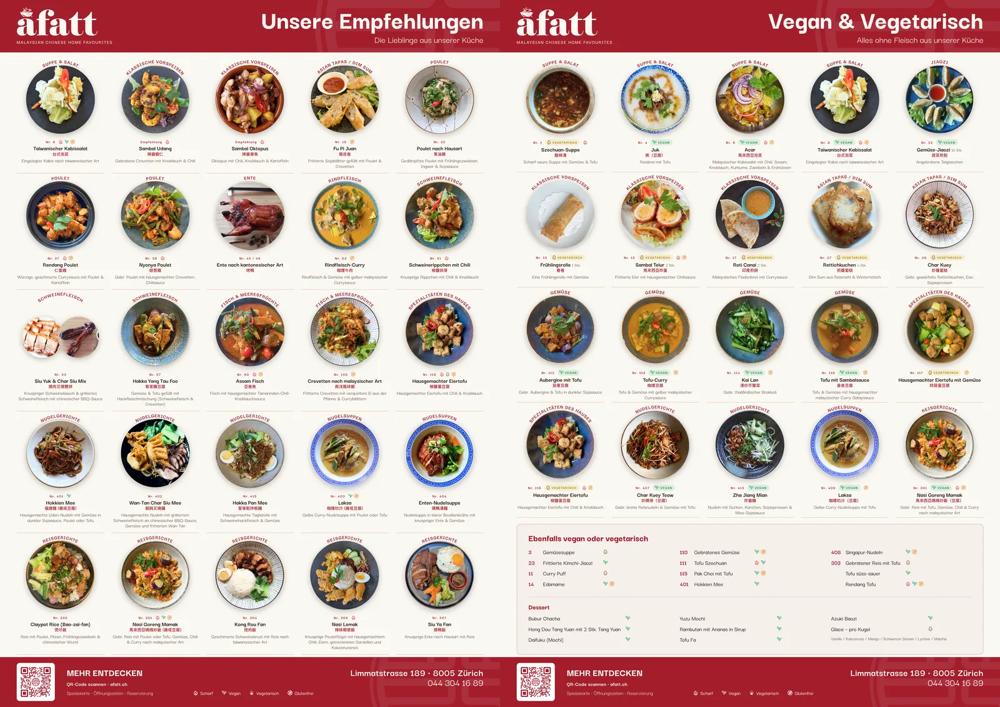
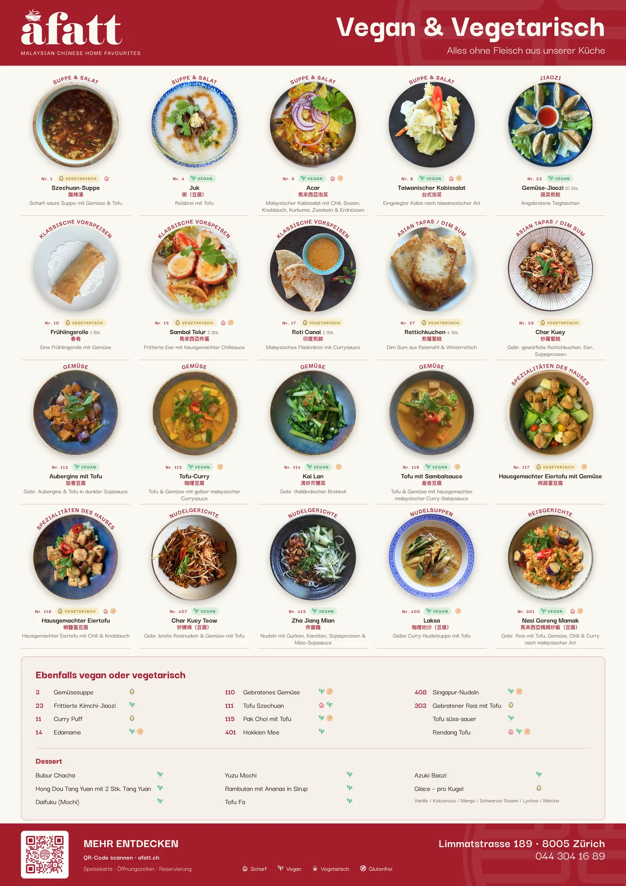
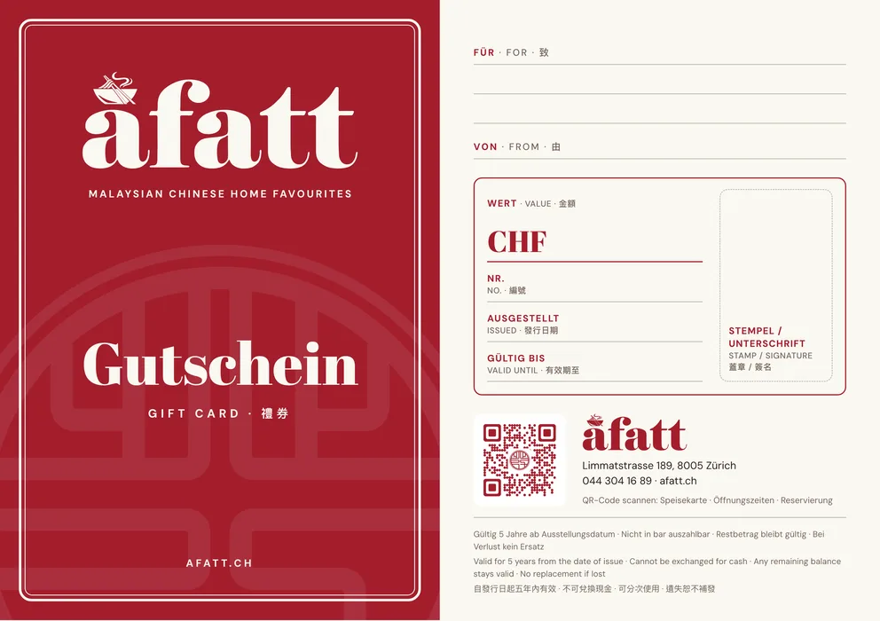
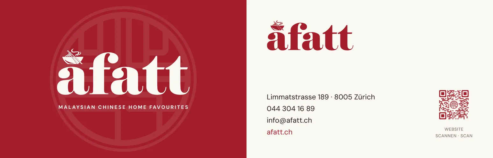
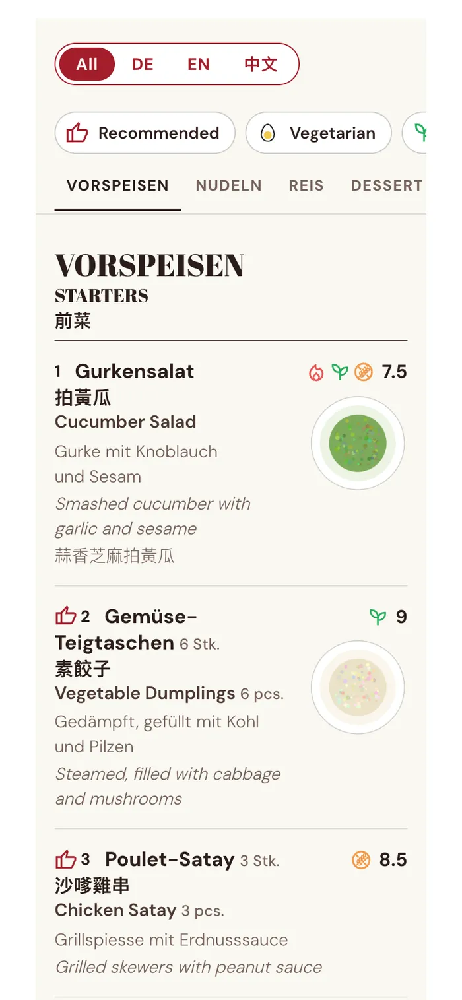

## Overview

A Fatt is a Malaysian Chinese restaurant in Zürich. Across two jobs for them, the same few questions kept coming back, and each time I stopped answering by hand and built the tool. This page is those four tools, and the job that started them.

| Tool | The question it answers | Where it stands |
| ---- | ----------------------- | --------------- |
| **[inscode](https://github.com/yingshiuan/inscode)** | Will a QR code with their logo in it still scan, printed? | Public. Their flyer is printed and scans |
| **Logo rebuild + vectoriser** | Will the logo hold at A2? | The script made their logo set; the vectoriser is private |
| **[menuGen](/yingsc/projects/menu-generator)** | Why am I redoing this layout every time a price changes? | Live, my own. No users yet, and A Fatt isn't one |
| **[MenuDash](https://github.com/yingshiuan/menudash)** | Is the menu on their website up to date? | Public. Built for their site, not yet installed |

#### Key Highlights

- **Every tool started as a question from a paying job,** not as an idea looking for a user.
- **Each one checks with a machine, not by eye.** A decoder reads back every QR file, a parity suite holds the vectoriser to the script, and a validator refuses a broken menu file.
- **The print work is code too.** The client's A2 posters, gift cards and name cards come from one TypeScript dish list, so a price changes in one place.
- **I didn't sell them more software than they needed.** The menu system they run is theirs, and when I showed them menuGen, they kept it.

## The Job That Started It

**2024: "redo the menu".** I surveyed the restaurant's diners and tested printed drafts with them at the table, then handed over a trilingual, diet-tagged menu system in Canva that the staff maintain without a designer. That was on purpose: no retainer. Two years on they still run it, and it took a new dessert section without a redesign. The full research and design process is in the [original case study](/yingsc/projects/afatt).

**2026: they came back.** A paying job this time: a dessert section, an exterior flyer with a QR code, two A2 posters (the recommended dishes, and every vegan and vegetarian dish), gift cards and name cards. I built the new pieces as code:

- **Every piece is an HTML and CSS page at its real print size,** with the brand's colours and fonts in one shared stylesheet.
- **The dish list is one TypeScript file.** Mark a dish as a pick and it joins the recommendations poster; tag it vegan or vegetarian and it joins the veggie poster, as a photo card if it has a photo and in the list if it doesn't.
- **The types stop a malformed dish before the export does,** and a page that overflows draws a red dashed outline on screen before anything reaches a printer.
- **A small Python script renders every page in headless Chrome** to a print PDF and a PNG, plus a version tiled across four A4 sheets for proofing at real size.

The 2024 menu is the staff's to edit. These pieces are mine to maintain. That line was drawn on purpose in 2024, and it held.

## Tool 1 · inscode: Will the Code Still Scan?

#### The question

The flyer hangs outside the restaurant, with a QR code carrying their logo. A logo eats a QR code's error correction, and a code that has gone over the line still looks fine on screen. It fails at the printer or on the wall. I could check that by printing and scanning, over and over, or I could measure it.

#### What it checks

- **The error-correction headroom as the logo grows,** so the coverage limit is a number, not a guess.
- **The module size at the chosen print size,** because a code that scans on a screen can fail on a wall.
- **Every file it writes, read back by a real decoder** before the export counts as done. The repo's rule: *nothing is written that has not been read back*.

My own check fooled me once. Early on, a design decoded perfectly at a tiny size. The test renderer draws perfect geometry and the decoder recovers it at a resolution no phone camera could manage, so the test was measuring the renderer, not a scanner. I found it by shrinking the size until it failed and asking where the pass had come from.

#### Where it stands

Public on [GitHub](https://github.com/yingshiuan/inscode). The flyer is printed and its code scans with a phone. I built it with agentic coding: I wrote the specification and checked every result, and the model wrote most of the code. It is a tool for one client job, not a product.

## Tool 2 · Logo Rebuild and Vectoriser: Will It Hold at A2?

#### The question

A poster at A2 needs a logo that stays sharp at any size.

#### What it does

I rebuilt their logo in Python: the seal from true circles and arcs, and the wordmark traced and refitted. That script produced the logo set the posters use. Afterwards I generalised it into a browser vectoriser for other clients' logos, one that never uploads the image anywhere. Its port is held to the original script by a parity suite that has to agree within a hundredth of a pixel.

#### Where it stands

The script did the client's job. The vectoriser is private and hasn't been used on a client job yet, which is why it gets the shortest section here.

## Tool 3 · menuGen: Why Am I Redoing This Layout?

#### The question

Designing the 2024 menu showed me the part a handover can't remove. Every price change is still layout work, even in Canva, and I had done that layout by hand.

#### What it does

[menuGen](/yingsc/projects/menu-generator) is my own tool: a menu spreadsheet in, a print-ready PDF out, with the editable preview being the document that prints. The 2026 job sent it somewhere narrower. The restaurant keeps an English, a German and a vegan and vegetarian menu, so one price change is three edits and sometimes one gets missed. Its September releases print every language and every diet version from one sheet, and testing them on the restaurant's real menu found two bugs the sample never had.

#### Where it stands

Live at [menugen.insdash.ch](https://menugen.insdash.ch), with no users yet. A Fatt looked at it and kept the system I had handed them. I read that as the handover working: the thing I built to outlive my involvement was tested against a replacement I wrote myself, and it held. The full story is on its [own page](/yingsc/projects/menu-generator).

## Tool 4 · MenuDash: Is the Website Up to Date?

#### The question

The menu on the restaurant's website should come from the same spreadsheet as everything else, and the owner, not me, has to be able to update it. Their site already runs on WordPress, so the answer wasn't a new product. It was a plugin for the tool they already log into.

#### What it does

The owner exports the menu sheet as a CSV and uploads it in the WordPress dashboard. Guests read it in German, English and Chinese, together or one at a time, and filter it by diet. It is real HTML, so it works without JavaScript and search engines can read it.

What I cared about most is what happens when the file is wrong, because the person uploading it isn't the person who designed the data:

- **Every upload gets a green, yellow or red report.** A red file is refused, so the old menu stays online.
- **It checks for the mistakes a restaurant actually makes:** the wrong encoding (the Chinese would be lost), the wrong file entirely, two dishes sharing a number, and the same dish listed twice with different diet marks. It already finds one of those in their real menu.
- **The last five uploads can be put back with one click.**

A wrong file costs the owner a message, not the website.

I also wrote an owner guide with a screenshot of every step. The plugin is open source, and one export writes both the restaurant's install and the public repository, refusing to write the public copy if anything identifying the client appears in it.

#### Where it stands

Public on [GitHub](https://github.com/yingshiuan/menudash). Self-initiated, and the owner agreed to it. It is built for their site and, at the time of writing, not yet installed.

## What I Took From It

- **Build the tool when the question comes back.** Every tool here started as something I kept answering by hand.
- **Check with a machine, not with your eyes.** A decoder, a parity suite and a validator each catch the failure that looks fine.
- **A test can pass for the wrong reason.** The QR check that passed at a size no phone could read taught me to ask where a pass comes from.
- **Keep the data in one place and make everything else a view.** One dish list became two posters; one spreadsheet became a website.
- **The handover is the product.** The 2024 system still runs without me, and that is why the client trusted me with the rest.

#### Where I Stopped

The obvious next step would be one system for all of it: menu, posters and website. The one time I offered a replacement, the restaurant kept what they had, and I take that as the answer. Each tool stays the size of the question it answers.

