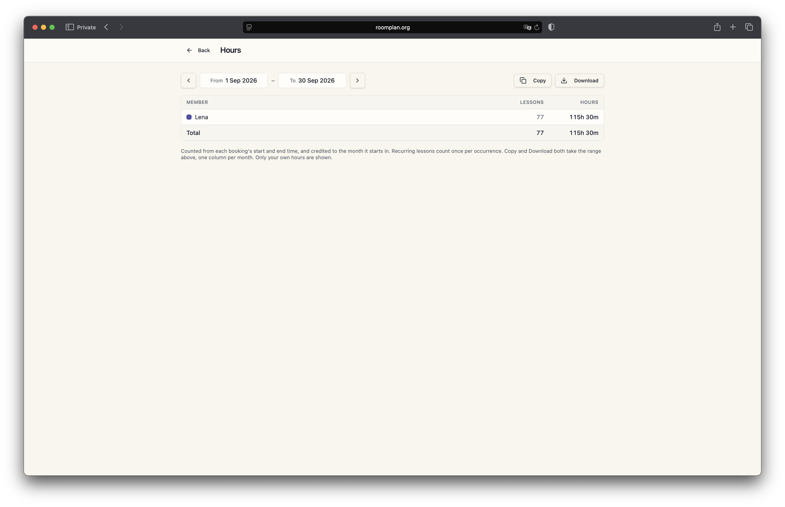
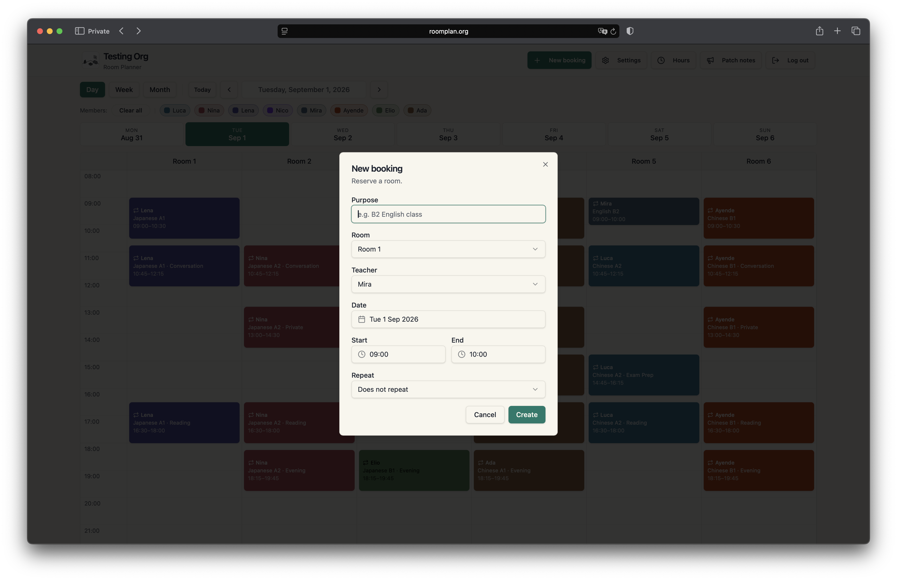
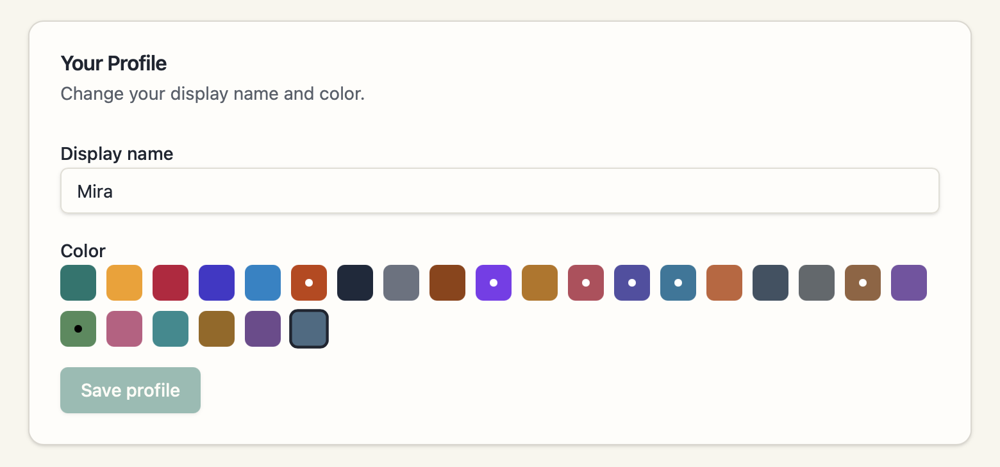
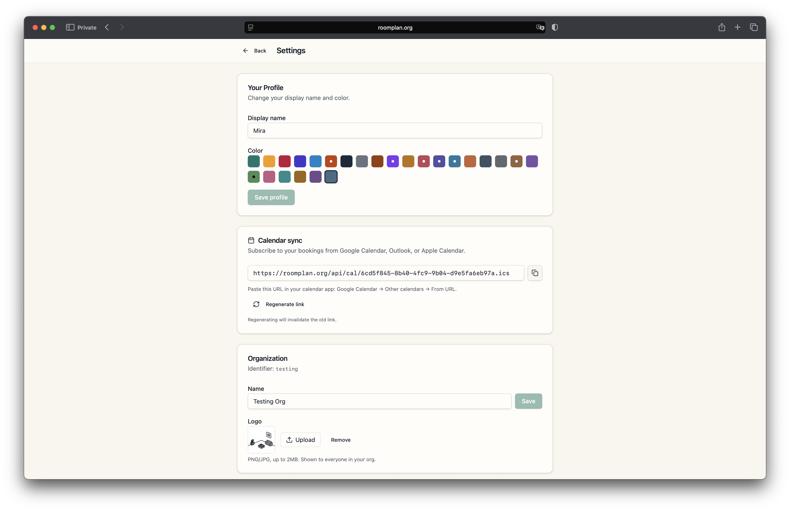
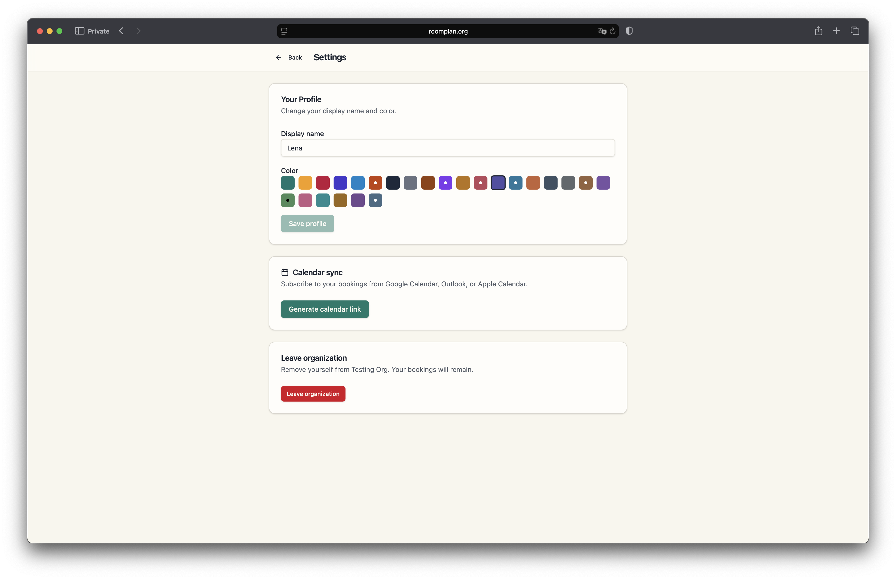
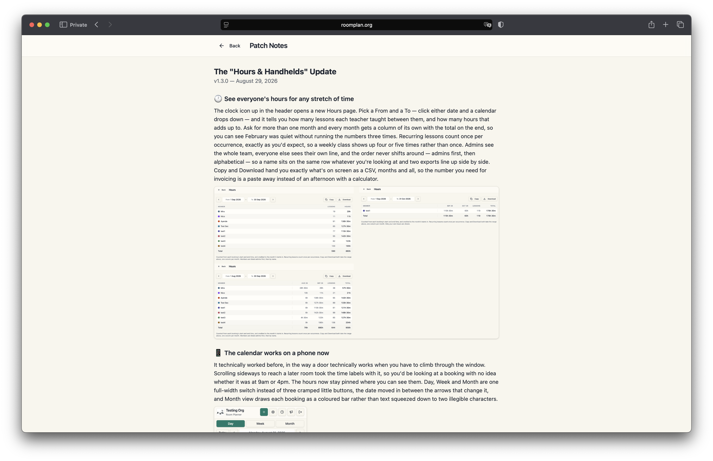

<div class="contentSection">

## Overview

Room Planner is a scheduling system built for [Sprachschule Yang](https://sprachschule-yang.ch), a Chinese and Japanese language school in Zürich Wiedikon. Teachers book rooms, classes repeat weekly or bi-weekly for a term, and at the end of the month somebody has to turn all of it into a number they can invoice.

It replaced a subscription whose price had doubled. **The harder part was deciding what not to build:** I mapped the school's whole term with the owner, and most of what that map showed is deliberately not in the system. The rule that decided each line was cheap and irreversible goes in early, expensive and reversible waits — which is why the tenancy boundary went in on day one and the school management system the same map described was never proposed.

It is multi-tenant: every school is an organisation with its own rooms, members and colours, isolated at the database level rather than by application code.

Built as a pair. The infrastructure, the security model and the recurring-series model are the senior engineer's, from the first release; v1.3.0 — the hours report, the calendar's small controls, the colour migrations, the mobile pass, the admin-permission fix and the patch notes — is mine, reviewed by him.

#### Key Highlights

- **Scoped and priced the replacement.** A commercial subscription had doubled in price; the custom build cost about 28% of one year at the new rate, and has run since at roughly 4% of it.
- **Found the feature nobody asked for.** Mapping the school's term surfaced an hours report that turns the calendar itself into an invoice-ready CSV — a monthly job the office was doing with a calculator.
- **Talked them out of the native app, and out of a feature I wanted.** They got a home-screen icon and a calendar rebuilt for touch; the class-category dimension I had already scoped did not ship.
- **Caught a permission bug myself.** Demoting an admin could leave scheduler rights behind; tracing the state showed the flag was redundant for admins, so I removed the extra write instead of patching the symptom.


#### The Problem

Six rooms, six teachers, two owners administering the timetable between them. Their booking ran on a commercial product built for organisations many times their size, until its monthly price doubled: renewing meant paying for capacity they would never touch, not renewing meant no scheduling at all. They asked us whether a custom replacement made commercial sense — and if so, to scope, price and deliver it.

So the first work was not the grid. I went through a whole term with the owner: how a booking is made and changed, and what happens at the end of the month when all of it has to turn into an invoice. The brief was a list of features; the workflow was what connected them, and the two did not describe the same system. It surfaced two things that mattered more than the grid — a repeating class inevitably has one lesson move, and every copy then has to be found by hand; and six teachers' worth of lessons had to become six invoiceable numbers every month, with a calculator, not in the brief at all. Nobody asked for that to change, which is why it was worth looking at.

#### The Solution

One calendar with rooms as columns, colour-coded by teacher, where a repeating class is a single object the system materialises into occurrences.

```
Booking or Series
↓
Materialised occurrences
↓
Calendar (Day / Week / Month) · iCal feed
↓
Hours report
↓
Invoice-ready CSV
```

The records that make the calendar readable during the term are the records the hours report bills from at the end of it. Nothing is entered twice.

</div>

<div class="contentSection">

## Then They Asked for an App

The school wanted a native app on top of the scheduler. **We told them not to buy one.**

What they actually wanted was to reach the schedule quickly from a phone, and that is a much smaller thing than an app. A native build would have added push notifications, offline access and a window with no browser chrome; for eight people checking which room is free at four o'clock, none of the three was the need. So they got an icon — two `<link>` tags and an afternoon in place of a project we would have been paid to build. What it did commit us to was a calendar that genuinely works on a small screen, and that part came to me.

</div>

<div class="contentSection">

## Reporting Hours

A week after launch I went through the system while the school was using it, and again in August. Neither visit was prompted by a bug report, and most of v1.3.0 came out of them: teachers work around a rough edge rather than write it down, and nobody can report a permission that silently stayed on.

The largest thing either visit turned up was this page, which nobody had asked for. Every booking already carried a teacher, a start and an end, so the schedule was one query away from a number the office was still reaching with a calculator — the counting had never been anyone's software problem. It was not what the school was paying to replace, so it waited for August, then became the centre of v1.3.0.

##### Admin view — the whole team

Pick a range and it returns lessons and hours per member, one column per month with a total on the end. Recurring classes count once per occurrence. The order is fixed — admins first, then alphabetical — so two exports from different months line up row for row. This is the view the invoice is written from.


##### Member view — your own line

An admin sees the whole team; everyone else sees their own line. That is a view filter rather than a boundary, and the difference is worth being exact about: booking rows are readable org-wide by any member, so narrowing the page in the client is presentation, not protection. Real separation would mean the aggregate moving behind a `security definer` function returning only the caller's rows — not worth the indirection for six colleagues who watch each other's classes on a shared calendar all day, and the first thing I would change for a school that treats hours as private.



##### The file, not just the page

Nobody invoices from a screen. Hours read as hours and minutes on the page and as decimals in the file, because a decimal multiplies by a rate and `2:45` does not; cells are quoted per RFC 4180, and a UTF-8 BOM keeps Excel from turning a teacher named Müller into Müller.

The hole I left in it, review found: a display name is member-editable free text landing in the first column of a file I had deliberately aimed at Excel, so a member who names themselves `=HYPERLINK(…)` gets a live formula in an admin's payroll sheet. Being careful about a file's encoding is not the same as being careful about what is in it. It is closed — the senior engineer's fix, in the same pass as the truncation below: values opening with `=`, `+`, `-` or `@` now carry a leading apostrophe, the spreadsheet's own escape.

#### A thousand rows, no error

PostgREST answers with a bounded slice of rows and `error === null` when it does. The cap is a thousand rows and the school was already sitting on roughly a thousand bookings, so any range covering the year it had been running crossed it — and the report was capable of quietly invoicing from a fraction of the data, with nothing on screen to say so.

My query had no limit and no order, so it crossed that cap and returned a different slice each call. Review caught it before it merged, and the fix — ask for an **exact count** alongside the page, treat any shortfall as truncated — is the senior engineer's. Of the six ways that pass found the page could be quietly wrong, the one I still think about is the smallest: a failed fetch rendered every member at zero with Copy still live, and an all-zero payroll CSV is indistinguishable from a real quiet month.

Nothing in the project would have caught it except a person, which is the honest reason review was the net. The first test I would write is the one that seeds past a thousand bookings and asserts the report refuses to answer.

I had built a page that fetches the rows and shows them; what payroll needed was a page that knows whether it has them. A CSV asserting that nobody taught anything is worse than no CSV, so the report shows figures only when it can prove they are complete.

</div>

<div class="contentSection">

## The Calendar

Three views over the same data. Day puts rooms across the top and hours down the side — what is happening now, and where. Week widens the same grid to seven days, for planning a term rather than a morning. Month trades detail for reach, drawing each booking as a coloured bar so a month reads as a pattern rather than a wall of text.

<video
  src="/yingsc/media/projects/room-planner/day-week-mon.mp4"
  poster="/yingsc/media/projects/room-planner/day-week-mon.webp"
  muted
  loop
  playsinline
  controls
  preload="metadata"
  aria-label="Switching between Day, Week and Month views"></video>

One dialog books all of it — purpose, room, teacher, date, time, and whether it repeats. Admins can book on behalf of any teacher; everyone else books for themselves.



##### Small controls, rewritten

###### The date is the control

The date between the arrows is also the way to leave them — clicking it opens a month picker, so one element answers both "which day am I on" and "take me somewhere else".

<video
  src="/yingsc/media/projects/room-planner/date.mp4"
  poster="/yingsc/media/projects/room-planner/date.webp"
  muted
  loop
  playsinline
  controls
  preload="metadata"
  aria-label="Clicking the date label to open a month picker"></video>

###### Select all, clear all

Narrowing the calendar to one teacher meant clicking seven names off one at a time, so the members row gained a single Select all / Clear all control.

<video
  src="/yingsc/media/projects/room-planner/filter.mp4"
  poster="/yingsc/media/projects/room-planner/filter.webp"
  muted
  loop
  playsinline
  controls
  preload="metadata"
  aria-label="Clearing and restoring the member filter above the calendar"></video>

###### What the grid cannot say for itself

The filter resets on reload, deliberately: an empty calendar is indistinguishable from a broken one, and a teacher returning to a blank grid concludes the bookings are gone. And because a grid of small coloured rectangles announces nothing on its own either, the calendar is navigable by keyboard, the dialog moves focus into itself and hands it back, and controls carry labels rather than leaving their icons to explain them.

</div>

<div class="contentSection">

## Three Migrations Against Live Data

The last of the three rewrites rows the school was already working from. It runs once, against live data, and cannot be un-run — which is what made a change to teacher colours the most careful work in the release. Colour is not decoration here: every booking is drawn in its teacher's, which is what lets a day be read at a glance, and ten stopped being enough before an organisation had ten teachers, because the trigger picked at random.

The first migration adds fifteen colours. The second moves the palette into a single SQL function so the sign-up trigger and the invite-acceptance path cannot drift apart, and gives a new member a colour no colleague holds. Colour has to be assigned twice, because the organisation is not known at sign-up — the trigger aims at the pending invite, and accepting it corrects the pick against the organisation actually joined.

The third repairs what was already there, and because it cannot be un-run it reports rather than assumes: colliding members are moved apart with the earliest joiner keeping theirs, it counts what it moved and what it left alone, and when an organisation holds more teachers than free colours it declines to reassign rather than pushing the duplicate somewhere else. I exercised all three against a scratch organisation before they merged.

##### Redefining a trigger against the wrong copy

Redefining the sign-up trigger meant redefining it against its *current* body. The copy sitting in the older migration was two definitions behind and predated the email-domain gate on sign-ups — so reusing it, which is the obvious move and what having it there invites, would have quietly reopened registration to any address, inside a migration whose stated purpose was colours. Checking the live definition against the migration history costs a minute; assuming the newest migration holds the newest body is what would have cost the gate.



Label colour is computed per swatch from relative luminance so every booking chip clears WCAG AA contrast — white text scores 2.15:1 on the amber entry and would have failed silently.

</div>

<div class="contentSection">

## On a Phone

The calendar technically worked on a phone the way a door technically works when you climb through the window: scrolling sideways to a later room took the time labels with it, so a booking could be read with no way to tell whether it was at 9am or 4pm.

I pinned the hour column, collapsed the three views into one full-width control, moved the date between the arrows that change it, and folded the member legend behind a toggle. Several controls only grew a border on hover, which is no use where hovering does not exist.

<video
  class="phone"
  poster="/yingsc/media/projects/room-planner/iphone-framed-alpha-web.webp"
  muted
  loop
  playsinline
  controls
  preload="metadata"
  aria-label="Scrolling the calendar on a phone with the hour column pinned">
  <source
    src="/yingsc/media/projects/room-planner/iphone-framed-alpha-web.mp4"
    type='video/mp4; codecs="hvc1"' />
  <source
    src="/yingsc/media/projects/room-planner/iphone-framed-alpha-web.webm"
    type="video/webm" />
</video>

##### One colour doing the work

Asked what had changed in v1.3.0, the owner did not name a feature. She said it felt friendlier and kinder, that it looked like a modern app, and that the whole thing was more comfortable to look at.

She was describing something real that she could not point at. The obvious suspect never moved — `--radius` is the same `0.5rem` it always was. What changed was proportion and colour: member chips became pills rather than boxes, the swatches grew on a phone, and the amber accent went. `--accent` is wired to nothing but hover and focus surfaces, so in light mode every hover had been flashing the colour that marks a selection. Making light mode agree with dark leaves teal as the one colour carrying meaning.

*Comfortable* was the word she had, and it was close enough to find the change. That is how every useful piece of feedback on this project arrived — none of it as a bug report.

</div>

<div class="contentSection">

## Settings and Access

Calendar sync is a personal iCal URL — the token is per user and regenerable, so a link shared by mistake can be revoked without touching anyone else's. Membership is invite-based, with sign-ups restricted to approved email domains.



#### The bug I caught

I found it while rebuilding the member row for a phone, which is the only reason it surfaced at all. Promoting someone to admin also wrote `can_modify_others_bookings`, and demoting them did not clear it, so a former admin kept the ability to edit everyone's bookings.

Nobody could have reported it, because the control that would have shown it is masked while the role is held: an admin's permission switch renders on and disabled, since admins pass every booking policy through `is_org_admin` regardless. The write went in underneath a switch that could not report it, and after a demotion the flag read exactly like a grant somebody had made deliberately. Not invisible so much as indistinguishable from intended state, which is the worse of the two — there is nothing there for a reader to disbelieve.

Clearing the flag on demotion is the obvious fix and it is the smaller half. The flag is load-bearing — the booking policies read it, and it is how a non-admin is given scheduler rights — so the defect was never the flag but writing it somewhere its value could not be seen. Promotion no longer touches it, demotion clears it, and the interface says that it has.



</div>

<div class="contentSection">

## Constraints I Worked Inside

Three decisions from the first release, none of them mine, that set the shape of everything above.

**Isolation belongs in the database.** Every table is scoped by `org_id` and gated by Row Level Security. One forgotten `.eq("org_id", …)` would otherwise be all that stands between a school and its neighbour's timetable — and a column and a policy per table is close to free at the start, close to impossible to retrofit over a year of live bookings.

**Never trust the client with identity.** Regenerating a series deletes and re-inserts rows in bulk, so it runs as a `security definer` function. It reads `org_id` and `teacher_id` **from the series row rather than from its arguments**, leaving no parameter through which a caller could forge them.

**A series is a template, not a group of copies.** A moved booking keeps its own schedule and stays in its series, Gmail-style, and only **structural** changes — time, weekday, interval — trigger regeneration. Editing one lesson stops competing with editing all of them.

Working inside those three is where most of what I learned came from. The review was rarely about a defect in a diff; it was being asked to defend a choice out loud, and a rule I could only justify by describing the screen it protected usually belonged one layer further down, in the schema.

#### Limitations

- Recurrence is weekly and bi-weekly only, and occurrences are materialised rows, so long series are bounded by a horizon rather than generated from an RRULE.
- Room conflicts are handled in the application rather than as a database constraint, deliberately: an overlap can be legitimate in this school's workflow, so the rule is not one the schema should be able to refuse. The interface prevents the accidental double-booking; the conflicts that remain stay visible to admins.
- The hours report answers how much a member taught, not what: bookings carry a free-text purpose, not a category.
- Students are outside the model, so enrolment and student billing stay in the school's own records.
- The admin-permission fix closed the write path but not the rows it had already written. No migration clears `can_modify_others_bookings` for anyone promoted and then demoted before it shipped, so where such a member exists the stale grant is still live — demotion only clears it from that point forward. And `create_organization` still writes the flag alongside `role = 'admin'` for a founding admin: the same redundant pair, moved from the client into SQL. Both are one-line fixes I have not made — a backfill, and dropping the column from that insert.
- There is no automated test suite. Correctness leans on constraints, policies, exercising changes by hand against seeded data, and review. It is the weakest part of the system and the first thing I would add — starting with the hours aggregation, where a silent wrong answer becomes an invoice.

</div>

<div class="contentSection">

## System Architecture

```
                    BROWSER
                       |
                       v
        React 19 + TanStack Router (SSR)
                       |
              TanStack Query cache
                       |
        ---------------------------------
        |                               |
        v                               v
  Supabase JS client            TanStack Start server
  (publishable key)             on Cloudflare Workers
        |                               |
        |                        auth middleware
        |                       (Bearer token check)
        |                               |
        -------------- + ----------------
                       |
                       v
               PostgreSQL (Supabase)
         Row Level Security on every table
                       |
         ---------------------------------
         |             |                 |
         v             v                 v
    bookings /    RPC functions      Edge function
    series /      security definer    invite email
    profiles      + authorization
```

The application's logic lives in the schema itself — policies, constraints and RPC functions — rather than in a separate API tier. The Workers runtime handles SSR, auth middleware and the iCal endpoint; pushes to `main` build with Bun and deploy through Wrangler in GitHub Actions.

<!-- #### Frontend

React 19 with TanStack Router in server-rendered mode, TanStack Query for data, Tailwind and Radix primitives for the interface. The calendar, the hours report and settings are three routes behind one authenticated boundary.

#### Backend

Supabase provides Postgres, auth and storage. The application's logic lives in the schema itself — policies, constraints and RPC functions — rather than in a separate API tier. The Workers runtime handles SSR, auth middleware and the iCal endpoint.

#### Delivery

Pushes to `main` build with Bun and deploy to Cloudflare Workers through Wrangler in GitHub Actions.
 -->

</div>

<div class="contentSection">

## Releasing to Non-Developers

The users are teachers, so the changelog is written for teachers: an in-app patch notes page, in plain language, with a screenshot, candid about bugs — including the release where editing a series could delete it.



Both versions have to be true at once. Technically, the Hours page aggregates bookings by teacher and by month across an arbitrary range, each lesson credited whole to the month it starts in. For a teacher: "Ask for more than one month and every month gets a column of its own." Writing the second version is the test of whether you understood the first.

</div>

<div class="contentSection">

## Outcome

Room Planner runs in production for Sprachschule Yang at [roomplan.org](https://roomplan.org). It holds roughly 1,000 bookings across six teachers, two admins and six rooms.

Measured against a single year of the subscription it replaced, at its raised price:

- **Build: about 28%** of one year at the new rate, so it had paid for itself before the first year was out.
- **Running: about 4%** of that year, every year after — a domain renewal and an hour of maintenance.

It also replaced something nobody had asked it to. Teachers submitted their hours and an admin reconciled each one against the bookings by hand, which was still happening after the July release. The figures are derived from the bookings now, so the admin verifies and exports rather than recounts. The recount was never long — under an hour a month — but it was a hand-copied number standing between a teacher's lessons and their pay.

#### What I took from it

- **Put invariants where they cannot be bypassed.** RLS policies and server-side identity hold regardless of what the client sends. Spending a release building on top of them is what taught me why they sit where they do.
- **Silence is the expensive failure mode.** My hours query returned no error and looked correct while it was silently truncated. Data that feeds money has to prove it is complete, not merely fail loudly when it is not.
- **What they ask for is not the job.** The hours report was never requested, and the native app was. Being close enough to a client's work to tell the two apart is worth more than agreeing to whichever they said out loud.

#### Where We Stopped

A per-organisation class category would let a school billing different rates per programme export the number it invoices. I went looking for it while building the Hours page, expecting a column I had not thought to display. It is not one: nothing in the system knows what a lesson is *about*, and the only field describing one is a free-text purpose that would file "B2 English", "b2 english" and "B2 Eng." as three courses. So it is scoped and not built — the school invoices by hours, and a second dimension would have doubled the surface area of a release already paying for itself.

The workflow map described something several times larger still: students, enrolment, the parts of running a school that never touch a room booking. We could have proposed it at a higher price with every line defensible, and did not, because the school's problem was a subscription that had doubled, not an absence of software. The tenancy boundary went in on day one anyway. That difference is the whole rule, and it is what mapping the term was for — not an inventory of what could be built, a way of knowing where to stop.

</div>
