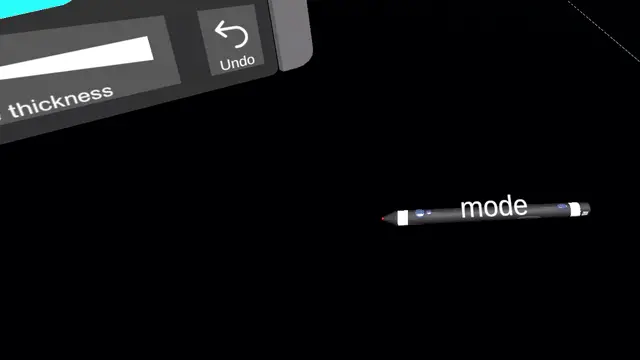
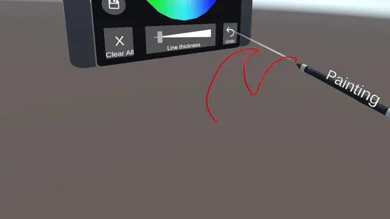
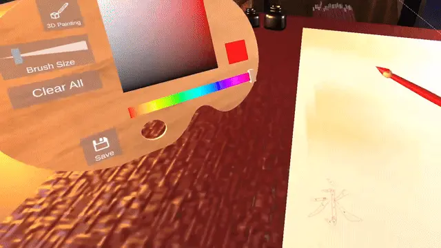

<div class="contentSection">

## Background

##### Transforming Hardware Input into Natural XR Interaction

Sensoryx developed motion-tracking technology for VR/AR applications. My role was to transform the stylus from a tracking device into a usable XR input system by connecting hardware capabilities, software behavior, and user interaction needs.

Rather than treating the stylus as a standalone controller, I designed interaction models that allowed users to perform spatial tasks naturally while working within hardware constraints.

##### Challenge

###### Designing Interaction Under Limited Input Constraints

The challenge was not only achieving accurate tracking, but translating limited hardware input into meaningful XR interactions.

- The stylus provided only one physical button.

- Multiple XR actions needed to be supported within a limited input space.

- Users needed efficient actions without accidental mode switching.


##### Interaction Areas

XR Interaction Systems, Hardware–Software Integration, Spatial Computing, Input System Design, Hand Tracking, XR Framework Integration, Human-Centered Interaction Design, Rapid Prototyping


#### System Overview

##### From Hardware Input to Spatial Interaction

```
Stylus Hardware
        ↓
Tracking & Button Input
        ↓
Unity Interaction Layer
        ↓
Interaction State Manager
        ↓
XR Actions
(Painting / Selection / Manipulation)
```

The system translated low-level hardware signals into higher-level XR interactions. I designed the interaction layer to separate physical input from application behavior, allowing different spatial workflows to share a consistent interaction model.

</div>


<div class="contentSection">

## Demo 1

## Designing an Input System for a Single-Button XR Stylus

##### Challenge

Multiple XR actions needed to be mapped into a single physical input while maintaining fast and reliable interaction.

##### Design Decision

Instead of assigning separate gestures for every action, I designed an interaction model that separated action execution from mode switching.

##### Interaction Model

- Single Click → Execute Current Mode Action  
(Painting / Grabbing / Selection & Delete)

- Double Click → Switch Interaction Mode

##### Design Rationale

- Common actions remain fast and direct.
- Mode switching is separated to reduce accidental triggers.
- The interaction model remains consistent across different XR tasks.

##### Trade-off

| Responsiveness | Input Reliability |
|---|---|
| Faster detection | Longer detection threshold |
| Immediate feedback | Fewer accidental mode switches |
| More fluid interaction | More reliable recognition |

#### Prototype

Implemented a button interaction state system that converted limited physical input into multiple XR actions through mode management and timing-based input detection.




##### Technical Implementation

- Built single-click and double-click detection logic.
- Designed interaction states for different XR modes.
- Tuned input timing thresholds to balance responsiveness and reliability.
- Connected interaction states with XR object manipulation workflows.

</div>


<div class="contentSection">

## Demo 2

## Combining Stylus Input with Hand Tracking for Spatial Interaction

##### Goal

Create natural XR interactions by combining precision stylus input with hand-based interaction.

##### Interaction Areas

- Stylus-based input
- Hand tracking
- Spatial object manipulation
- Immersive workflow design

##### Design Focus

The goal was not only technical integration, but designing interactions that felt predictable and natural inside immersive environments.

The stylus provided precise control for tasks requiring accuracy, while hand tracking enabled more direct spatial interaction.

#### Prototype

Developed XR interaction prototypes integrating stylus tracking, XR Interaction Toolkit components, ray-based selection, and hand tracking workflows.




##### Technical Implementation

- Integrated stylus input with XR interaction workflows.
- Used XR Interaction Toolkit components for object interaction.
- Implemented ray-based selection and manipulation.
- Connected stylus input with hand-based interaction workflows.
- Evaluated interaction patterns for precision-based tasks.

</div>


<div class="contentSection">

## Demo 3

## Integrating Stylus Input into an XR Software Framework

##### Challenge

Different XR frameworks define their own interaction pipelines, input systems, and spatial workflows. The challenge was adapting Sensoryx's stylus input into an external XR software environment.

##### Collaboration with

[Zoe Immersive](https://zoeimmersive.com/)

##### My Role

I integrated Sensoryx's stylus interaction system with Zoe Immersive's spatial computing framework and evaluated how the stylus could support existing XR workflows.

##### Technical Focus

- Hardware–software integration
- XR framework integration
- Input abstraction
- Interaction workflow adaptation

##### Design Focus

The goal was not only technical compatibility, but ensuring that the stylus could provide meaningful interaction within an existing spatial computing ecosystem.

##### Prototype

Integrated the stylus-based interaction system with Zoe Immersive's framework and demonstrated how custom hardware input could extend existing XR workflows.



</div>


<div class="contentSection">

## Implementation

## From Interaction Concepts to Working Systems

I translated interaction concepts into functional XR prototypes through rapid development and iteration.

##### Technical Implementation

- Integrated motion-tracked stylus input with Unity XR workflows.
- Developed interaction logic for button detection and mode switching.
- Implemented raycasting-based object selection and manipulation.
- Tuned interaction timing through prototype evaluation.
- Collaborated with hardware engineers to evaluate improvements to the input experience.

</div>


<div class="contentSection">

## Takeaways

##### Impact

This project demonstrated how XR hardware constraints can be transformed into meaningful interaction opportunities. By connecting hardware input, interaction logic, and spatial workflows, I developed practical approaches for designing intuitive XR systems.

##### Outcomes

- Designed interaction models for stylus-based XR workflows.
- Integrated hardware input with Unity XR environments.
- Developed spatial interaction prototypes combining stylus and hand tracking.
- Integrated custom XR hardware into an external spatial computing framework.
- Contributed to product decisions beyond implementation.

</div>


<div class="contentSection">

## Reflection

Successful XR experiences are not only about technical capability, but about designing the relationship between hardware constraints, software behavior, and human expectations.

This project reinforced my approach of building interactive systems by balancing engineering constraints with human-centered design.

</div>