

## Background

3D animation is a popular digital marketing method. It can attract people's attention in a short time and effectively display the characteristics of the product. It also represents the brand. We may use the video on social media platforms or showcase it at product launches. 3d animation includes more than knowledge of 3d data geometry and techniques used to create visual effects, lighting, rigging, cameras and animation. There are also storyboards, background music, music effects that can successfully convey the functionality of the product to the user. As 3D artists, our goal is to present abstract concepts of products through visual representation and animation techniques.

#### Challenge

Transform the functions of electric bicycles into visual animations to provide users with a good viewing experience.

#### Solution

Research animation techniques, visual effects, and market research to determine the style of the video. Create prototype clips to communicate with clients and increase iterations of 3d animations.

#### A glimpse at behind the scene

User Research, Competitive Audit, Animation Techniques Research, Prototype

## Research and Process

#### The Animation's Goal

SWISSRIDER is a lightweight electronics urban / road bike from THÖMUS. Its high-tech motor system is there to assist when you feel the need. It's a versatile bike for road and urban, with integrated lights and optional fenders and frame. Swissrider is a "The bike for your life".

#### We summarize the following requirements:

- Versatile: The bike is designed for the road, gravel and urban cycling. It is available in red, black and pearl.

- Lightweight: The bike starts at 11.5kg, which is very light for an e-bike.

- High-tech: The integrated maxon motor is almost invisible. It is based on technology maxon motors used in their Mars vehicles.

- Light assist: The motor will support you when you feel the need. It's not a "power engine" it's more like a constant tailwind.

- Integrated lights: Front Light and Backlight provide you with safe and clear vision.

- Claim: “The bike for your life”

#### Moodborad

Next Generation, High-Tech, Electronics Bicycles, Dynamic, Versatile, Lightweight, Integrated, X-Ray

  

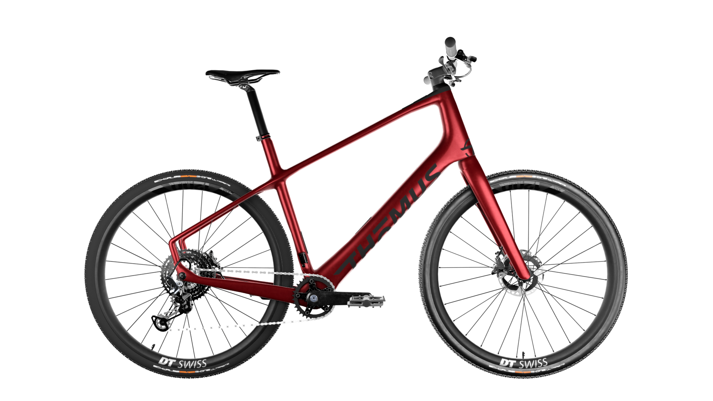

Futuristic design

Modern, lightweight and multifunctional electronics bike.

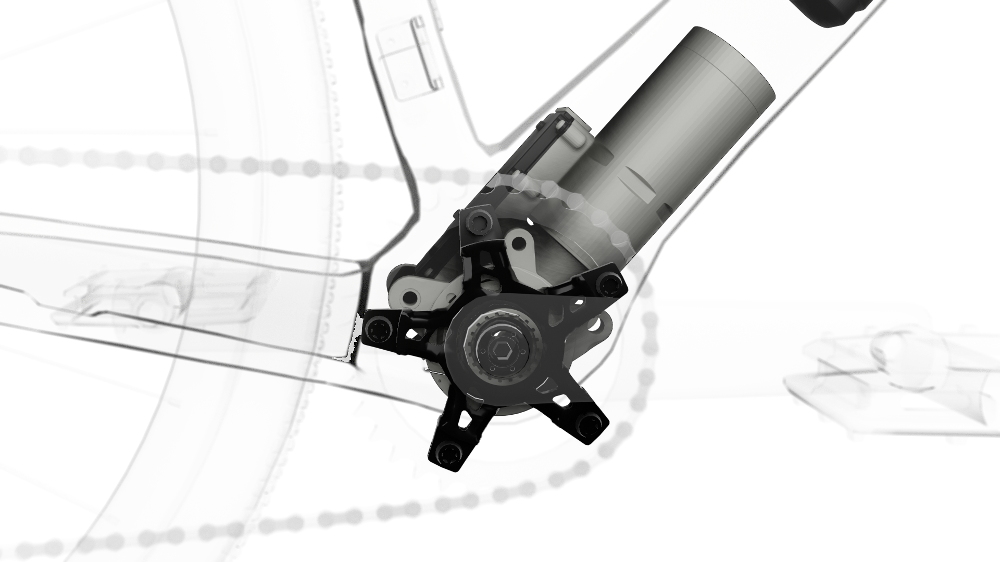

High-tech

Technology maxon motors and APP interface.

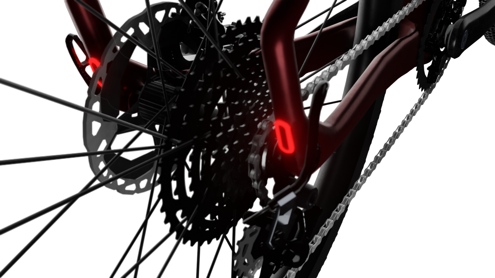

Integrated

Integrated lights and custom components.

## Prototype

#### Paper Wireframes

Paper wireframes help organize the main layout, interactions, user flow, and UI design. I can quickly iterate to find a suitable layout, then think about the main user flow.

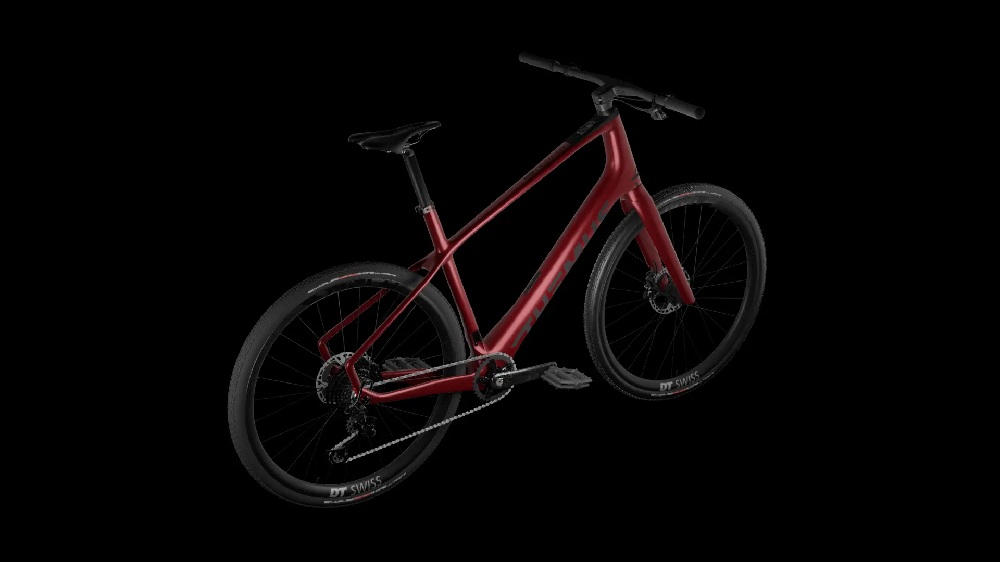

## Competitor Analysis

To understand the industrial aesthetic of the bike, I search most of the brands that make e-bikes and watch their ad animations and videos. Such as VanMoof, Bianchi, Cannondale, Terk, Cervelo and SCOTT.

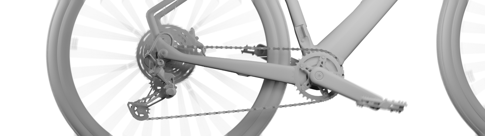

#### Takeaway

- What kind of State-of-the-art does the brand want to present?

- The storytelling highlights the style of the bike, from the details displayed to the presentation of the entire bike.

- Showcasing integrated motors, design and technology with visual renderings.

- Animated gears, pedals and details bring the bike to life.

## Storyboard

The storyboard highlights the characteristics of the Swissrider, such as its lightweight, modern design, high-tech motor system and versatility. Showcasing the bike's industrial aesthetic and providing a lifestyle for the rider.

Additionally, we designed transitions from each scene to scene and wanted to provide viewers with a seamless viewing experience. Hopefully our spectators and riders will get an overview of the Swissrider and see more details on the website to learn about the Swissrider.

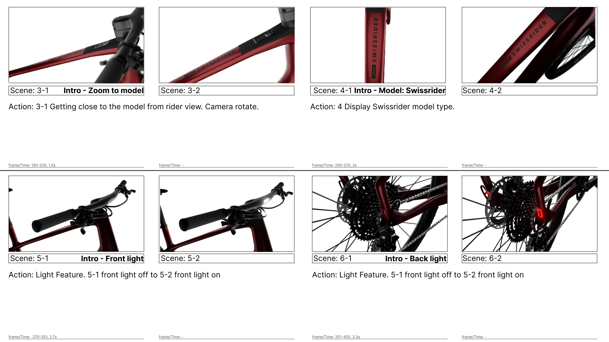

#### Overview

##### Intro - Use Bike Urban/Off-Road in the scene: Scene 1~4

1. Bike-Urban/Off-Road

2. Brand - Thömus

3. Zoom to bike model

4. Model - Swissrider

##### Intro - Features, Light, Motor, Two bikes, Color: Scene 5~9

5. Front Light

6. Backlight

7. Maxon system

8. Maxon Motor

9. Display two type - Urban/Off-Road, Road/Gravel - Color

##### Features - Maxon Motor, lightweight, Colors, Lights: Scene 10~13

10. Transition to Motor

11. Maxon motor and battery with X-Ray

12. Lightweight

13. Frame color

##### Bike - Use Road/Gravel in the scene : Scene 14~15

14. Left back to top, right front

15. Right Side to left back

##### End - Display Urban and Road bike Scene 16~20

16. Top

17. Bike-Road/Gravel

18. Bike-Urban/Off-Road

19. Two bike

20. End- Logo, website

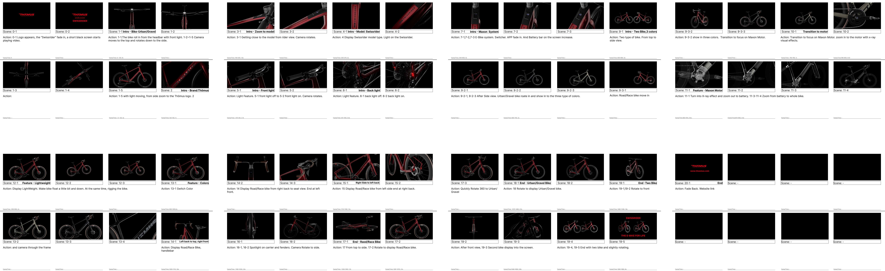

## Prototype

#### Visual Effects - X-Ray

We used an X-ray effect to show the silhouette of the bike and kept the motor and battery material to make it clearly visible.

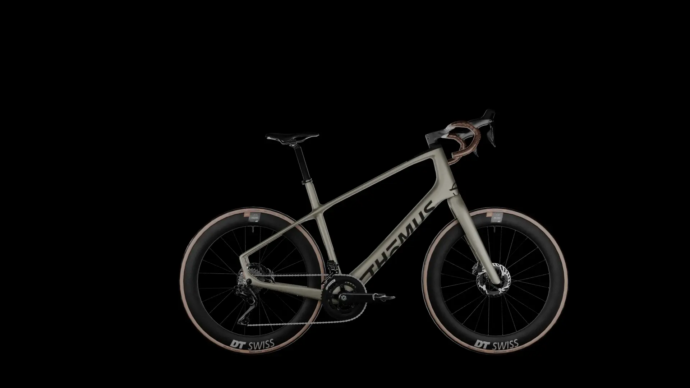

#### Rigging

To animate the bike, we need to understand the mechanics of the bike and separate each component into different layers. Then set the component in its parent component and its driver.

## User Viewing Experience

We want to post videos on YouTube and Instagram. Here we consider portrait and landscape versions.

#### Landscape

We used an X-ray effect to show the silhouette of the bike and kept the motor and battery material to make it clearly visible.

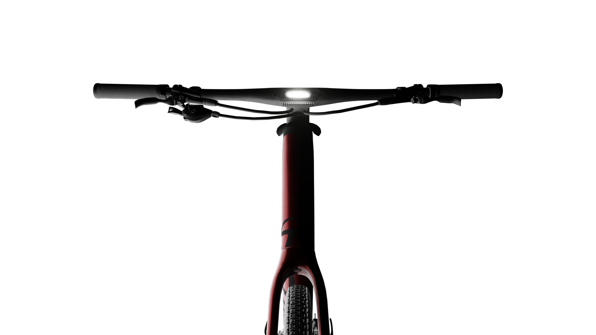

#### Portrait

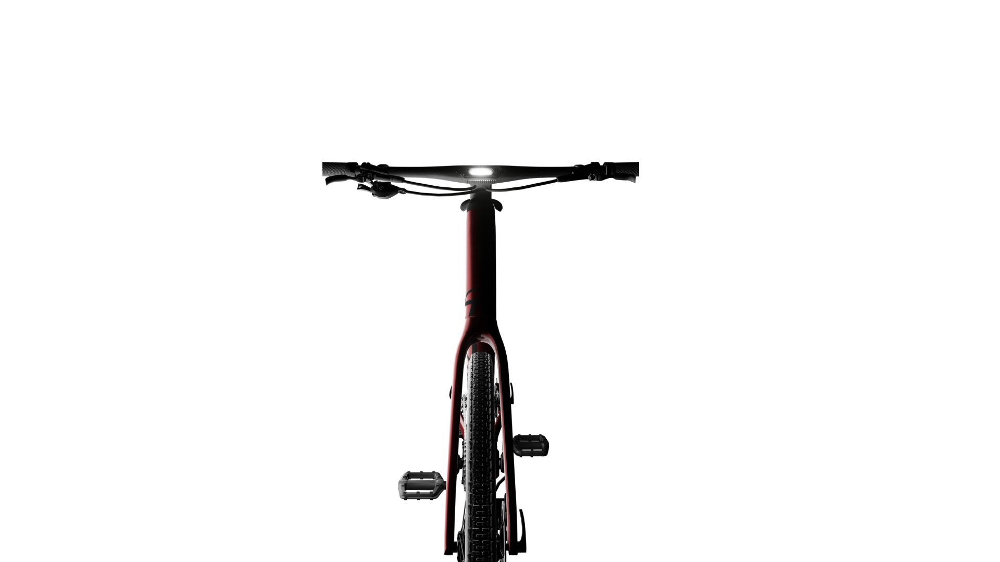

## Main Features

#### Intergated LED Rear Light

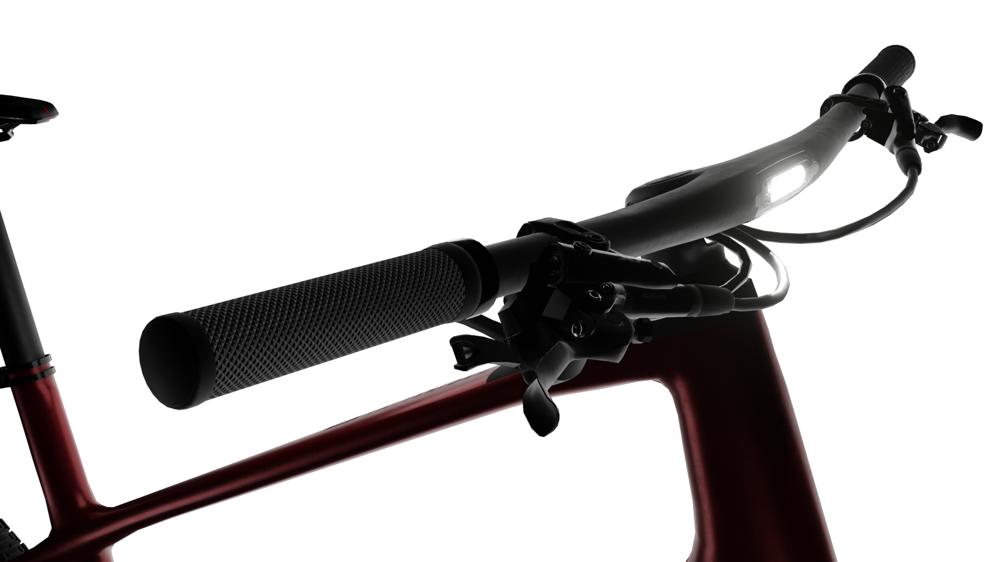

#### maxon motor

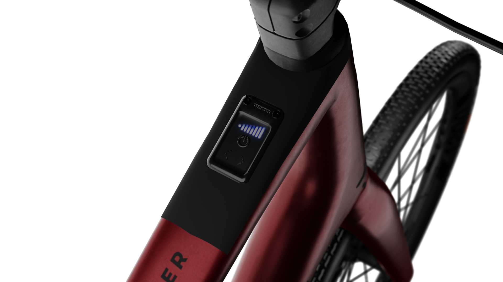

#### Bikedrive Air Light Assist

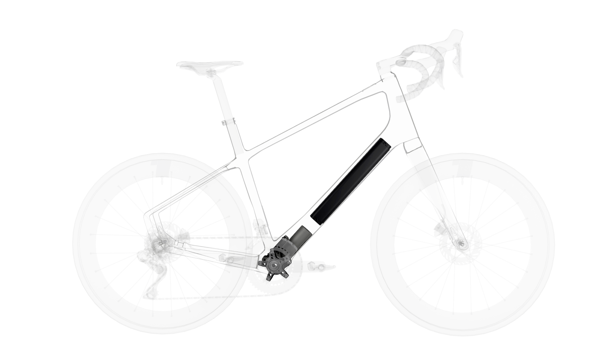

#### Monocoque Handlebar

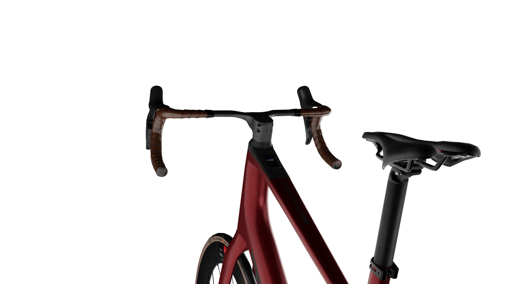

#### Swissrider: Urban/Off-Road & Road/Gravel

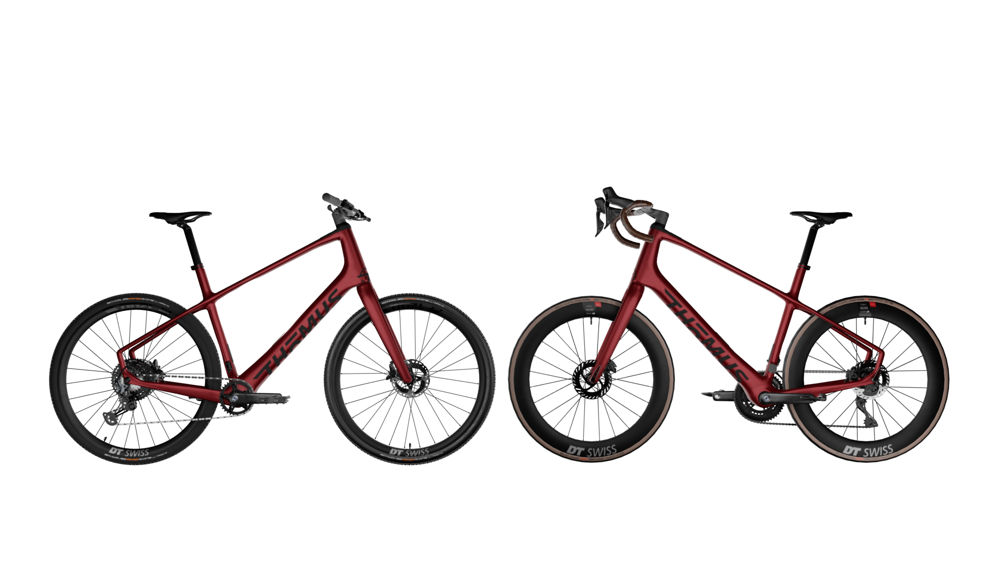

## Swissrider - The e-bike for life

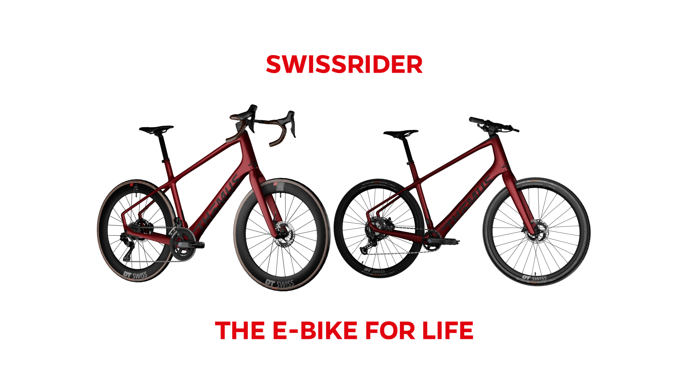

## Welcome to watch the video below.

<iframe class="responsive-iframe" title="vimeo-player" width="100%" height="100%" loading="lazy" src="https://player.vimeo.com/video/805829495?h=4808c91ecf" frameborder="0" allow="autoplay; fullscreen; picture-in-picture" allowfullscreen></iframe>

## Takeaways

#### What I learned

In this project, I not only improved my animation skills, but also paid more attention to the audience's viewing experience. Viewers of different age groups have different usage habits and video viewing speeds on digital platforms and devices. Video length, speed, font size, and timing affect what people get from the video, which in turn affects marketing. I am happy to learn a lot in this project.

## Reflection

Big thanks to THÖMUS for giving me a great opportunity to work on everything from storyboards, background music, visual effects, lighting, rigging to animation. It was a great experience working with the CMO and other 3d modelers. Sometimes, I feel a little stressed. But I told myself: We are never fully prepared for anything, but the most important thing is never stop learning and trying. The more challenges, the more opportunities I have to improve my skills. Thanks for giving me this opportunity. I am already looking forward to the next one.

