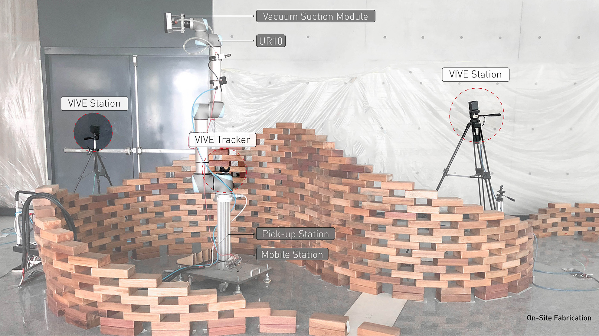
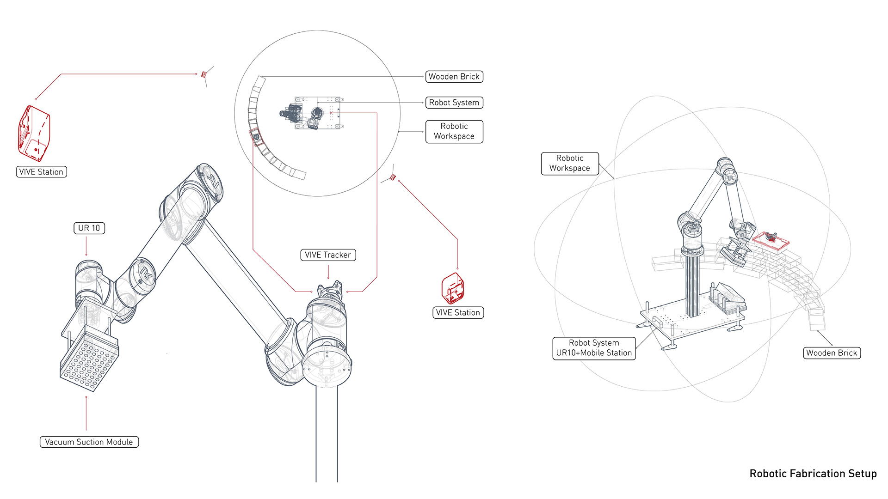
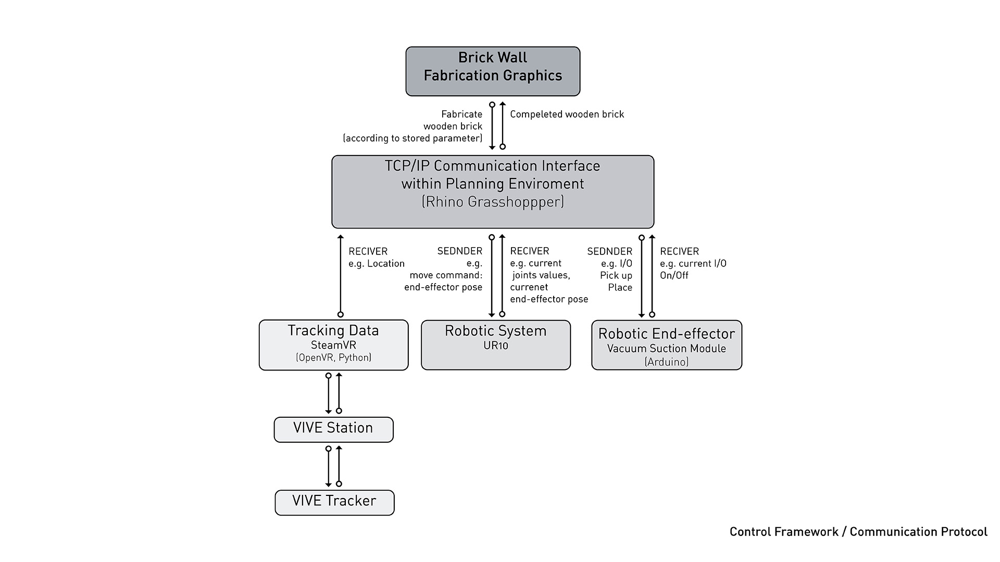
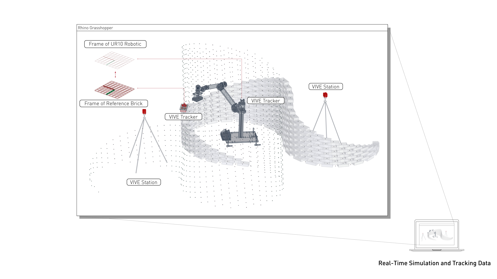
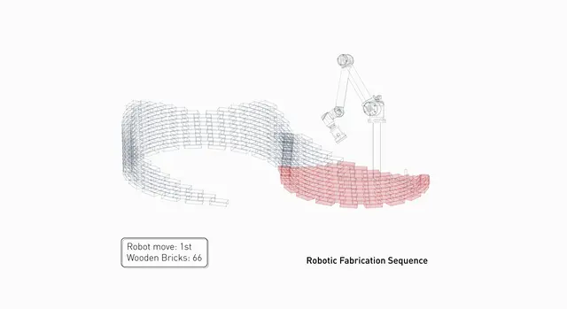

## Background

My role was to fabricate the fundraising brick wall on site, and to take the real-time positioning system — an HTC VIVE Tracker integrated with a UR10 robotic arm — from a working lab rig to something that held up through 22 re-registrations on a live construction site.

#### The work began with two challenges:

1. How to reposition a robotic system on a construction site, and
2. How to use VR-based tracking to locate building components in situ?

#

## On-Site Robotic Setup

The UR10 robotic arm was mounted on a mobile station for on-site deployment. A pickup area for 20×10×5 cm wooden bricks was integrated at the base of the station.

## VR–Robotics Integration Pipeline

HTC VIVE tracking was used to collect real-time positional data. Using Rhino3D, Grasshopper3D, SteamVR, OpenVR, and Python, we created a virtual environment that synchronized with the physical site.

## Robotic Fabrication Simulation

The VIVE Tracker provided relative coordinates between the UR10 and a reference block. This data allowed us to simulate and execute the fabrication process: each cycle placed 80–120 bricks within 1–2 hours, ensuring the UR10 avoided collisions. Once an area was completed, the robot was repositioned to continue the build.

## Construction Sequence

Throughout construction, the UR10 was repositioned 22 times to complete 38 layers totaling 1,024 bricks. Due to ceiling height limitations, the remaining 14 layers (406 bricks) could not be reached in place, so the robot built them as prefabricated components off the wall and we installed them by hand. All 1,430 bricks were laid by the robot.

## Welcome to watch the video below.

<iframe class="responsive-iframe" title="vimeo-player" width="100%" height="100%" loading="lazy" src="https://player.vimeo.com/video/244675340" frameborder="0" allow="autoplay; fullscreen; picture-in-picture" allowfullscreen></iframe>

## Team

Prof. Chen-Cheng Chen, You-Wen Ji, Ying-Shiuan Chen, Ching-Yin Wang

